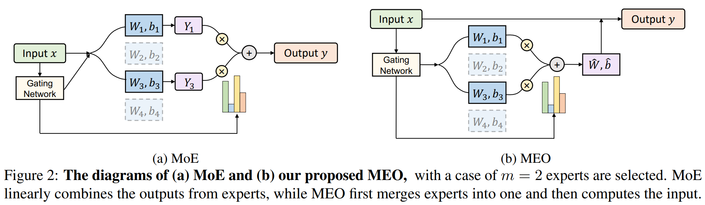

# Merging Experts into One: Improving Computational Efficiency of Mixture of Experts
The source code of "Merging Experts into One: Improving Computational Efficiency of Mixture of Experts
 (EMNLP 2023)":

 ```
Merging Experts into One: Improving Computational Efficiency of Mixture of Experts
Shwai He, Run-Ze Fan, Liang Ding, Li Shen, Tianyi Zhou, Dacheng Tao
EMNLP 2023 Main Conference. 
```

<p align="center">
    
</p>


## Requirements
- torch==1.13.1
- transformers==4.17.0
- tokenizers==0.10.1
- nltk==3.5

## Usage

Run BERT on GLUE for text classification: 

`tasks/text-classification/run_glue.py`; 

Run GPT-2 on Wikitext for language modeling: 

`tasks/language-modeling/run_clm.py`; 

Run T5 on SquAD for question-answering: 

`tasks/question-answering/run_seq2seq_qa.py`; 

Run BART on XSum for summarization: 

`tasks/summarization/run_summarization.py`; 

## Citation

```
@inproceedings{he-etal-2023-merging,
    title = "Merging Experts into One: Improving Computational Efficiency of Mixture of Experts",
    author = "He, Shwai  and
      Fan, Run-Ze  and
      Ding, Liang  and
      Shen, Li  and
      Zhou, Tianyi  and
      Tao, Dacheng",
    editor = "Bouamor, Houda  and
      Pino, Juan  and
      Bali, Kalika",
    booktitle = "Proceedings of the 2023 Conference on Empirical Methods in Natural Language Processing",
    month = dec,
    year = "2023",
    address = "Singapore",
    publisher = "Association for Computational Linguistics",
    url = "https://aclanthology.org/2023.emnlp-main.907",
    doi = "10.18653/v1/2023.emnlp-main.907",
    pages = "14685--14691",
    abstract = "Scaling the size of language models usually leads to remarkable advancements in NLP tasks. But it often comes with a price of growing computational cost. Although a sparse Mixture of Experts (MoE) can reduce the cost by activating a small subset of parameters (e.g., one expert) for each input, its computation escalates significantly if increasing the number of activated experts, limiting its practical utility. Can we retain the advantages of adding more experts without substantially increasing the computational costs? In this paper, we first demonstrate the superiority of selecting multiple experts and then propose a computation-efficient approach called \textbf{Merging Experts into One} (MEO), which reduces the computation cost to that of a single expert. Extensive experiments show that MEO significantly improves computational efficiency, e.g., FLOPS drops from 72.0G of vanilla MoE to 28.6G (MEO). Moreover, we propose a token-level attention block that further enhances the efficiency and performance of token-level MEO, e.g., 83.3{\%} (MEO) vs. 82.6{\%} (vanilla MoE) average score on the GLUE benchmark. Our code will be released upon acceptance. Code will be released at: \url{https://github.com/Shwai-He/MEO}.",
}
```