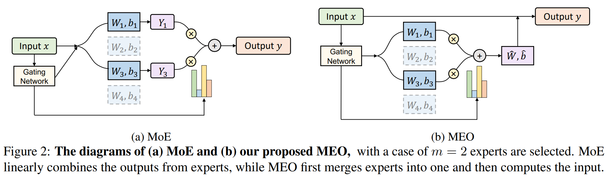
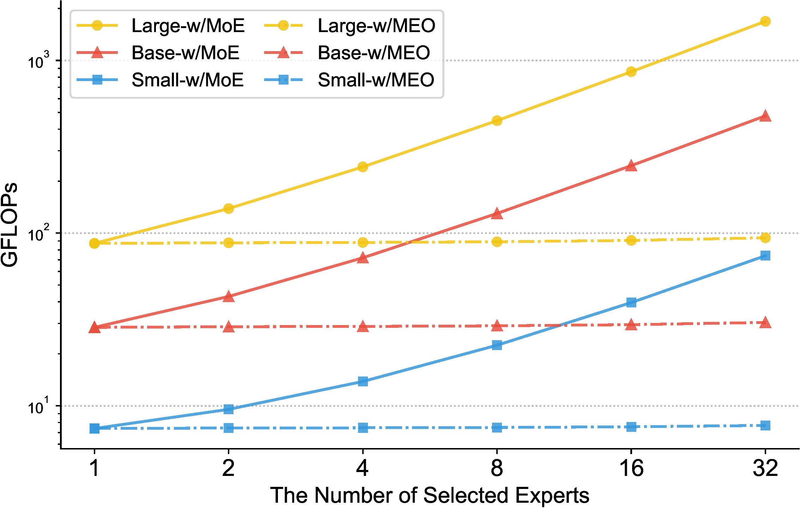

# 🚀 Merging Experts into One: Improving Computational Efficiency of Mixture of Experts

[](https://aclanthology.org/2023.emnlp-main.907)
[](https://aclanthology.org/2023.emnlp-main.907)
[](#installation)

### Shwai He, Run-Ze Fan, Liang Ding, Li Shen, Tianyi Zhou, Dacheng Tao

> This is the official implementation of the paper
> [**Merging Experts into One: Improving Computational Efficiency of Mixture of Experts**](https://aclanthology.org/2023.emnlp-main.907),
> published at **EMNLP 2023 Main Conference**.

<p align="center">
  
</p>

## 📰 News

- Dec 2023: Paper accepted at EMNLP 2023 Main Conference.
- Feb 2026: README updated with cleaner structure and quick-start workflow.

## 🤔 Why MEO

Sparse Mixture-of-Experts (MoE) improves model capacity and quality, but activating multiple experts usually increases computation cost.

MEO addresses this by **merging multiple selected experts into one effective expert computation path**, aiming to keep multi-expert benefits while reducing runtime overhead.

## 🧠 Core Idea

- ✅ **Multi-expert selection is beneficial**, but naive execution is expensive.
- ⚙️ **MEO merges selected experts into one computation**, reducing cost close to single-expert inference.
- 🔍 A **token-level attention block** is further introduced to improve token-level MEO efficiency and performance.

## 📁 Repository Structure

- `tasks/text-classification/`: GLUE and XNLI scripts.
- `tasks/language-modeling/`: CLM/MLM/PLM scripts.
- `tasks/question-answering/`: extractive and seq2seq QA scripts.
- `tasks/summarization/`: summarization scripts and task notes.
- `transformers/`: customized Transformers source used by this project.
- `Figures/`: project figures and result visualizations.

## 🛠️ Installation

### 1) 🧪 Create environment

```bash
conda create -n meo python=3.9 -y
conda activate meo
```

### 2) 📦 Install dependencies

```bash
pip install -r requirements.txt
```

## ⚡ Quick Start

You can run MEO-style experiments through task scripts below.

| Task | Dataset/Benchmark | Entry Script |
|---|---|---|
| Text Classification | GLUE | `tasks/text-classification/run_glue.py` |
| Language Modeling | WikiText (CLM) | `tasks/language-modeling/run_clm.py` |
| Question Answering | SQuAD (seq2seq) | `tasks/question-answering/run_seq2seq_qa.py` |
| Summarization | XSum | `tasks/summarization/run_summarization.py` |

Example:

```bash
python tasks/text-classification/run_glue.py \
  --model_name_or_path bert-base-uncased \
  --task_name mrpc
```

## 📊 Results

<p align="center">
  
</p>

From the paper, MEO provides substantial efficiency gains while preserving performance, for example:

- 📉 FLOPs reduced from **72.0G** (vanilla MoE) to **28.6G** (MEO).
- 🏆 On GLUE, token-level MEO reports **83.3%** average score vs **82.6%** for vanilla MoE in the reported setting.

For full setup details, please refer to the paper and scripts in this repository.

## 📚 Citation

```bibtex
@inproceedings{he-etal-2023-merging,
    title = "Merging Experts into One: Improving Computational Efficiency of Mixture of Experts",
    author = "He, Shwai  and
      Fan, Run-Ze  and
      Ding, Liang  and
      Shen, Li  and
      Zhou, Tianyi  and
      Tao, Dacheng",
    editor = "Bouamor, Houda  and
      Pino, Juan  and
      Bali, Kalika",
    booktitle = "Proceedings of the 2023 Conference on Empirical Methods in Natural Language Processing",
    month = dec,
    year = "2023",
    address = "Singapore",
    publisher = "Association for Computational Linguistics",
    url = "https://aclanthology.org/2023.emnlp-main.907",
    doi = "10.18653/v1/2023.emnlp-main.907",
    pages = "14685--14691"
}
```

## 📬 Contact

For questions or collaboration, please contact: `shwaihe@umd.edu`.
