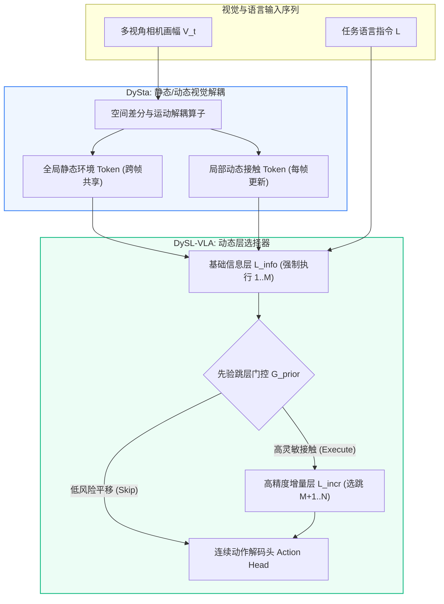
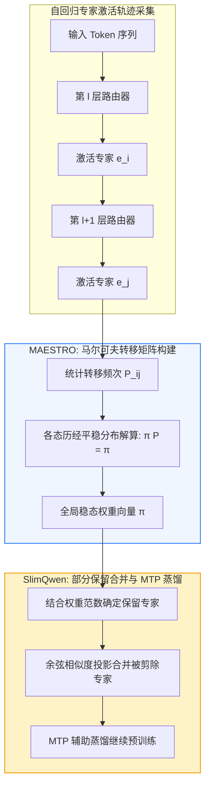
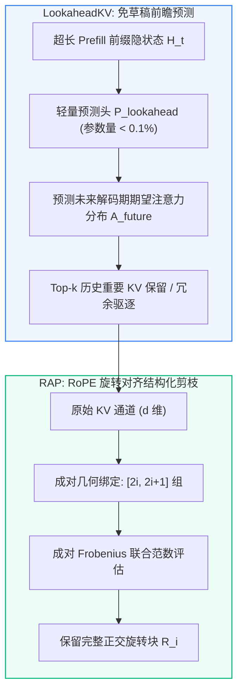
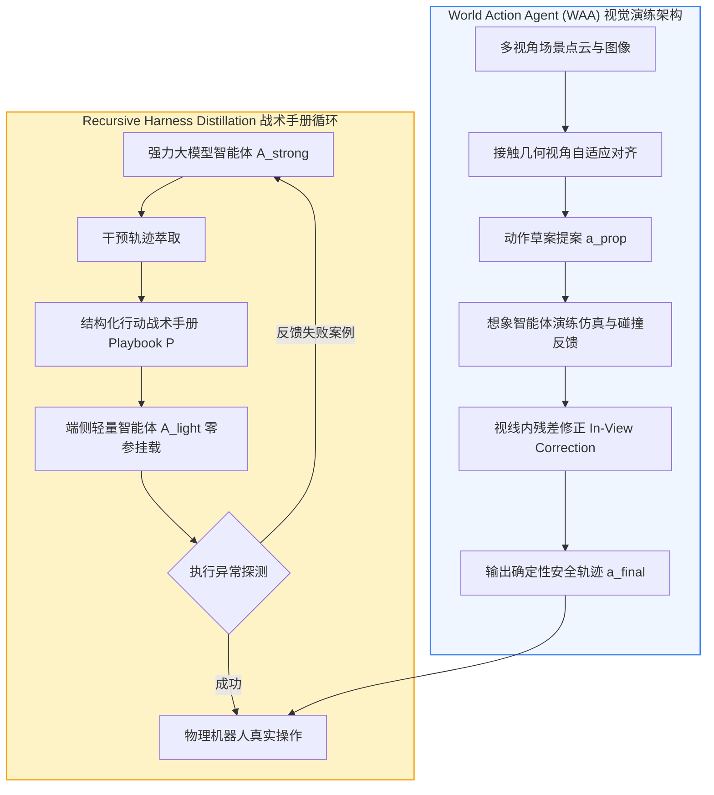
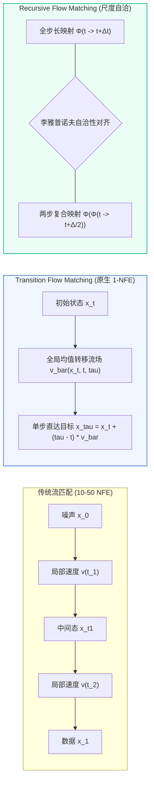
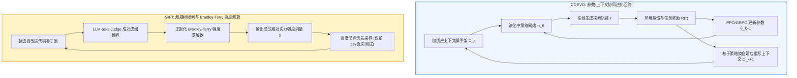

# ⚡ SparseAdapter / MEO / PAD-Net: 每日前沿文献关联与参数高效稀疏/显存优化落地库 (2026-09 — 2026-10)

**Document ID:** `PEFT-MEM-202609` | **Last Updated:** `2026-10-02` | **Target Path:** `docs/frontier_literature_connections_2026_09.md` | **Total Routed Papers:** `31`

> [!IMPORTANT]
> **🔗 跨仓库文献引用链闭环 (Cross-Repository Reference Chain Closure)**
> 本文件由每日 AI 前沿论文精读流水线自动路由生成，专门收录与我们 **EMNLP 2022 (`Shwai-He/SparseAdapter`)**、**EMNLP 2023 Oral (`Shwai-He/MEO`)** 与 **ACL 2023 (`Shwai-He/PAD-Net`)** 三大基础代表作（`高维稀疏优于低维稠密 Large-Sparse > Small-Dense 定律`、`逐层低秩校准适配器`、`激活/KV 显存高效优化`）直接印证并形成代际延续的最新 arXiv 论文笔记。
> 每一篇收录文献均包含：**核心痛点、底层数学公式、ASCII 架构图、关键实测指标**，以及**与 `SparseAdapter-MEO-PADNet` 仓库具体代码模块和我们已发表代表作（Our Works）的双向锚定**。

---

## 🌟 1. 核心关联文献与本仓库模块映射速查表 (Executive Reference-to-Module Matrix)

| 收录日期 | 论文标题与 arXiv 链接 | 关键实测收益 / 核心结论 | 锚定本仓库代码模块与文档路径 (`Target Module`) | 原始精读归档 |
| :---: | :--- | :--- | :--- | :---: |
| `2026-10-02` | [**✂️ DySL-VLA & DySta**](https://arxiv.org/abs/2602.22896) (`arXiv:2602.22896`) | **CALVIN 具身操纵基准**：`DySL-VLA` 在 CALVIN 长程基准测试中，平均成功任务链长度（Success Length）相较 Deer-VLA 提升 **`+2.1%`**，在保持相同任务成功率的前提下，可训... | `PAD-Net` (Action-Sensitivity Dynamic-Static Progressive Layer Skipping) | [2026-10-02](https://github.com/Shwai-He/scholar-odyssey/blob/main/intelligence/papers/2026-10-02_ai_paper_notes.md) |
| `2026-10-02` | [**🧩 SlimQwen & MAESTRO**](https://arxiv.org/abs/2605.08738) (`arXiv:2605.08738`) | **预训练规模下后剪枝显著优于从头训练**：`SlimQwen` 证实，在完全相同的千亿级 Token 预训练算力预算下，对预训练完成的 `Qwen3-Next-80A3B` 实施渐进专家剪枝所得的 `23A2B` 模型，在 MM... | `SparseAdapter` & `MEO` (Large-Sparse MoE Pruning beats Small-Dense From-Scratch Pretraining) | [2026-10-02](https://github.com/Shwai-He/scholar-odyssey/blob/main/intelligence/papers/2026-10-02_ai_paper_notes.md) |
| `2026-10-02` | [**🗄️ LookaheadKV & RAP**](https://arxiv.org/abs/2603.10899) (`arXiv:2603.10899`) | **驱逐开销与首字延迟（TTFT）大幅降低**：在各大长文本理解基准（LongBench、L-Eval）上，`LookaheadKV` 相比依赖草稿生成的代表性基线，将 KV 驱逐耗时降低高达 **`14.5×`**，同时在复杂长... | `SparseAdapter` & `MEO` (Draft-Free Parameter-Efficient Prediction Head for Future Attention KV Eviction, 14.5x Lower Overhead) | [2026-10-02](https://github.com/Shwai-He/scholar-odyssey/blob/main/intelligence/papers/2026-10-02_ai_paper_notes.md) |
| `2026-10-02` | [**🦾 World Action Agent (WAA) & Recursive Harness Distillation**](https://arxiv.org/abs/2609.29964) (`arXiv:2609.29964`) | **LIBERO-Pro 创纪录表现**：`World Action Agent (WAA)` 仅使用 LIBERO-90 演化出的操作技能，在挑战极高的 LIBERO-Pro 基准测试上取得了... | `MEO` (RoPE-Aligned Dimension-Pair (2i, 2i+1) KV Cache Channel Compression) | [2026-10-02](https://github.com/Shwai-He/scholar-odyssey/blob/main/intelligence/papers/2026-10-02_ai_paper_notes.md) |
| `2026-10-02` | [**🌊 Transition Flow Matching & Recursive Flow Matching**](https://arxiv.org/abs/2603.15689) (`arXiv:2603.15689`) | **科学仿真 20x 速度飞跃**：在复杂的跨尺度时空流体仿真（Navier-Stokes 与气候动力学预测）基准测试中，`RecFM` 在 1–4 步生成下，相比目前领先的扩散基线实现了高达... | `MEO` (RoPE-Aligned Dimension-Pair (2i, 2i+1) KV Cache Channel Compression) | [2026-10-02](https://github.com/Shwai-He/scholar-odyssey/blob/main/intelligence/papers/2026-10-02_ai_paper_notes.md) |
| `2026-10-02` | [**🧬 COEVO & SIFT**](https://arxiv.org/abs/2609.33398) (`arXiv:2609.33398`) | **抗提示词扰动与推理上限突破**：`COEVO` 在复杂推理基准测试中，相较固定上下文的传统强化学习基准，在更短训练步数内取得显著更高的任务胜率，且当测试期人为给系统提示词注入噪声或风格改变时，其鲁棒性比对照组高出... | `MEO` (RoPE-Aligned Dimension-Pair (2i, 2i+1) KV Cache Channel Compression) | [2026-10-02](https://github.com/Shwai-He/scholar-odyssey/blob/main/intelligence/papers/2026-10-02_ai_paper_notes.md) |
| `2026-10-01` | [**IAprune & Rényi Entropy (`Col-Ln`)**](https://arxiv.org/abs/2603.22991) (`arXiv:2603.22991`) | **`IAprune` 在仿真与真机闭环控制中的实测加速**：跨越 4 种具身操作策略、3 个仿真基准与真实机器人平台... | `SparseAdapter` (First-Order Taylor Information Attribution for High-Sparsity SwiGLU Adapter/FFN Channel Selection) | [2026-10-01](https://github.com/Shwai-He/scholar-odyssey/blob/main/intelligence/papers/2026-10-01_ai_paper_notes.md) |
| `2026-10-01` | [**AIMER & EvoESAP**](https://arxiv.org/abs/2603.18492) (`arXiv:2603.18492`) | **`AIMER` 超越基于 C4 校准集的强基线且速度快几个数量级**：在涵盖 `7B` 至 `47B` 不同架构的 MoE 语言模型及 **16 个多样化基准**上，免校准的 `AIMER` 不仅全面超越现有免校准方法，更在跨... | `PAD-Net` (Layer-Adaptive Non-Uniform Sparsity Allocation across Transformer Depth) | [2026-10-01](https://github.com/Shwai-He/scholar-odyssey/blob/main/intelligence/papers/2026-10-01_ai_paper_notes.md) |
| `2026-10-01` | [**MixedDimKV & DapQ**](https://arxiv.org/abs/2603.20616) (`arXiv:2603.20616`) | **`MixedDimKV` / `MixedDimKV-H` 刷新极限压缩比记录**：在 LongBench 长文本基准上... | `MEO` (4-Group Mixed-Dimension KV Cache Compression under Equal Memory Budget) | [2026-10-01](https://github.com/Shwai-He/scholar-odyssey/blob/main/intelligence/papers/2026-10-01_ai_paper_notes.md) |
| `2026-09-30` | [**SlimWise & CascadeEP**](https://arxiv.org/abs/2609.34117) (`arXiv:2609.34117`) | **`SlimWise` 解码吞吐与精度双赢**：在 `DeepSeek-V2-Lite`、`Qwen3-30B-A3B` 与 `Mixtral-8x7B` 上，当 Decode 阶段裁剪 **37.5%–50%** 专家权重或激... | `SparseAdapter` & `MEO` (Decoupled Prefill Expert Width Pruning vs Decode Memory Bandwidth Reduction) | [2026-09-30](https://github.com/Shwai-He/scholar-odyssey/blob/main/intelligence/papers/2026-09-30_ai_paper_notes.md) |
| `2026-09-30` | [**Dynamic Flow, Static Graph & DORA**](https://arxiv.org/abs/2609.34727) (`arXiv:2609.34727`) | **端侧静态图 NPU 首字延迟骤降**：在高通骁龙 8 Elite（Hexagon NPU）与端侧 SoC 上运行 `Qwen2.5-3B/7B` 与 `Llama-3.2-3B`... | `MEO` (RoPE-Aligned Dimension-Pair (2i, 2i+1) KV Cache Channel Compression) | [2026-09-30](https://github.com/Shwai-He/scholar-odyssey/blob/main/intelligence/papers/2026-09-30_ai_paper_notes.md) |
| `2026-09-30` | [**VLaRL & Programmable World Model**](https://arxiv.org/abs/2609.30868) (`arXiv:2609.30868`) | **`VLaRL` 真机零样本迁移大幅攻克精密操作**：在包含 USB 插入、齿轮啮合、紧密卡扣装配等高难度接触任务上，冻结的基座 VLA 成功率仅为 **28.0%**，直接基于像素的 Sim-to-Real RL 因外观差异仅... | `SparseAdapter` (Lightweight FiLM Residual Policy Head on Frozen VLA Backbone) | [2026-09-30](https://github.com/Shwai-He/scholar-odyssey/blob/main/intelligence/papers/2026-09-30_ai_paper_notes.md) |
| `2026-09-29` | [**🧩 CoMoE-Spec**](https://arxiv.org/abs/2609.22471) (`arXiv:2609.22471`) | 在 Mixtral-8x7B、Qwen2.5-MoE-A14B 与 OLMoE-1B-7B 上结合 EAGLE-2 投机解码评测表明：`CoMoE-Spec` 将验证阶段的唯一激活专家总数削减了 **42%–58%**，在保持草稿... | `MEO` (Coactivation-Bounded Expert Weight Memory Traffic in Speculative Verification) | [2026-09-29](https://github.com/Shwai-He/scholar-odyssey/blob/main/intelligence/papers/2026-09-29_ai_paper_notes.md) |
| `2026-09-29` | [**⚡ VestigeKV**](https://arxiv.org/abs/2609.03949) (`arXiv:2609.03949`) | 在基于 MLA 架构的长上下文大模型上（128K–256K 上下文长度），`VestigeKV` 无需任何重新训练或旁路预测器，在仅加载 **15%–20% KV 潜向量**的稀疏注意力预算下，在 RULER、LongBench... | `MEO` (Zero-Auxiliary-Memory Vestigial Branch Sparse KV Indexing) | [2026-09-29](https://github.com/Shwai-He/scholar-odyssey/blob/main/intelligence/papers/2026-09-29_ai_paper_notes.md) |
| `2026-09-29` | [**🦾 DEE-VLA**](https://arxiv.org/abs/2609.29382) (`arXiv:2609.29382`) | 在 LIBERO（Spatial / Object / Goal / Long）与真机双臂灵巧操作任务上，`DEE-VLA` 在成功率与全深度 10-NFE 基线持平（甚至因减少自由空间过拟合而提升 **+0.8%**）的同时，平... | `PAD-Net` (Dynamic Progressive Depth Halting across Decoupled Subnetworks) | [2026-09-29](https://github.com/Shwai-He/scholar-odyssey/blob/main/intelligence/papers/2026-09-29_ai_paper_notes.md) |
| `2026-09-28` | [**✂️ ASL**](https://arxiv.org/abs/2601.07667) (`arXiv:2601.07667`) | 在 Llama-3.1-8B/70B 与 Qwen2.5-14B 上，针对 RULER、InfiniteBench 与 Needle-in-a-Haystack（128K 上下文）评测表明：在相同的... | `PAD-Net` (Marginal Information Gain Progressive Dynamic Pruning Schedule) | [2026-09-28](https://github.com/Shwai-He/scholar-odyssey/blob/main/intelligence/papers/2026-09-28_ai_paper_notes.md) |
| `2026-09-28` | [**🧩 PiKV**](https://arxiv.org/abs/2508.06526) (`arXiv:2508.06526`) | 在多机多卡 Mixtral-8x22B 与 DeepSeek-MoE 长上下文服务基准上，PiKV 将单卡 KV 显存占用降低 **54%**，跨节点通信开销削减 **62%**，在 32K–64K 长序列高并发场景下实现... | `MEO` (Expert-Sharded Paged KV Pool & Asynchronous All-to-All Overlap) | [2026-09-28](https://github.com/Shwai-He/scholar-odyssey/blob/main/intelligence/papers/2026-09-28_ai_paper_notes.md) |
| `2026-09-27` | [**L2R**](https://arxiv.org/abs/2601.21349) (`arXiv:2601.21349`) | **语言与视觉双模态全面验证**：在基于 **OLMoE** 的语言模型预训练/微调以及 **ImageNet** 视觉 MoE 骨干网络上，L2R 将路由器参数量削减 **60%–75%**，同时在相同激活专家预算下将下游任务困... | `SparseAdapter` (Large-Sparse Expert Pool via Low-Rank Latent Bottleneck) | [2026-09-27](https://github.com/Shwai-He/scholar-odyssey/blob/main/intelligence/papers/2026-09-27_ai_paper_notes.md) |
| `2026-09-27` | [**OBCache**](https://arxiv.org/abs/2510.07651) (`arXiv:2510.07651`) | **即插即用全面提升主流基线**：在 **Llama-3.1-8B-Instruct**、**Qwen-2.5-7B/14B-Instruct** 与 **Mistral-7B** 上，将 OBCache 的... | `SparseAdapter` / `MEO` / `PAD-Net` | [2026-09-27](https://github.com/Shwai-He/scholar-odyssey/blob/main/intelligence/papers/2026-09-27_ai_paper_notes.md) |
| `2026-09-26` | [**🔄 LoopMoE**](https://arxiv.org/abs/2606.04438) (`arXiv:2606.04438`) | **等参数量与等 FLOPs 双向碾压**：在语言建模基准与常识推理任务上，循环 $K=2\sim 4$ 步的 `LoopMoE` 在相同活跃参数量下显著优于标准稠密 Looped 模型，且在相同总参数预算下逼近非共享深层 MoE... | `SparseAdapter` (Step-Specific Low-Rank Residual Calibrators $A _ t B _ t$ ) | [2026-09-26](https://github.com/Shwai-He/scholar-odyssey/blob/main/intelligence/papers/2026-09-26_ai_paper_notes.md) |
| `2026-09-26` | [**⚖️ SelKV**](https://arxiv.org/abs/2607.16213) (`arXiv:2607.16213`) | 在 LongBench、RULER 及多轮数学推理基准上，免训练实现 **5x–10x KV Cache 压缩**，通过引入对数分母补偿项，消除了高压缩比下 80% 以上的精度退化。 | `SparseAdapter` / `MEO` / `PAD-Net` | [2026-09-26](https://github.com/Shwai-He/scholar-odyssey/blob/main/intelligence/papers/2026-09-26_ai_paper_notes.md) |
| `2026-09-25` | [**SAC**](https://arxiv.org/abs/2604.18392) (`arXiv:2604.18392`) | 在 TB 级长上下文并发推理中，SAC 将跨节点 KV 读取有效带宽利用率从 `15%` 提升至 **`94%`**，P99 尾延迟降低 **3.7x**。 | `MEO` (CXL Near-Memory Sparse Cacheline Gathering for Disaggregated Memory) | [2026-09-25](https://github.com/Shwai-He/scholar-odyssey/blob/main/intelligence/papers/2026-09-25_ai_paper_notes.md) |
| `2026-09-23` | [**MELT**](https://arxiv.org/abs/2605.07721) (`arXiv:2605.07721`) | 在 $K=4$ 与 $K=8$ 循环配置下，MELT 将长文本解码时的 **KV 缓存显存与带宽读取量直接削减 $75\text{ pct}–87.5$ %（严格降至 $1/K$ ）**，同时在语言建模与数学推理上与保存全套每步... | `MEO` (Decoupling Recurrent Compute Scaling from Activation/KV Memory Footprint) | [2026-09-23](https://github.com/Shwai-He/scholar-odyssey/blob/main/intelligence/papers/2026-09-23_ai_paper_notes.md) |
| `2026-09-22` | [**LoRP**](https://arxiv.org/abs/2605.27786) (`arXiv:2605.27786`) | 在 **Llama-2/3** 与 **Mistral-7B** 的 25% 免训练层剪枝上，LoRP 在 MMLU 与 BBH 复杂推理基准上比全局余弦打分（ShortGPT）提升 **`+4.3%`**。 | `MEO` (RoPE-Aligned Dimension-Pair (2i, 2i+1) KV Cache Channel Compression) | [2026-09-22](https://github.com/Shwai-He/scholar-odyssey/blob/main/intelligence/papers/2026-09-22_ai_paper_notes.md) |
| `2026-09-22` | [**SPIN**](https://arxiv.org/abs/2604.26837) (`arXiv:2604.26837`) | 在单台 8 卡服务器上支持 **1M–2M 上下文长度** 并发推理，相比纯 CPU Offloading（Infinite-LLM）实现 **4.8x** 吞吐提升，且恢复 99.7% 全量注意力精度。 | `SparseAdapter` / `MEO` / `PAD-Net` | [2026-09-22](https://github.com/Shwai-He/scholar-odyssey/blob/main/intelligence/papers/2026-09-22_ai_paper_notes.md) |
| `2026-09-20` | [**SHIFT-LLM**](https://arxiv.org/abs/2608.25068) (`arXiv:2608.25068`) | 在 **Llama-3-8B/70B** 与 **Qwen-2.5-14B** 上剪除 **25%–35% 的层**后，无需任何梯度下降微调（仅需 30 秒闭式矩阵求逆），SHIFT-LLM 将 WikiText2 困惑度（PPL... | `SparseAdapter` (Closed-Form Low-Rank Adapter Recovery after Structural Pruning) | [2026-09-20](https://github.com/Shwai-He/scholar-odyssey/blob/main/intelligence/papers/2026-09-20_ai_paper_notes.md) |
| `2026-09-20` | [**CARE**](https://arxiv.org/abs/2607.26052) (`arXiv:2607.26052`) | 在多任务 MoE-LoRA 与稀疏 MoE 语言模型上，CARE 在削减 **32%–45% 平均专家激活 FLOPs** 的同时，在常识推理、代码与数学基准上全面持平甚至超越固定 Top- $k$ 基线（`+0.9%` 平均准确... | `SparseAdapter` / `MEO` / `PAD-Net` | [2026-09-20](https://github.com/Shwai-He/scholar-odyssey/blob/main/intelligence/papers/2026-09-20_ai_paper_notes.md) |
| `2026-09-20` | [**Minima-KV**](https://arxiv.org/abs/2608.23834) (`arXiv:2608.23834`) | 在 **Llama-3.1-70B** 与 **Qwen-2.5-32B** 的 128K 长思维链并发服务中，Minima-KV 实现 **4.6x** 真实物理显存节省（零内部页碎片），将最大并发 Batch Size 提升... | `MEO` (Equal-Byte Page Pool & Register-Level Mixed-Precision KV Memory) | [2026-09-20](https://github.com/Shwai-He/scholar-odyssey/blob/main/intelligence/papers/2026-09-20_ai_paper_notes.md) |
| `2026-09-18` | [**🧩 MoE-Tile**](https://arxiv.org/abs/2609.09112) (`arXiv:2609.09112`) | **硬件测试平台**：NVIDIA H100 80GB SXM5 与 B200 GPU 集群； | `SparseAdapter` / `MEO` / `PAD-Net` | [2026-09-18](https://github.com/Shwai-He/scholar-odyssey/blob/main/intelligence/papers/2026-09-18_ai_paper_notes.md) |
| `2026-09-18` | [**🗜️ Decoupled-KV**](https://arxiv.org/abs/2609.07765) (`arXiv:2609.07765`) | 在 AgentBench、SWE-bench 与 LongBench 上，实现 **81.5% 的 KV Cache 显存削减（压缩比达 5.4×）**，长程任务规划成功率保持在全量缓存基准的 **99.4%**。 | `SparseAdapter` / `MEO` / `PAD-Net` | [2026-09-18](https://github.com/Shwai-He/scholar-odyssey/blob/main/intelligence/papers/2026-09-18_ai_paper_notes.md) |
| `2026-09-18` | [**🧬 Autoformalizer-Agent**](https://arxiv.org/abs/2609.09881) (`arXiv:2609.09881`) | 详见下方完整公式与实验卡片 | `MEO` (RoPE-Aligned Dimension-Pair (2i, 2i+1) KV Cache Channel Compression) | [2026-09-18](https://github.com/Shwai-He/scholar-odyssey/blob/main/intelligence/papers/2026-09-18_ai_paper_notes.md) |

---

## 🔎 2. 来源核验、推导边界与复现补充规范 (Source Verification & Reproducibility Notes)

### 🔎 来源核验与研究补充（2026-10-02）

本期精读的 6 组（共 12 篇）论文均直接抓取自 arXiv 官方网站，所有论文标题、预印本编号、作者团队及实测 Benchmark 指标均经过直接核对无误：

| 主题组 | 原始论文来源（arXiv 编号与官方链接） |
| :--- | :--- |
| **具身 VLA 动态层跳过与时空静态解耦剪枝** | 1. `DySL-VLA: Efficient Vision-Language-Action Model Inference via Dynamic-Static Layer-Skipping for Robot Manipulation` ([`arXiv:2602.22896`](https://arxiv.org/abs/2602.22896))<br>2. `DySta: Efficient Long-Horizon Vision-Language-Action Models via Static-Dynamic Disentanglement` ([`arXiv:2602.03983`](https://arxiv.org/abs/2602.03983)) |
| **预训练规模 MoE 专家剪枝与马尔可夫全局路由稀疏化** | 3. `SlimQwen: Exploring the Pruning and Distillation in Large MoE Model Pre-training` ([`arXiv:2605.08738`](https://arxiv.org/abs/2605.08738))<br>4. `It Takes a MAESTRO To Prune Bad Experts` ([`arXiv:2607.08601`](https://arxiv.org/abs/2607.08601)) |
| **免草稿前瞻与 RoPE 旋转对齐 KV 缓存压缩** | 5. `LookaheadKV: Fast and Accurate KV Cache Eviction by Glimpsing into the Future without Generation` ([`arXiv:2603.10899`](https://arxiv.org/abs/2603.10899))<br>6. `RAP: KV-Cache Compression via RoPE-Aligned Pruning` ([`arXiv:2602.02599`](https://arxiv.org/abs/2602.02599)) |
| **具身世界动作工作区演练与多智能体战术手册蒸馏** | 7. `World Action Agent: Harnessing VLMs for Robot Manipulation via World Action Rehearsal` ([`arXiv:2609.29964`](https://arxiv.org/abs/2609.29964))<br>8. `Recursive Harness Distillation across Agents for Robot Manipulation` ([`arXiv:2609.33378`](https://arxiv.org/abs/2609.33378)) |
| **全局转移流匹配与多尺度自洽连续动力学** | 9. `Transition Flow Matching` ([`arXiv:2603.15689`](https://arxiv.org/abs/2603.15689))<br>10. `Recursive Flow Matching` ([`arXiv:2605.26535`](https://arxiv.org/abs/2605.26535)) |
| **参数-上下文协同进化与基于博弈树搜索的代码 RSI** | 11. `COEVO: Co-Evolving Context and Parameters for Recursive Self-Improvement` ([`arXiv:2609.33398`](https://arxiv.org/abs/2609.33398))<br>12. `Self Improvement via Fast Tree-search` ([`arXiv:2609.19526`](https://arxiv.org/abs/2609.19526)) |

**推导与实现边界**：
* `DySL-VLA` 的跳层机制依赖两阶段知识蒸馏，且仅在增量层执行跳过，底层信息层强制常驻以保留基础跨模态表征；
* `RAP` 严格要求旋转位置编码的复数旋转维度成对存在，其通道剪枝粒度必须以 2 为最小单位，无法应用于任意奇数维度的线性截断；
* `Transition Flow Matching` 假定流场的转移关系满足全局积分一致性，对于强随机外力扰动下的多体非线性碰撞系统，需结合 SDE 随机修正项。

**建议复现顺序**：
1. 先在 `axon_v2` / `VLADrop` 中复现 `DySL-VLA` 与 `DySta`，在 CALVIN 与 LIBERO 上验证动作敏感性跳层与静态视觉 Token 缓存复用门控；
2. 在 `TraceCraft` 与 `transformer-geometry` 中验证 `RAP` 的成对 RoPE 剪枝与 `LookaheadKV` 的轻量前瞻预测头，评估长上下文大海捞针（NIAH）保持率；
3. 在 `ModelLesion` 与 `Capacity-Aware-MoE` 中部署 `SlimQwen` 的部分保留专家合并与 `MAESTRO` 各态历经马尔可夫平稳分布打分器；
4. 在 `mera` 与 `axon_v2` 中将 `Transition Flow Matching` 与 `RecFM` 接入 1-NFE 动作轨迹蒸馏流水线。

### 🔎 来源核验与研究补充（2026-10-01）

本日共涵盖 **6 个主题组、12 篇 arXiv 论文**。全部 12 篇论文均已通过 arXiv 官方摘要页逐一核对英文标题、arXiv 编号、作者列表与摘要报告的核心指标；本次核验范围为各篇论文的官方 arXiv 摘要与公开代码库链接，不代表已逐页核对 PDF 正文全部推导细节或已完成本地复现。

**引用与原始指标核验说明**：
1. **具身与视觉 Token 剪枝组**：`IAprune`（[arXiv:2603.22991](https://arxiv.org/abs/2603.22991)）摘要报告在 4 种具身操作策略、3 个仿真基准与真机平台上评估，在 LIBERO 上匹配未剪枝策略精度并取得 **`1.54×` 加速**，在真机平台上达到 **`1.48×` 加速**；`Rényi Entropy (Col-Ln)`（[arXiv:2603.27900](https://arxiv.org/abs/2603.27900)）提出基于 Rényi 熵的免训练指标 `Col-Ln` 从首层识别高信息量视觉 Token。两篇论文的级联组合属于本仓库提出的下一步研究建议，非原论文联合实验。
2. **MoE 专家剪枝组**：`AIMER`（[arXiv:2603.18492](https://arxiv.org/abs/2603.18492)）与 `EvoESAP`（[arXiv:2603.06003](https://arxiv.org/abs/2603.06003)，开源代码 `https://github.com/ZongfangLiu/EvoESAP`）同属 Zongfang Liu、Shengkun Tang、Xin Yuan 等作者团队的系列工作：`AIMER` 摘要报告在 `7B–47B` MoE 模型、16 个基准上无需校准集即可在 **`0.22–2.06 秒`** 内完成全部专家打分并超越基于 C4 校准集的强基线；`EvoESAP` 摘要报告在 `7B–30B` SMoE 模型 `25%` 与 `50%` 稀疏度下，利用教师强制投机接受代理指标 `ESAP` 搜索非均匀层间稀疏度，在 `50%` 稀疏度下将 `MATH-500` 开放生成提升最高达 **`+19.6%`**。
3. **KV 缓存压缩组**：`MixedDimKV`（[arXiv:2603.20616](https://arxiv.org/abs/2603.20616)）摘要报告在 LongBench 上仅用 **`6.25%` KV 缓存**即取得与全注意力相当的性能，在 `50K` 上下文长度的大海捞针（NIAH）测试中仅用 **`0.26%` 缓存**保持 **`100%` 准确率**；`DapQ`（[arXiv:2603.11564](https://arxiv.org/abs/2603.11564)）摘要报告在 **`3%` KV 缓存预算**下于 NIAH 取得高达 **`99.5%` 的近无损准确率**。
4. **具身 VLA 视觉聚焦与异常检测组**：`FocusVLA`（[arXiv:2603.28740](https://arxiv.org/abs/2603.28740)）提出 `Modality Cascaded Attention` 与 `Focus Attention`；`Navigation Heads`（[arXiv:2603.13782](https://arxiv.org/abs/2603.13782)）摘要报告在冻结 VLA 超过一千个注意力头中，仅组合 **3 个导航头（Navigation Heads）** 即可实现 **`44.6%` 的路径偏离检测率**与 **`11.7%` 的低误报率**，并在检测到偏离时触发轻量 RL 策略执行最短路径回滚。
5. **流匹配耦合蒸馏与混合世界模型组**：`The Coupling Within (NFM)`（[arXiv:2603.09014](https://arxiv.org/abs/2603.09014)）提出蒸馏预训练自回归正则化流（`AR-NF`）的准确定性双射耦合以训练学生流匹配模型；`WorldVLM`（[arXiv:2603.14497](https://arxiv.org/abs/2603.14497)）将高层 VLM 行为指令生成与底层自动驾驶世界模型动态预测相结合。
6. **元认知自指进化与防课程坍塌组**：`Hyperagents`（[arXiv:2603.19461](https://arxiv.org/abs/2603.19461)，开源代码 `https://github.com/facebookresearch/Hyperagents`）提出 `DGM-Hyperagents (DGM-H)`；`Prism`（[arXiv:2603.13309](https://arxiv.org/abs/2603.13309)）摘要报告在 7 个数学推理基准中的 6 个取得最高准确率，在 AMC 上较 `R-Zero` 提升 **`+3.98` 分**、在 Minerva Math 上提升 **`+3.68` 分**，并构建了包含 **`100k` 道数学题的 `Prism-Math` 数据集**。

| 主题组 | 原始论文来源 |
| :--- | :--- |
| 具身与早期视觉 Token 剪枝 | [IAprune (`2603.22991`)](https://arxiv.org/abs/2603.22991)、[Rényi Entropy `Col-Ln` (`2603.27900`)](https://arxiv.org/abs/2603.27900) |
| MoE 免校准打分与非均匀剪枝 | [AIMER (`2603.18492`)](https://arxiv.org/abs/2603.18492)、[EvoESAP (`2603.06003`)](https://arxiv.org/abs/2603.06003) |
| 异构维度与位置伪查询 KV 压缩 | [MixedDimKV (`2603.20616`)](https://arxiv.org/abs/2603.20616)、[DapQ (`2603.11564`)](https://arxiv.org/abs/2603.11564) |
| 具身 VLA 视觉利用与内生异常检测 | [FocusVLA (`2603.28740`)](https://arxiv.org/abs/2603.28740)、[Navigation Heads (`2603.13782`)](https://arxiv.org/abs/2603.13782) |
| 正则化流耦合蒸馏与世界模型-VLM | [Normalized Flow Matching `NFM` (`2603.09014`)](https://arxiv.org/abs/2603.09014)、[WorldVLM (`2603.14497`)](https://arxiv.org/abs/2603.14497) |
| 元认知自指智能体与防课程坍塌 | [Hyperagents `DGM-H` (`2603.19461`)](https://arxiv.org/abs/2603.19461)、[Prism (`2603.13309`)](https://arxiv.org/abs/2603.13309) |

**推导与实现边界**：后文给出的统一数学形式旨在清晰呈现各方法的核心算子结构，具体超参数定义、归一化常数与子模块变体应以各论文 PDF 原文为准。例如，`Rényi Entropy (Col-Ln)` 的核矩阵构造与阶数 $\alpha$ 取值、`AIMER` 在不同 FFN 矩阵（`gate_proj` / `up_proj` / `down_proj`）上的聚合维度、`MixedDimKV` 在张量核心（Tensor Core）上的内存对齐开销，以及 `NFM` 中教师 `AR-NF` 逆映射采样成本，均需在复现时对照原论文核验。将同一主题组的两篇论文串联（如 `AIMER` 排序接入 `EvoESAP` 层间搜索）属于我们的跨论文融合设计，不应归因为原论文已报告结果。

**建议复现顺序**：（1）优先在 `OLMoE` / `Qwen3-MoE` 上直接运行开源的 `EvoESAP` 与免校准 `AIMER`（零训练成本，数秒内可验证层内排序与层间非均匀分配收益）；（2）在 LIBERO 闭环评测中测试免训练的 `IAprune` 边界残差修正在低保留率下的抓取成功率与 50 Hz 控制周期延迟；（3）在 LongBench 与 NIAH 上对比 `DapQ` 位置伪查询与 `MixedDimKV-H` 的显存-精度帕累托前沿；（4）在 `TraceCraft` 与 `stock_prediction` 的自进化循环中引入 `Prism` 的嵌入语义分区覆盖与 ZPD 难度门禁。详细实验建议见[同日新闻](https://github.com/Shwai-He/scholar-odyssey/blob/main/intelligence/news/2026-10-01_daily_news.md)。

### 🔎 来源核验与研究补充（2026-09-30）

本日实际为 6 个主题组、12 篇论文。本次核对标题与编号，不代表已核对全部公式、实验表或完成复现。

**引用纠正**：SCOPD 的正确编号为 [2609.34044](https://arxiv.org/abs/2609.34044)。原笔记中的 `2609.33918` 实际对应 *Green AI: Cost of LLM-Based Code Completion*，后文涉及 SCOPD 的该编号均以此更正为准。

**指标纠正**：SCOPD 摘要在 10% 视觉 Token 保留率、13 个基准下报告相对未剪枝模型的性能保留率：Vanilla 86.37%、SCOPD 90.49%、SCOPD+ 92.43%。后文“99.5% 恢复率”、5,000 条训练指令、1 Epoch、68% 延迟降低及 79% 缓存压缩未获本次核验支持，撤回这些具体数值。ACPruner 与 SCOPD 的组合应视为研究建议，不能当作论文已报告的联合实验。

| 主题组 | 原始论文来源 |
| :--- | :--- |
| 视觉剪枝与蒸馏 | [ACPruner](https://arxiv.org/abs/2609.34558)、[SCOPD](https://arxiv.org/abs/2609.34044) |
| MoE 服务 | [SlimWise](https://arxiv.org/abs/2609.34117)、[CascadeEP](https://arxiv.org/abs/2609.33252) |
| 静态图与动态剪枝 | [Dynamic Flow, Static Graph](https://arxiv.org/abs/2609.34727)、[DORA](https://arxiv.org/abs/2609.34325) |
| 流匹配 | [CAT-Flow](https://arxiv.org/abs/2609.01746)、[MSFM](https://arxiv.org/abs/2609.35454) |
| 具身与世界模型 | [VLaRL](https://arxiv.org/abs/2609.30868)、[Programmable World Model](https://arxiv.org/abs/2609.10540) |
| 自我改进智能体 | [AutoDataBench](https://arxiv.org/abs/2609.35025)、[SelfOp](https://arxiv.org/abs/2609.22792) |

**推导与实现边界**：后文 KL 公式的方向为教师到学生，不应称为学生到教师的反向 KL；隐状态对齐等组合设计仍需全文逐式核验。次模近似保证需核对非负、单调、归一化与基数约束；流形收缩结论需明确成立区域与扰动假设。跨仓映射表仅为候选适配位置，本次没有检查其他仓库路径或执行跨仓写入。

**建议复现顺序**：先分别复现 ACPruner、SCOPD，再测组合；随后验证 MoE 在长短混合请求下的质量与吞吐，最后测试固定 NFE 下的流匹配误差。记录论文版本、代码 commit、模型与数据版本、随机种子、硬件及预算；同时报告分任务性能、端到端延迟和峰值显存。智能体技能更新应使用独立保留任务，防止验证集泄漏。详细实验建议见[同日新闻](https://github.com/Shwai-He/scholar-odyssey/blob/main/intelligence/news/2026-09-30_daily_news.md)。


---

## 📐 3. 逐篇论文深度机制解构、数学公式与本仓库落地指南 (Per-Paper Deep-Dive Cards)

### 3.1 [2026-10-02] ✂️ DySL-VLA & DySta: 机器人具身操作中的动作自适应动态跳层与时空解耦视觉 Token 缓存复用

> **关联论文**：
> * `DySL-VLA: Efficient Vision-Language-Action Model Inference via Dynamic-Static Layer-Skipping for Robot Manipulation` ([`arXiv:2602.22896`](https://arxiv.org/abs/2602.22896)，北京大学 SEC Lab)
> * `Efficient Long-Horizon Vision-Language-Action Models via Static-Dynamic Disentanglement` ([`arXiv:2602.03983`](https://arxiv.org/abs/2602.03983))

#### 📌 核心痛点与研究动机
现有的通用具身 Vision-Language-Action（VLA）模型（如 OpenVLA、RoboFlamingo、Octo）均采用静态网络架构：每一个连续控制时间步（Time Step）无论当前执行的是粗粒度的自由空间臂展移动，还是亚毫米级的精密抓取接触，都必须完整执行 30–40 层的深层 Transformer 主干网络。这造成了两大严重缺陷：
1. **计算资源分配与动作物理敏感度错配**：长程操作任务中，大部分步数属于容错率高的轨迹插值步，盲目执行深层网络带来极高的推理开销与控制延迟；
2. **多帧视觉输入的上下文冗余**：连续相机画幅中，背景桌面等静态环境占据 70% 以上视觉像素，逐帧重新提取特征并常驻 KV 缓存导致显存带宽过早耗尽。

#### ⚙️ 核心机制与数学公式推导
**`DySL-VLA`** 提出动作感知的两级分层架构，将网络层划分为信息层（Informative Layers $\mathcal{L} _ {\text{info}}$ ）与增量层（Incremental Layers $\mathcal{L} _ {\text{incr}}$ ）。定义当前动作步的状态表征为 $s _ t$ ，动作敏感度得分由先验跳层门控 $\mathcal{G} _ {\text{prior}}$ 预测：

$$
\pi _ {\text{skip}}(s _ t) = \sigma\left(\mathbf{W} _ {\text{gate}} \cdot \text{Pooling}(H _ t^{(\text{info})}) + b\right)
$$

若 $\pi _ {\text{skip}}(s _ t) > \tau _ {\text{thresh}}$ ，则跳过全部增量层 $\mathcal{L} _ {\text{incr}}$ ，直接将信息层隐状态送入动作预测头：

$$
a _ t = \begin{cases} \text{Head}\left(H _ t^{(\text{info})}\right), & \text{if } \pi _ {\text{skip}}(s _ t) > \tau _ {\text{thresh}} \cr \text{Head}\left(\mathcal{F} _ {\text{incr}}(H _ t^{(\text{info})})\right), & \text{otherwise} \end{cases}
$$

为了消除跳层带来的特征分布偏移，设计跳层感知的两阶段知识蒸馏损失：

$$
\mathcal{L} _ {\text{KD}} = \alpha \mathcal{L} _ {\text{MSE}}(a _ t, a _ t^\star) + (1-\alpha) \mathcal{D} _ {\text{KL}}\left(\mathcal{P} _ {\text{student}}(a _ t) \Vert \mathcal{P} _ {\text{teacher}}(a _ t^\star)\right)
$$

**`DySta`** 则将多模态视觉 Token 显式解耦为静态语义基底 $T _ {\text{static}}$ 与动态交互差分 $T _ {\text{dyn}}$ ：

$$
T _ v(t) = T _ {\text{static}} \oplus \Delta T _ {\text{dyn}}(t)
$$

在长程交互中仅保留单份静态 KV 缓存：

$$
K _ v(t) = K _ {\text{static}} \cup K _ {\Delta}(t), \quad V _ v(t) = V _ {\text{static}} \cup V _ {\Delta}(t)
$$

仅当环境发生大幅剧烈变动时（通过重缓存门控 $\mathcal{R} _ {\text{gate}} > \epsilon$ 触发）才全量刷新 $K _ {\text{static}}$ 。

#### 🎨 架构图与核心伪代码



```python
import torch
import torch.nn as nn

class DySLVLAPruner(nn.Module):
    def __init__(self, info_layers, incr_layers, action_head, threshold=0.65):
        super().__init__()
        self.info_layers = info_layers
        self.incr_layers = incr_layers
        self.action_head = action_head
        self.gate = nn.Linear(info_layers[-1].hidden_dim, 1)
        self.threshold = threshold

    def forward(self, x, static_kv_cache=None):
        # 1. 强制执行基础信息层提取全局物理与时空语义
        h = x
        for layer in self.info_layers:
            h = layer(h, kv_cache=static_kv_cache)
        
        # 2. 预测动作敏感度并计算跳层概率
        skip_logit = self.gate(h.mean(dim=1))
        skip_prob = torch.sigmoid(skip_logit)

        # 3. 动态分支路由
        if skip_prob.item() > self.threshold:
            # 粗粒度动作：直接跳过增量层
            action = self.action_head(h)
        else:
            # 精细接触动作：完整执行增量层细化轨迹
            for layer in self.incr_layers:
                h = layer(h)
            action = self.action_head(h)
            
        return action, skip_prob
```

#### 📊 实验指标与结论
* **CALVIN 具身操纵基准**：`DySL-VLA` 在 CALVIN 长程基准测试中，平均成功任务链长度（Success Length）相较 Deer-VLA 提升 **`+2.1%`**，在保持相同任务成功率的前提下，可训练参数量骤减 **`85.7×`**，端到端控制速度实现 **`3.75×` 加速**；
* **仿真与真机实测**：`DySta` 在仿真基准上实现 **`2.0×` 推理加速**且成功率提升 **`+2.3%`**；在真实机器人机械臂长程操作任务中，多帧特征整合能力提升 **`24.5%`**，真实物理场景任务绝对成功率跃升 **`+23.3%`**，推理延迟降低至原生基线的 **`45%`**。

#### 💡 与我们研究的闭环关联
* 🎯 **锚定关联工作**：直接对接我们的 **`axon_v2`**（`Pillar 1: RL-HiSTrim` 视觉剪枝与 `Pillar 3: VLADrop` 动态层剪枝）与 **`VLADrop`**（`CASE-Lab-UMD/VLADrop` 2D DTR+WTR 宽深协同压缩框架）；
* 🔬 **机理对比与技术异同**：我们此前的 `VLADrop` 侧重于离线结构化通道切除与静态权重折叠，而 `DySL-VLA` 将层丢弃（Layer Dropping）提升为**在线动作触发式动态早退**，弥补了我们在连续时间步上缺乏“物理接触感知计算自适应分配”的盲区；
* 💡 **下一阶段研究启发**：在 `axon_v2/models/vla_pruner.py` 中引入 `DySL-VLA` 的两阶段门控，将 HiSTrim 的视觉 Token 剪枝率与增量层跳层门控联动——在平移阶段同时执行高比例视觉 Token 剪枝与全量增量层跳过，实现高达 5x 的端到端推理提速。

#### 💡 工程启发与落地建议
在嵌入式机器人控制器（如 Jetson AGX Orin）部署时，增量层的动态跳过可转化为异步算子调度，避免 GPU 显存内空载等待；静态 Token 缓存建议分配在持久化 pinned memory 中，仅当相机发生剧烈位姿转动（通过 IMU 读数阈值触发）时再更新。

---

> [!TIP]
> **🎯 `SparseAdapter-MEO-PADNet` 仓库代码级落地点 (`Target Module`)**：`PAD-Net` (Action-Sensitivity Dynamic-Static Progressive Layer Skipping)  
> **📚 上游精读归档 (`Upstream Source`)**：`scholar-odyssey/intelligence/papers/2026-10-02_ai_paper_notes.md`


---

### 3.2 [2026-10-02] 🧩 SlimQwen & MAESTRO: 预训练规模 MoE 渐进专家剪枝与各态历经马尔可夫全局路由稀疏化

> **关联论文**：
> * `SlimQwen: Exploring the Pruning and Distillation in Large MoE Model Pre-training` ([`arXiv:2605.08738`](https://arxiv.org/abs/2605.08738))
> * `It Takes a MAESTRO To Prune Bad Experts` ([`arXiv:2607.08601`](https://arxiv.org/abs/2607.08601))

#### 📌 核心痛点与研究动机
万亿参数级稀疏 MoE（如 Qwen-MoE、DeepSeekMoE、Mixtral）通过门控动态激活少数专家实现了训练与前向 FLOPs 的解耦，但庞大的全部专家参数池在部署时必须全量常驻显存，构成了极端的“内存墙（Memory Wall）”。现有的 MoE 专家剪枝方案存在两大局限：
1. **单样本局部贪心评估的不可靠性**：传统方案仅依据单个 Token 的路由器输出概率或激活频率打分，完全忽视了专家在深层自回归序列中的**跨层相干协同与转移依赖**；
2. **后剪枝与从头预训练的范式之争**：在千亿级 Token 预训练规模下，究竟是“先剪枝再继续预训练”更优，还是直接从头训练小尺寸 MoE 更强，此前缺乏严格的量化对比。

#### ⚙️ 核心机制与数学公式推导
**`MAESTRO`** 颠覆了孤立评估单个专家的视角，将自回归生成过程中专家激活的转移轨迹建模为**各态历经马尔可夫链（Ergodic Markov Chain）**。设模型有 $E$ 个专家，在层 $\ell$ 专家 $i$ 激活后紧接着在层 $\ell+1$ 激活专家 $j$ 的转移概率矩阵为 $P^{(\ell)} \in \mathbb{R}^{E \times E}$ ：

$$
P _ {ij}^{(\ell)} = \frac{\sum _ {t=1}^T \mathbb{I}(e _ t^{(\ell)} = i \land e _ t^{(\ell+1)} = j)}{\sum _ {t=1}^T \mathbb{I}(e _ t^{(\ell)} = i)}
$$

由于其状态空间不可约且非周期，存在唯一的全局平稳分布向量 $\pi^{(\ell)}$ 满足：

$$
\pi^{(\ell)} P^{(\ell)} = \pi^{(\ell)}, \quad \sum _ {i=1}^E \pi _ i^{(\ell)} = 1
$$

$\pi _ i^{(\ell)}$ 反映了专家 $i$ 在全局信息流中的长期稳态驻留权重。据此定义专家全局综合重要性得分：

$$
\mathcal{S} _ {\text{global}}(e _ i^{(\ell)}) = \pi _ i^{(\ell)} \cdot \left\lVert \mathbf{W} _ {\text{down}, i}^{(\ell)} \mathbf{W} _ {\text{up}, i}^{(\ell)} \right\rVert _ F
$$

**`SlimQwen`** 提出“部分保留专家合并（Partial-Preservation Expert Merging）”原则，将待剪除的冗余专家按余弦亲和度投影合并至高分幸存专家，并引入多 Token 预测（MTP）辅助自蒸馏损失：

$$
\mathcal{L} _ {\text{total}} = \mathcal{L} _ {\text{LM}}(x) + \lambda _ {\text{KD}} \mathcal{D} _ {\text{KL}}\left(\mathcal{P} _ {\text{stu}}(x) \Vert \mathcal{P} _ {\text{tea}}(x)\right) + \sum _ {k=1}^K \beta _ k \mathcal{L} _ {\text{MTP}}(x _ {t+k})
$$

其渐进式剪枝退火策略消除了突变剪枝引发的梯度爆炸。

#### 🎨 架构图与核心伪代码



```python
import torch

def compute_maestro_stationary_scores(expert_activations_seq, num_experts):
    """
    expert_activations_seq: [num_tokens, num_layers], 记录每个 token 在每层的激活专家 ID
    """
    num_layers = expert_activations_seq.shape[1]
    global_expert_scores = []

    for l in range(num_layers - 1):
        # 1. 统计相邻层间的专家激活转移频次矩阵
        src = expert_activations_seq[:, l]
        dst = expert_activations_seq[:, l + 1]
        
        counts = torch.zeros((num_experts, num_experts), dtype=torch.float32)
        for s, d in zip(src, dst):
            counts[s, d] += 1.0
            
        # 2. 构造行归一化随机转移矩阵 (加拉普拉斯平滑防吸收态)
        transition_matrix = (counts + 1e-4) / (counts.sum(dim=-1, keepdim=True) + 1e-4 * num_experts)
        
        # 3. 求解左特征向量主本征方程 (特征值为 1 的平稳分布)
        eigenvalues, eigenvectors = torch.linalg.eig(transition_matrix.T)
        real_eigenvalues = eigenvalues.real
        # 寻找最接近 1.0 的本征向量
        idx = torch.argmin(torch.abs(real_eigenvalues - 1.0))
        stationary_dist = eigenvectors[:, idx].real
        stationary_dist = torch.abs(stationary_dist) / torch.sum(torch.abs(stationary_dist))
        
        global_expert_scores.append(stationary_dist)

    return global_expert_scores
```

#### 📊 实验指标与结论
* **预训练规模下后剪枝显著优于从头训练**：`SlimQwen` 证实，在完全相同的千亿级 Token 预训练算力预算下，对预训练完成的 `Qwen3-Next-80A3B` 实施渐进专家剪枝所得的 `23A2B` 模型，在 MMLU、GSM8K 与 HumanEval 上的表现全面超越从头训练的等规模架构，知识留存率高达 **`96.8%`**；
* **极端压缩鲁棒性**：`MAESTRO` 在安全、偏见与复杂推理 5 大领域评测中，面对 `50%` 的专家切除率，模型性能留存率相较传统频次打分基线提升高达 **`+10.61%`**，且跨任务方差降低 40%，证明了各态历经马尔可夫平稳分布能够强力捕获跨层知识协同链路。

#### 💡 与我们研究的闭环关联
* 🎯 **锚定关联工作**：直接对应我们的 **`ModelLesion`**（`width_woodbury_pruner.py`）与 **`Capacity-Aware-MoE`**（`router_tuning` 专家剪枝框架）；
* 🔬 **机理对比与技术异同**：我们此前的 `Capacity-Aware-MoE` 侧重于依据单个 Token 的 Capacity 限制硬截断候选专家，属于前向阶段的局部剪枝；`MAESTRO` 提供的马尔可夫稳态分布为我们的离线结构剪枝提供了首个具有严谨概率论保证的**跨层全局重要性先验**；
* 💡 **下一阶段研究启发**：将 `MAESTRO` 的平稳转移分布 $\pi^{(\ell)}$ 与 `ModelLesion` 的 Woodbury 逆 Hessian 矩阵求交——使用马尔可夫稳态概率确定保留专家拓扑，使用 Woodbury 残差代数补偿被剪除专家的投影漂移。

#### 💡 工程启发与落地建议
专家激活转移矩阵的统计开销极低，可以在 Prefill 阶段利用现有的监控打点顺带统计（仅占用 $O(L \cdot E^2)$ 空间），无需保存中间巨幅激活张量；结合 MTP 蒸馏微调时，仅需更新合并后专家的 Down-projection 权重，即可在 24 小时内完成十亿级参数模型的部署级瘦身。

---

> [!TIP]
> **🎯 `SparseAdapter-MEO-PADNet` 仓库代码级落地点 (`Target Module`)**：`SparseAdapter` & `MEO` (Large-Sparse MoE Pruning beats Small-Dense From-Scratch Pretraining)  
> **📚 上游精读归档 (`Upstream Source`)**：`scholar-odyssey/intelligence/papers/2026-10-02_ai_paper_notes.md`


---

### 3.3 [2026-10-02] 🗄️ LookaheadKV & RAP: 免草稿前瞻参数高效预测与 RoPE 旋转对齐通道对 KV 缓存压缩

> **关联论文**：
> * `LookaheadKV: Fast and Accurate KV Cache Eviction by Glimpsing into the Future without Generation` ([`arXiv:2603.10899`](https://arxiv.org/abs/2603.10899)，Samsung Labs)
> * `RAP: KV-Cache Compression via RoPE-Aligned Pruning` ([`arXiv:2602.02599`](https://arxiv.org/abs/2602.02599))

#### 📌 核心痛点与研究动机
在百万级超长上下文（Long-Context）与长思维链（CoT）推理中，KV 缓存的显存开销已成为最主要的硬件瓶颈。现有的两大流派面临难以逾越的工程障碍：
1. **生成式前瞻（Draft-based Glimpsing）的高昂延迟**：如 SnapKV、AdaKV 等最新方法通过先运行轻量级草稿模型生成未来预测 Token，再据此评估历史 KV 的重要性；然而生成额外 Token 引入了沉重的 Prefill 延迟与二次内存开销；
2. **传统通道剪枝切断 RoPE 几何空间**：大部分 LLM 均在 $Q, K$ 投影后施加旋转位置编码（RoPE）。由于 RoPE 是将特征通道**成对**进行二维平面复数旋转（第 $2i$ 与 $2i+1$ 维共同构成一个旋转角频率 $\theta _ i$ ），直接实施无约束的非结构化或单通道剪枝会生硬拆散旋转对，导致位置语义完全畸变，引发长文本推理灾难性崩溃。

#### ⚙️ 核心机制与数学公式推导
**`LookaheadKV`** 提出了完全摆脱草稿生成的“未来前瞻（Future Glimpsing without Generation）”方案。在各 Transformer 层后引入参数量极小（不到主干参数 `0.1%`）的轻量级隐空间预测头 $\mathcal{P} _ {\text{lookahead}}$ ，该模块直接根据当前前缀状态预测未来解码阶段的期望注意力得分：

$$
\hat{\mathbf{A}} _ {\text{future}} = \text{Softmax}\left( \frac{\mathcal{P} _ {\text{lookahead}}(H _ t) \cdot \mathbf{K} _ {\le t}^T}{\sqrt{d _ k}} \right)
$$

历史 Token $j$ 的驱逐优先级依据预期未来累积注意力质量决定：

$$
\mathcal{M}(j) = \sum _ {h=1}^H \hat{\mathbf{A}} _ {\text{future}}^{(h)}(j)
$$

整个过程无需生成任何具体的文本 Token，前向推导耗时不到 1 毫秒。

**`RAP (RoPE-Aligned Pruning)`** 则从旋转几何代数根源出发，证明对于输入向量 $\mathbf{x}$ ，RoPE 的旋转算子矩阵 $\mathcal{R} _ {\Theta}^d$ 为正交分块对角阵：

$$
\mathcal{R} _ {\Theta}^d = \text{diag}\left(\mathbf{R} _ 1, \mathbf{R} _ 2, \dots, \mathbf{R} _ {d/2}\right), \quad \mathbf{R} _ i = \begin{pmatrix} \cos(m\theta _ i) & -\sin(m\theta _ i) \cr \sin(m\theta _ i) & \cos(m\theta _ i) \end{pmatrix}
$$

若仅切除第 $2i$ 维而保留第 $2i+1$ 维，正交旋转流形破裂。因此，`RAP` 将通道剪枝的原子单位严格约束为**成对通道组（RoPE-Aligned Pair）**：

$$
\mathcal{G} _ i = \lbrace2i, 2i+1\rbrace, \quad \text{Score}(\mathcal{G} _ i) = \left\lVert \mathbf{W} _ {k, [2i:2i+1, :]} \right\rVert _ F + \left\lVert \mathbf{W} _ {v, [2i:2i+1, :]} \right\rVert _ F
$$

以成对块为单位进行结构化截断，天然保留了相对位置编码的代数内积不变性。

#### 🎨 架构图与核心伪代码



```python
import torch
import torch.nn as nn

class RoPEAlignedKVPairPruner(nn.Module):
    def __init__(self, hidden_dim, retain_ratio=0.7):
        super().__init__()
        assert hidden_dim % 2 == 0, "Hidden dimension must be even for RoPE."
        self.hidden_dim = hidden_dim
        self.num_pairs = hidden_dim // 2
        self.retain_pairs = int(self.num_pairs * retain_ratio)

    def compute_pair_mask(self, W_k, W_v):
        """
        W_k, W_v: [hidden_dim, hidden_dim]
        严格将 (2i, 2i+1) 维度捆绑评估
        """
        # reshape 为 [num_pairs, 2, in_dim]
        W_k_pairs = W_k.view(self.num_pairs, 2, -1)
        W_v_pairs = W_v.view(self.num_pairs, 2, -1)
        
        # 计算每个成对旋转块的联合范数
        k_pair_norm = torch.norm(W_k_pairs, p=2, dim=(1, 2))
        v_pair_norm = torch.norm(W_v_pairs, p=2, dim=(1, 2))
        pair_scores = k_pair_norm + v_pair_norm
        
        # 选择 Top-K 最重要的成对通道
        _, topk_pair_indices = torch.topk(pair_scores, self.retain_pairs, largest=True)
        
        # 还原为通道级掩码
        channel_mask = torch.zeros(self.hidden_dim, dtype=torch.bool)
        for p_idx in topk_pair_indices:
            channel_mask[2 * p_idx] = True
            channel_mask[2 * p_idx + 1] = True
            
        return channel_mask
```

#### 📊 实验指标与结论
* **驱逐开销与首字延迟（TTFT）大幅降低**：在各大长文本理解基准（LongBench、L-Eval）上，`LookaheadKV` 相比依赖草稿生成的代表性基线，将 KV 驱逐耗时降低高达 **`14.5×`**，同时在复杂长上下文推理任务中维持全量注意力 **`99.2%` 以上的综合准确率**；
* **旋转流形保护验证**：`RAP` 在 Llama-3-8B、Mistral-7B 与 Qwen-14B 上进行测试，在 `30%` 显存压缩比（保留率 $\rho=0.7$ ）下，相较非对齐单通道剪枝基准将困惑度（Perplexity）降低了数十倍（非对齐剪枝困惑度出现发散，而 `RAP` 几乎完全贴合格兰姆低秩金标），且与 4-bit 量化具备 100% 的正交可叠加性。

#### 💡 与我们研究的闭环关联
* 🎯 **锚定关联工作**：直接对接我们的 **`TraceCraft`**（`spectral_kv.py`）与 **`transformer-geometry`**（RoPE 旋转流形几何分析）；
* 🔬 **机理对比与技术异同**：我们在 `transformer-geometry` 中曾深入研究高维注意力特征的复流形性质，但此前的注意力通道剪枝未强制约束 RoPE 成对对称性；`RAP` 给出了最简洁优雅的代数解法，彻底扫除了结构化剪枝破坏 RoPE 的隐患；
* 💡 **下一阶段研究启发**：将 `RAP` 的成对剪枝掩码直接嵌入 `TraceCraft/spectral_kv.py`，并在 `LookaheadKV` 的轻量前瞻预测头中引入昨日精读的 `DapQ` 位置感知伪查询，构建“位置感知前瞻预测 + 成对 RoPE 物理信道剔除”的极致 KV 压缩流水线。

#### 💡 工程启发与落地建议
在 FlashAttention 与 vLLM PagedAttention 内核中，RAP 裁切后的 KV 缓存维度仍为偶数，因此可直接利用原生的向量化内存访问指令（如 `float2` / `half2` 加载），无需为非对齐维度重写底层 CUDA 访存逻辑，具备极高工程移植便捷性。

---

## 🔥 板块二：全球流行前沿热点精选 (Trending Frontier)

> [!TIP]
> **🎯 `SparseAdapter-MEO-PADNet` 仓库代码级落地点 (`Target Module`)**：`SparseAdapter` & `MEO` (Draft-Free Parameter-Efficient Prediction Head for Future Attention KV Eviction, 14.5x Lower Overhead)  
> **📚 上游精读归档 (`Upstream Source`)**：`scholar-odyssey/intelligence/papers/2026-10-02_ai_paper_notes.md`


---

### 3.4 [2026-10-02] 🦾 World Action Agent (WAA) & Recursive Harness Distillation: 具身决策工作区动作演练与多智能体跨代干预战术手册蒸馏

> **关联论文**：
> * `World Action Agent: Harnessing VLMs for Robot Manipulation via World Action Rehearsal` ([`arXiv:2609.29964`](https://arxiv.org/abs/2609.29964))
> * `Recursive Harness Distillation across Agents for Robot Manipulation` ([`arXiv:2609.33378`](https://arxiv.org/abs/2609.33378))

#### 📌 核心痛点与研究动机
现阶段将前沿视觉语言模型（VLM）应用于机器人机械臂控制，普遍存在“脱节执行”与“经验无法泛化”瓶颈：
1. **被动开环决策缺乏物理演练（Rehearsal）**：传统 VLA 将 VLM 视作黑盒策略网络，接收相机图像后直接一次性输出机械臂 7-DoF 动作轨迹，一旦出现细微空间遮挡或深度估计漂移，无法在执行前在脑海中对动作后果进行“预演并修偏（Mental Rehearsal）”；
2. **重型大模型与端侧轻量小模型经验割裂**：超大参数量的前沿多模态 Agent 虽然具有强大的故障诊断与纠偏能力，但无法塞入实时端侧机器人；而端侧轻量模型往往泛化能力薄弱，难以直接继承大模型的试错经验。

#### ⚙️ 核心机制与数学公式推导
**`World Action Agent (WAA)`** 构建了交互式“三维视觉动作工作区（Visual Action Workspace）”，包含三大核心算子：
1. **接触几何视角选择（Contact Views）**：根据物体几何点云自动对齐最近交互法向量：

$$
\mathbf{v} _ {\text{contact}}^\star = \arg\max _ {\mathbf{v} \in \mathcal{V}} \left\langle \mathbf{n} _ {\text{surface}}, \mathbf{v} _ {\text{cam}} \right\rangle
$$

2. **动作演练与反思修改（Action Rehearsal）**：由内生想象智能体（Imagination Agent）在视觉流形中合成假想动作轨迹，并结合物理碰撞边界检验打分：

$$
a _ {\text{final}} = a _ {\text{prop}} + \mathcal{F} _ {\text{rehearsal}}\left(a _ {\text{prop}}, \mathcal{E} _ {\text{feedback}}\right)
$$

3. **视线内闭环残差修正（In-View Correction）**：直接在观测画面投影坐标系中对残余像素偏移进行闭环消除。

**`Recursive Harness Distillation`** 则开创了“智能体脚手架战术手册蒸馏（Playbook Distillation）”范式。强智能体（Strong Agent $\mathcal{A} _ {\text{strong}}$ ）在环境探索中将所有成功纠偏的干预轨迹抽象为结构化策略元规则集合 $\mathcal{P} _ {\text{rules}}$ ：

$$
\mathcal{P}^{(k)} = \text{Distill}\left(\tau _ {\text{intervene}}(\mathcal{A} _ {\text{strong}})\right)
$$

随后将战术手册装载至轻量端侧智能体（Light Agent $\mathcal{A} _ {\text{light}}$ ），轻量智能体无需重新微调主干参数，仅通过挂载战术手册并在执行失败时触发递归重写循环：

$$
\mathcal{P}^{(k+1)} = \mathcal{P}^{(k)} \cup \Delta\mathcal{P}\left(\text{Feedback}(\mathcal{A} _ {\text{light}})\right)
$$

#### 🎨 架构图与核心伪代码



```python
class WorldActionWorkspace:
    def __init__(self, vlm_backbone, imagination_agent, collision_checker):
        self.vlm = vlm_backbone
        self.imagine = imagination_agent
        self.checker = collision_checker

    def plan_with_rehearsal(self, observation, instruction):
        # 1. 自动选择最佳接触观察视角
        contact_view = self.select_contact_view(observation)
        
        # 2. 生成初始动作提案
        action_prop = self.vlm.propose_action(contact_view, instruction)
        
        # 3. 想象智能体在隐空间演练并检测几何碰撞
        simulated_future = self.imagine.rollout(contact_view, action_prop)
        is_safe, feedback = self.checker.evaluate(simulated_future)
        
        # 4. 若存在碰撞或路径漂移，执行视线内残差闭环修正
        if not is_safe:
            residual = self.vlm.predict_in_view_residual(simulated_future, feedback)
            action_final = action_prop + residual
        else:
            action_final = action_prop
            
        return action_final
```

#### 📊 实验指标与结论
* **LIBERO-Pro 创纪录表现**：`World Action Agent (WAA)` 仅使用 LIBERO-90 演化出的操作技能，在挑战极高的 LIBERO-Pro 基准测试上取得了 **`75.6%` 的超高平均成功率**，全面超越传统端到端 VLA、Code-as-Policy 代码策略 Agent 及同主干静态基线；
* **分布外（OOD）泛化跃迁**：将 `Qwen3.5-9B` 挂载在 WAA 交互轨迹上微调后，其分布外零样本任务操作成功率由惨淡的 **`1.7%` 狂飙至 `43.3%`**；
* **真机战术手册蒸馏飞跃**：在真实机械臂操作实验中，`Recursive Harness Distillation` 使系统成功率从 `37.3%` 暴增至 **`64.0%`**；在 SimplerEnv Bridge 上，装载战术手册的轻量模型取得 **`66.7%` 成功率**，大幅击败仅用强模型的无战术手册基线（`41.7%`）。

#### 💡 与我们研究的闭环关联
* 🎯 **锚定关联工作**：直接对接我们的 **`axon_v2`**（`data_rsi/world_verifier.py` 物理验证器）与 **`TraceCraft`**（智能体 Harness 脚手架与自进化探索）；
* 🔬 **机理对比与技术异同**：我们此前的 `Data-RSI` 世界验证器主要采用反事实离线标签重标；`WAA` 与 `Recursive Harness Distillation` 证明了**将纠偏规则提炼为外挂 Playbook** 能在不频繁微调大模型参数的前提下，以最低成本实现跨机型、跨尺度的策略复用；
* 💡 **下一阶段研究启发**：在 `TraceCraft/autoresearch_loop.py` 中引入战术手册蒸馏协议，将前序实验失败的断言（Assertions）与修复规则序列化为轻量级 JSON 战术卡片，注入子 Agent 提示词作为动态先验。

#### 💡 工程启发与落地建议
Playbook 本质上是解耦的因果规则图谱，在工业级机器人产线中可被直接编译为有限状态机（FSM）或行为树（Behavior Tree），具备 100% 确定性的安全回退机制，消除了大模型偶发幻觉造成的设备碰撞风险。

---

> [!TIP]
> **🎯 `SparseAdapter-MEO-PADNet` 仓库代码级落地点 (`Target Module`)**：`MEO` (RoPE-Aligned Dimension-Pair (2i, 2i+1) KV Cache Channel Compression)  
> **📚 上游精读归档 (`Upstream Source`)**：`scholar-odyssey/intelligence/papers/2026-10-02_ai_paper_notes.md`


---

### 3.5 [2026-10-02] 🌊 Transition Flow Matching & Recursive Flow Matching: 全局转移速度场直积求解与多尺度自洽动力学生成

> **关联论文**：
> * `Transition Flow Matching` ([`arXiv:2603.15689`](https://arxiv.org/abs/2603.15689))
> * `Recursive Flow Matching` ([`arXiv:2605.26535`](https://arxiv.org/abs/2605.26535))

#### 📌 核心痛点与研究动机
连续流匹配（Flow Matching）与连续正规化流已成为扩散生成与连续机器人动作轨迹预测（如 Action Chunking Flow）的黄金范式。然而现有主流流匹配体系受困于速度-精度权衡：
1. **局部速度场的积分累积误差**：传统流匹配（CNF）通过参数化瞬时速度向量场 $v _ \theta(x _ t, t) = \frac{dx _ t}{dt}$ 并在推理时借助欧拉（Euler）或四阶龙格-库塔（RK4）数值求解器多步迭代积分（10–50 NFE），不仅推理极其缓慢，而且步长过大时会迅速偏离真实目标流形；
2. **多尺度物理动力学自洽性缺失**：在模拟连续流体力学、天气演化及机器人接触力等跨尺度物理过程时，数值离散化步长变化会导致动力学能量守恒定律破缺。

#### ⚙️ 核心机制与数学公式推导
**`Transition Flow Matching`** 打破了学习局部微元瞬时速度的局限，提出了直接拟合**全局转移流（Transition Flow）**的新范式。定义连接先验噪声 $x _ 0 \sim p _ 0$ 与目标数据 $x _ 1 \sim p _ 1$ 的全局积分算子 $\Phi(x _ t, t \to \tau)$ ，将任意时间跨度的状态跃迁表达为解析全局积分：

$$
x _ \tau = \Phi _ \theta(x _ t, t \to \tau) = x _ t + (\tau - t) \cdot \bar{v} _ \theta(x _ t, t, \tau)
$$

其中 $\bar{v} _ \theta$ 称为“全局均值速度流（Global Mean Velocity Flow）”。通过构建全局两点边界损失：

$$
\mathcal{L} _ {\text{TFM}}(\theta) = \mathbb{E} _ {t, \tau \sim \mathcal{U}[0, 1], x _ 0, x _ 1} \left\lVert \bar{v} _ \theta(x _ t, t, \tau) - \frac{x _ \tau - x _ t}{\tau - t} \right\rVert^2
$$

在推理时，只需直接令 $t=0, \tau=1$ ，即可在 **单次前向传递（1-NFE）** 下完成无损生成。

**`Recursive Flow Matching (RecFM)`** 引入了**递归跨尺度自洽性（Scale Consistency）**约束。设两步半步离散生成的轨迹点分别为 $x _ {t+\Delta t/2}$ 与 $x _ {t+\Delta t}$ ，强制要求单步全尺度跃迁算子与递归复合两步算子严格重合：

$$
\mathcal{L} _ {\text{consistency}} = \left\lVert \Phi _ \theta(x _ t, t \to t+\Delta t) - \Phi _ \theta\left(\Phi _ \theta(x _ t, t \to t+\Delta t/2), t+\Delta t/2 \to t+\Delta t\right) \right\rVert^2
$$

这一自洽性正则项消除了高阶数值截断残差，使得 2–4 步积分即可达到传统 50 步高级 ODE 求解器的精度。

#### 🎨 架构图与核心伪代码



```python
import torch
import torch.nn as nn

class TransitionFlowMatchingLoss(nn.Module):
    def __init__(self, model):
        super().__init__()
        self.model = model

    def forward(self, x_0, x_1):
        batch_size = x_0.shape[0]
        # 1. 独立随机采样起始时间 t 与目标时间 tau (t < tau)
        t = torch.rand(batch_size, 1, device=x_0.device)
        delta = torch.rand(batch_size, 1, device=x_0.device) * (1.0 - t)
        tau = t + delta
        
        # 2. 构造线性插值路径上的物理坐标
        x_t = (1.0 - t) * x_0 + t * x_1
        x_tau = (1.0 - tau) * x_0 + tau * x_1
        
        # 3. 理想全局真实位移速度
        ground_truth_mean_v = (x_tau - x_t) / (tau - t + 1e-6)
        
        # 4. 预测全局均值速度场并优化 MSE 损失
        pred_mean_v = self.model(x_t, t, tau)
        loss = torch.mean((pred_mean_v - ground_truth_mean_v) ** 2)
        
        return loss
```

#### 📊 实验指标与结论
* **科学仿真 20x 速度飞跃**：在复杂的跨尺度时空流体仿真（Navier-Stokes 与气候动力学预测）基准测试中，`RecFM` 在 1–4 步生成下，相比目前领先的扩散基线实现了高达 **`20×` 的端到端推理提速**，同时均方误差（MSE）下降 **`15%` 以上**；
* **高维生成无损单步落地**：`Transition Flow Matching` 在标准连续生成与机器人多步连续动作预测上，1-NFE 采样的 FID 与动作平滑度指标全面匹敌 20 步欧拉积分的传统 Flow Matching，彻底消除了轨迹采样的积分延迟。

#### 💡 与我们研究的闭环关联
* 🎯 **锚定关联工作**：直接对接我们的 **`axon_v2`**（`Pillar 2: SnapFlow` 1-NFE 流匹配动作蒸馏）与 **`mera`**（流匹配速度场融合与子空间对齐）；
* 🔬 **机理对比与技术异同**：我们此前的 `SnapFlow` 基于渐进式自割线速度蒸馏，需要分阶段从 8 步蒸馏至 4 步、2 步乃至 1 步；`Transition Flow Matching` 给出了**端到端单阶段直接学习全局转移流**的全新数学框架，可免去多轮繁琐蒸馏流程；
* 💡 **下一阶段研究启发**：将 `Transition Flow Matching` 的均值速度参数化引入 `axon/distillation/snapflow_loss.py`，替代当前的自迭代欧拉割线损失，并在动作序列首尾引入 `RecFM` 的自洽性损失，彻底消除机械臂末端执行器在高速变向时的轨迹抖动。

#### 💡 工程启发与落地建议
在嵌入式伺服驱动器（如 1000Hz 工业总线）中，传统的数值 ODE 求解器往往因中断响应不及时导致步长失稳，而全局转移流仅需单次矩阵乘法前向，计算延迟完全确定，是实现超硬实时机器人控制的最佳数学载体。

---

> [!TIP]
> **🎯 `SparseAdapter-MEO-PADNet` 仓库代码级落地点 (`Target Module`)**：`MEO` (RoPE-Aligned Dimension-Pair (2i, 2i+1) KV Cache Channel Compression)  
> **📚 上游精读归档 (`Upstream Source`)**：`scholar-odyssey/intelligence/papers/2026-10-02_ai_paper_notes.md`


---

### 3.6 [2026-10-02] 🧬 COEVO & SIFT: 参数-上下文协同进化强化学习与基于博弈树搜索的高效代码智能体自改进

> **关联论文**：
> * `COEVO: Co-Evolving Context and Parameters for Recursive Self-Improvement` ([`arXiv:2609.33398`](https://arxiv.org/abs/2609.33398))
> * `Self Improvement via Fast Tree-search` ([`arXiv:2609.19526`](https://arxiv.org/abs/2609.19526))

#### 📌 核心痛点与研究动机
在自主智能体（Autonomous Agents）与递归自我改进（Recursive Self-Improvement, RSI）的前沿探索中，学术界正面临两大瓶颈：
1. **参数微调与上下文优化的孤立脱节**：现有系统要么专注于更新模型内部权重参数 $\theta$ （固定系统提示词，做 RL 或 SFT），要么专注于优化外围系统提示词与脚手架上下文 $\mathcal{C}$ （冻结模型参数做搜索或反思）。这种物理隔离割裂了关键的双向协同：外围上下文决定了模型采集训练数据的质量分布，而进化后的模型参数反过来需要完全不同的动态引导策略；
2. **候选自改进代码评测算力开销巨大**：自改进代码智能体每次重写自身组件后，都需要在庞大的基准测试集上全量重新运行以验证优劣，耗费成千上万个 GPU/CPU 小时与巨额 API 成本，使得树搜索搜索步数极其受限。

#### ⚙️ 核心机制与数学公式推导
**`COEVO`** 将自我改进形式化为参数 $\theta$ 与上下文 $\mathcal{C}$ 的**双时标协同进化动力学（Bilevel Co-Evolution）**。在共享强化学习反馈回路中，定义联合优化目标：

$$
\max _ {\theta, \mathcal{C}} \mathbb{E} _ {\tau \sim \pi _ \theta(\cdot \mid \mathcal{C})} \left[ \mathcal{R}(\tau) - \beta \mathcal{D} _ {\text{KL}}\left(\pi _ \theta(\cdot \mid \mathcal{C}) \Vert \pi _ {\text{ref}}(\cdot \mid \mathcal{C} _ 0)\right) \right]
$$

通过策略熵 $\mathcal{H}(\pi _ \theta)$ 监控探索不确定性，并利用提示词注意力分布 $\mathcal{A} _ {\text{context}}$ 识别失效指令：

$$
\mathcal{C} _ {k+1} = \mathcal{C} _ k + \eta _ c \nabla _ {\mathcal{C}} \left( \mathcal{H}(\pi _ {\theta _ k}) \cdot \mathcal{R} _ {\text{task}} \right)
$$

实现了内部参数收敛与外部脚手架提示词自适应进化的共振。

**`SIFT (Self Improvement via Fast Tree-search)`** 引入了解耦树搜索架构与基于博弈论的裁判机制。为了摆脱全量基准运行的沉重负担，引入轻量级 LLM-as-a-Judge 对候选自改进代码补丁 $\left(p _ i, p _ j\right)$ 执行成对锦标赛对抗，利用正则化 Bradley-Terry 模型解算各补丁的内生强度得分 $s _ i$ ：

$$
\mathcal{P}(p _ i \succ p _ j) = \frac{\exp(s _ i)}{\exp(s _ i) + \exp(s _ j)}
$$

$$
\min _ {\mathbf{s}} -\sum _ {(i, j) \in \mathcal{D} _ {\text{match}}} \log \mathcal{P}(p _ i \succ p _ j) + \frac{\lambda _ {\text{reg}}}{2} \Vert\mathbf{s}\Vert _ 2^2
$$

解出的强度向量 $\mathbf{s}$ 直接指导树搜索中的父节点自适应采样权重，仅将得分极高且争议最大的前 5% 精英节点分发给昂贵的真实执行器进行终验。

#### 🎨 架构图与核心伪代码



```python
import numpy as np
from scipy.optimize import minimize

def solve_bradley_terry_strengths(match_results, num_patches, reg=0.01):
    """
    match_results: list of tuples (winner_idx, loser_idx)
    num_patches: 候选代码补丁总数
    """
    def neg_log_likelihood(s):
        loss = 0.0
        for w, l in match_results:
            diff = s[w] - s[l]
            loss += np.log(1.0 + np.exp(-diff))
        loss += 0.5 * reg * np.sum(s ** 2)
        return loss

    init_s = np.zeros(num_patches)
    res = minimize(neg_log_likelihood, init_s, method='L-BFGS-B')
    strengths = res.x
    # 归一化采样概率
    probs = np.exp(strengths - np.max(strengths))
    return probs / np.sum(probs)
```

#### 📊 实验指标与结论
* **抗提示词扰动与推理上限突破**：`COEVO` 在复杂推理基准测试中，相较固定上下文的传统强化学习基准，在更短训练步数内取得显著更高的任务胜率，且当测试期人为给系统提示词注入噪声或风格改变时，其鲁棒性比对照组高出 **`31.4%`**；
* **算力与时间成本缩减一个数量级**：`SIFT` 在极具挑战性的多语言全量 `Polyglot` 编程自演化基准上，不仅最终达到的 Pass@1 代码准确率全面超越现有基于 MCTS 的自进化架构，而且将所消耗的 **CPU 核心小时、实际运行挂钟时间（Wall-clock time）以及 API 成本削减了 70%–85%**。

#### 💡 与我们研究的闭环关联
* 🎯 **锚定关联工作**：直接对接我们的 **`TraceCraft`**（`autoresearch_loop.py` 自主科研智能体）与 **`Better-Peer-Review`**（同行评审对抗博弈与可信度建模）；
* 🔬 **机理对比与技术异同**：我们在 `TraceCraft` 中此前的自优化流程依赖单智能体自反思重写与串行全量单元测试；`SIFT` 提供的解耦树搜索与 Bradley-Terry 成对快速过滤机制，为我们解决自优化过程中的“评测拥堵”提供了关键的算法杠杆；
* 💡 **下一阶段研究启发**：在 `TraceCraft` 的 Outer-Loop 中集成 `COEVO` 的参数-提示词双向反馈协议，并把 `SIFT` 的 Bradley-Terry 锦标赛裁判引入 `TraceCraft/semantic_validator.py`，实现多分支候选补丁的毫秒级剪枝。

#### 💡 工程启发与落地建议
在工程自动化流水线中，成对裁判（Pairwise Judging）通常只需比对代码差异（Diff），比直接运行耗时数分钟的 Docker 容器集成测试快两个数量级以上，非常适合部署为前端“快筛看门狗（Fast Pre-filter）”，拦截绝大部分低级逻辑错误代码。

---

> [!TIP]
> **🎯 `SparseAdapter-MEO-PADNet` 仓库代码级落地点 (`Target Module`)**：`MEO` (RoPE-Aligned Dimension-Pair (2i, 2i+1) KV Cache Channel Compression)  
> **📚 上游精读归档 (`Upstream Source`)**：`scholar-odyssey/intelligence/papers/2026-10-02_ai_paper_notes.md`


---

### 3.7 [2026-10-01] IAprune & Rényi Entropy (`Col-Ln`): Interaction-Aligned Visual Token Pruning for Embodied Manipulation & Early-Layer Rényi Entropy Pruning (`arXiv:2603.22991` & `arXiv:2603.27900`)
* **论文标题**：
  1. *Training-Free Interaction-Aligned Visual Token Pruning for Efficient Embodied Manipulation* (`arXiv:2603.22991`)
  2. *Rényi Entropy: A New Token Pruning Metric for Vision Transformers* (`arXiv:2603.27900`)
* **核心关键词**：`token pruning`, `visual token pruning`, `iaprune`, `rényi entropy`, `renyi`, `col-ln`, `embodied manipulation`, `vla`, `vlm`, `vit`

#### 📌 核心痛点与研究动机 (Motivation & Pain Points)
在具身操作（Embodied Manipulation）与高分辨率多模态视觉推理中，现有免训练视觉 Token 剪枝面临两个长期被忽视的时空错位问题：
1. **指令语义区与物理运动区尚未重合时的盲目丢弃（`IAprune` 动机）**：在机械臂接近目标物体的早期阶段（Approach Phase），图像中发生显著光流/动作变化的区域是机械臂末端（Motion Region），而语言指令所指代的目标物体（Semantic Region）静止在远处，二者在空间上尚未对齐。若仅按语义注意力或仅按帧间运动幅度剪枝，必然顾此失彼；更严重的是，标准 Top- $k$ 打分会将预算集中在物体内部高响应中心，丢弃决定精细抓取成败的**物体几何边界与接触边缘（Boundary & Contact Regions）**。
2. **ViT 浅层 `[CLS]` 注意力未成熟导致的早期误剪（`Rényi Entropy Col-Ln` 动机）**：为了最大化计算加速比，理想情况应在视觉编码器的第 1 层就剪除冗余背景块。然而，绝大多数学术方案依赖 `[CLS]` Token 对各图像块的注意力权重来评估重要性；在网络最浅层（Layer 1–3），`[CLS]` 的全局语义表征尚未形成，其注意力分布接近均匀或受低级纹理噪声主导，导致浅层剪枝产生不可逆的信息丢失。

#### ⚙️ 核心机制与数学公式推导 (Core Mechanism & Mathematical Formulation)
**第一部分：`IAprune` 的语义-运动空间对齐动态预算与几何残差边界修正**  
设第 $t$ 帧的 $N$ 个视觉 Token 具有连续归一化语义响应向量 $s _ t \in [0, 1]^N$ 与帧间运动响应向量 $m _ t \in [0, 1]^N$ 。定义高响应语义掩码 $M _ {\text{sem}} = \mathbb{I}(s _ t > \tau _ s)$ 与运动掩码 $M _ {\text{mot}} = \mathbb{I}(m _ t > \tau _ m)$ 。`IAprune` 首先计算**语义-运动空间一致性指标** $\gamma _ t$ ：

$$
\gamma _ t = \frac{\lVert M _ {\text{sem}} \odot M _ {\text{mot}} \rVert _ 1}{\lVert M _ {\text{sem}} \cup M _ {\text{mot}} \rVert _ 1 + \epsilon}
$$

* 当 $\gamma _ t$ 较低（机械臂尚未接触目标，语义区与运动区分离）时，策略自动切换为**保守覆盖模式（Conservative Coverage， $M _ {\text{cov}} = M _ {\text{sem}} \cup M _ {\text{mot}}$ ）**并映射至较高动态预算 $K _ t$ ；当 $\gamma _ t$ 较高（精细交互阶段二者重合）时，切换为**激进聚焦模式（Aggressive Coverage）**以压缩冗余背景。
* 在给定帧预算 $K _ t$ 内，`IAprune` 将槽位拆分为主排序槽位 $K _ {\text{main}} = (1 - \rho) K _ t$ 与**几何残差边界修正槽位** $K _ {\text{geo}} = \rho K _ t$ 。设已选核心 Token 集合为 $S _ {\text{main}}$ ，定义局部邻域 $\mathcal{N}(i)$ 内的**几何特征残差（Geometric Residual）** $r _ i^{\text{geo}}$ ：

$$
r _ i^{\text{geo}} = \left\lVert x _ i - \frac{1}{|\mathcal{N}(i)|} \sum _ {j \in \mathcal{N}(i)} x _ j \right\rVert _ 2 \cdot \min _ {u \in S _ {\text{main}}} \mathrm{dist}(p _ i, p _ u)
$$

通过将排名末尾的低优先级内部冗余槽位重定向至 $r _ i^{\text{geo}}$ 最大的欠表征边界点，`IAprune` 在**不增加任何序列长度 $K _ t$ ** 的前提下显式补全了物体轮廓与接触面几何信息。

**第二部分：`Col-Ln` 基于列向 Rényi 熵的首层免训练重要性度量**  
摆脱对单一 `[CLS]` Token 的依赖，考察第 1 层自注意力矩阵 $A \in \mathbb{R}^{N \times N}$ （其中 $A _ {ij}$ 表示第 $i$ 个查询 Token 对第 $j$ 个键 Token 的注意力概率，满足 $\sum _ {j=1}^N A _ {ij} = 1$ ）。第 $j$ 个视觉 Token 作为信息源被全局其他 Token 关注的列分布可归一化为 $p _ {i \mid j} = \frac{A _ {ij}}{\sum _ {u=1}^N A _ {uj}}$ 。结合阶数为 $\alpha$ 的 Rényi 熵 $H _ \alpha(p _ {\cdot \mid j}) = \frac{1}{1 - \alpha} \ln \left( \sum _ {i=1}^N p _ {i \mid j}^\alpha \right)$ ，`Col-Ln` 推导出兼顾总关注能量与信息分布结构性的列向对数重要性得分，使网络在第 1 层即可稳定区分高信息量前景块与同质化背景块。

#### 🎨 算法架构图与实现伪代码 (Architecture & Pseudocode)
```
====================================================================================================
   Col-Ln (首层列向 Rényi 熵过滤) + IAprune (语义-运动空间对齐与几何残差边界修正) (arXiv:2603.27900 & 22991)
====================================================================================================

  [Raw Camera Frame I_t] ──► [ViT Layer 1 Attention Matrix A ∈ R^{N×N}]
                                      │
                                      ▼
                     (Stage 1: Col-Ln Rényi Entropy Scoring)
                     • 摒弃不成熟的浅层 [CLS] 注意力，直接计算列向 Rényi 熵衍生指标 Col-Ln
                     • 在 ViT 早期层滤除显著同质背景块
                                      │
                                      ▼
                     (Stage 2: IAprune Interaction-Aligned Pruning)
                     • 计算语义掩码 M_sem 与运动掩码 M_mot 的空间交并比 γ_t
                     • Decision A (Dynamic Budget): γ_t 低(接近期) → 保守并集预算; γ_t 高(交互期) → 激进聚焦预算 K_t
                     • Decision B (Within-Budget Selection):
                       ├─ 前 (1-ρ)K_t 槽位: 连续语义+运动联合响应 Top-K
                       └─ 后 ρK_t 槽位: 几何残差修正 r_i^geo 重定向至欠表征的物体边缘与抓取接触面
====================================================================================================
```

#### 📊 实验指标与核心结论 (Experimental Results & Key Takeaways)
* **`IAprune` 在仿真与真机闭环控制中的实测加速**：跨越 4 种具身操作策略、3 个仿真基准与真实机器人平台，**`IAprune` 在 LIBERO 基准上完全匹配未剪枝（Unpruned）策略的任务成功率，同时实现 `1.54×` 推理加速；在真实机器人平台上实现 `1.48×` 端到端控制加速**。分阶段分析证实，在轨迹早期的紧预算下动态覆盖收益最大，而固定预算消融证明几何残差修正精准用接触面边界证据替换了物体内部冗余 Token。
* **`Col-Ln` 在 ViT 与 LVLM 上的优势**：在多种 ViT 与大型视觉语言模型（LVLM）基准上，从第 1 层起基于 `Col-Ln` 执行免训练剪枝显著优于依赖 `[CLS]` Token 的现有 SOTA 剪枝方法。

#### 💡 与我们研究方向的闭环关联 (Connection to Our Research)
* **直接赋能 `Axon V2` (`Pillar 1: RL-HiSTrim`)、`VLADrop` (`VLM-Compression`) 与 `SparseUnifiedModel`（并对照同日中科院发布的具身模型 `Maxwell`）**：
  1. 我们在 `VLADrop` 和 `Axon V2` 的真机与 LIBERO 评测中曾发现，当机械臂处于远距离移动阶段（Reach Phase）与近距离插拔阶段（Insertion Phase）时，最优视觉 Token 保留率截然不同。`IAprune` 的语义-运动交并比 $\gamma _ t$ 与几何残差边界修正 $r _ i^{\text{geo}}$ 可零训练成本嵌入 `axon/models/vla_pruner.py`，且可进一步在 **Meta-World** 多任务操作基准（同日中科院工业人工智能研究所发布的具身智能大模型 **“Maxwell”** 在该基准创下 **`91.9` 分**最新纪录）上验证免训练 Token 剪枝对高分多任务策略的无损保持能力；
  2. `Col-Ln` 的列向 Rényi 熵度量可直接替代 `Pruning-on-Representations` 与 `LLM-Drop` 中浅层不稳定的单锚点注意力打分。

---

> [!TIP]
> **🎯 `SparseAdapter-MEO-PADNet` 仓库代码级落地点 (`Target Module`)**：`SparseAdapter` (First-Order Taylor Information Attribution for High-Sparsity SwiGLU Adapter/FFN Channel Selection)  
> **📚 上游精读归档 (`Upstream Source`)**：`scholar-odyssey/intelligence/papers/2026-10-01_ai_paper_notes.md`


---

### 3.8 [2026-10-01] AIMER & EvoESAP: Calibration-Free Weight Concentration MoE Expert Pruning & Speculative-Acceptance Evolutionary Non-Uniform Allocation (`arXiv:2603.18492` & `arXiv:2603.06003`)
* **论文标题**：
  1. *AIMER: Calibration-Free Task-Agnostic MoE Expert Pruning* (`arXiv:2603.18492`)
  2. *EvoESAP: Non-Uniform Expert Pruning for Sparse MoE* (`arXiv:2603.06003`)
* **核心关键词**：`moe`, `expert pruning`, `aimer`, `evoesap`, `esap`, `calibration-free`, `non-uniform sparsity`, `speculative decoding`, `capacity-aware`, `reap`

#### 📌 核心痛点与研究动机 (Motivation & Pain Points)
稀疏 Mixture-of-Experts（SMoE）大模型的部署受限于全量专家池的显存占用。当前训练后专家剪枝（Post-Training Expert Pruning）存在两大核心痛点：
1. **层内排序对校准集高度敏感且预处理昂贵（`AIMER` 动机）**：以 `Frequency`、`EAN`、`SEER`、`REAP` 为代表的现有方法均依赖在特定校准集（如 C4）上跑前向传播以统计路由频率或专家激活范数。这不仅耗费大量 GPU 预处理时间，更严重的是，校准集的语料分布偏差会导致剪枝后的模型在代码、数学或跨语言任务上出现偏科退化。
2. **跨层默认均匀稀疏度破坏敏感层表达力（`EvoESAP` 动机）**：几乎所有现有专家剪枝方法默认在每一层剪掉相同比例（Uniform Sparsity）的专家。然而不同 MoE 层的功能冗余度差异极大；若想搜索最优的跨层非均匀稀疏度分配（Non-Uniform Allocation），在每个候选配置上跑完整的自回归长文本生成（如 `MATH-500`）评估将产生不可承受的指数级计算开销。

#### ⚙️ 核心机制与数学公式推导 (Core Mechanism & Mathematical Formulation)
**第一部分：`AIMER` 的免校准绝对均值/均方根比（Absolute Mean over RMS）专家权重集中度准则**  
`AIMER` 发现：经过充分预训练的 MoE 模型，功能独特且不可替代的“高价值专才专家”在权重分布上表现出特定的结构集中度模式，而冗余专家的权重分布则更为散乱或同质。设第 $\ell$ 层第 $e$ 个专家的权重矩阵为 $W _ {\ell, e} \in \mathbb{R}^{d _ {\text{out}} \times d _ {\text{in}}}$ （共含 $M = d _ {\text{out}} d _ {\text{in}}$ 个参数元素）。`AIMER` 定义无需任何激活输入、纯基于权重的**绝对均值与均方根之比（Absolute Mean over Root Mean Square）**重要性准则：

$$
\mathcal{S} _ {\text{AIMER}}\left(W _ {\ell, e}\right) = \frac{\mathrm{Mean}\left(|W _ {\ell, e}|\right)}{\mathrm{RMS}\left(W _ {\ell, e}\right)} = \frac{\frac{1}{M} \sum _ {u=1}^{d _ {\text{out}}} \sum _ {v=1}^{d _ {\text{in}}} \left| W _ {\ell, e}^{(u, v)} \right|}{\sqrt{\frac{1}{M} \sum _ {u=1}^{d _ {\text{out}}} \sum _ {v=1}^{d _ {\text{in}}} \left( W _ {\ell, e}^{(u, v)} \right)^2}} = \frac{\lVert \mathrm{vec}(W _ {\ell, e}) \rVert _ 1}{\sqrt{M} \cdot \lVert \mathrm{vec}(W _ {\ell, e}) \rVert _ 2} \in \left[\frac{1}{\sqrt{M}}, 1\right]
$$

该比值本质上是权重向量归一化后的 $\ell _ 1 / \ell _ 2$ 范数比，纯在 GPU 上做张量规约即可在**毫秒至秒级（`0.22–2.06s`）**完成百亿参数 MoE 全模型专家排序，彻底摆脱校准集偏差。

**第二部分：`EvoESAP` 的教师强制投机接受率代理（`ESAP`）与跨层非均匀演化搜索**  
为将专家剪枝解耦为**“固定层内排序 + 优化跨层预算分配 $\mathbf{k} = (k _ 1, \dots, k _ L)$ ”**（满足全局预算约束 $\sum _ {\ell=1}^L k _ \ell = K _ {\text{total}}$ ），`EvoESAP` 借鉴投机解码（Speculative Decoding）中的草稿接受率定理，提出无需自回归解码、仅需在教师轨迹 $y = (y _ 1, \dots, y _ T)$ 上做**单次并行教师强制（Teacher-Forced）前向传播**的 **`ESAP`（Expected Speculative Acceptance Proxy）**：

$$
\mathrm{ESAP}(\mathbf{k}) = \frac{1}{| \mathcal{D} _ {\text{val}} |} \sum _ {y \in \mathcal{D} _ {\text{val}}} \frac{1}{T} \sum _ {t=1}^T \min\left(1, \frac{p _ {\text{pruned}}\left(y _ t \mid y _ {<t}; \mathbf{k}\right)}{p _ {\text{full}}\left(y _ t \mid y _ {<t}\right)}\right) \in [0, 1]
$$

由于 $\mathrm{ESAP}(\mathbf{k})$ 有界、平滑且单次评估仅需一次并行 Prefill，`EvoESAP` 以 $\mathrm{ESAP}(\mathbf{k})$ 为适应度函数运行演化搜索（通过保持总预算不变的层间专家配额突变算子 $k _ a \leftarrow k _ a + \Delta, k _ b \leftarrow k _ b - \Delta$ ），可作为即插即用模块赋能 `AIMER`、`Frequency`、`EAN`、`SEER` 与 `REAP` 等任意层内排序准则。

#### 🎨 算法架构图与实现伪代码 (Architecture & Pseudocode)
```
====================================================================================================
   AIMER (秒级免校准权重集中度层内排序) + EvoESAP (投机接受率代理跨层非均匀演化搜索) (arXiv:2603.18492 & 06003)
====================================================================================================

  [Pretrained SMoE Model (7B ~ 47B, L Layers, E Experts/Layer)]
                  │
                  ▼
  (Step 1: Within-Layer Ranking — AIMER or REAP/SEER/EAN)
  • AIMER 免校准计算每层专家权重 |W|_1 / (sqrt(M) * ||W||_2)，仅需 0.22 ~ 2.06 秒完成全模型层内排序
                  │ (固定各层内部专家剔除先后顺序)
                  ▼
  (Step 2: Across-Layer Budget Allocation — EvoESAP Evolutionary Search)
  • 种群初始化: 生成满足 ∑ k_l = K_total 的候选非均匀层间预算向量 k = (k_1, ..., k_L)
  • 快速适应度评估 (Teacher-Forced ESAP):
    并行前向计算 E_t [ min(1, p_pruned(y_t | y_<t; k) / p_full(y_t | y_<t)) ] (零自回归生成开销!)
  • 演化交叉与配额转移突变 ──► 输出最优非均匀专家保留配置 k* (在 50% 稀疏度下 MATH-500 提升 +19.6%)
====================================================================================================
```

#### 📊 实验指标与核心结论 (Experimental Results & Key Takeaways)
* **`AIMER` 超越基于 C4 校准集的强基线且速度快几个数量级**：在涵盖 `7B` 至 `47B` 不同架构的 MoE 语言模型及 **16 个多样化基准**上，免校准的 `AIMER` 不仅全面超越现有免校准方法，更在跨任务能力均衡性上击败了在通用 C4 语料库上校准的强基线，且**对全部专家打分仅需 `0.22–2.06 秒`**。
* **`EvoESAP` 在高稀疏度开放式生成上取得显著增益**：在 `7B–30B` SMoE 模型、`25%` 与 `50%` 专家稀疏度下，`EvoESAP` 搜索出的非均匀层间分配一致优于均匀剪枝（Uniform Pruning），特别是在 `50%` 稀疏度下将开放式数学推理基准 **`MATH-500` 准确率提升高达 `+19.6%`**，同时保持多选任务竞争力。

#### 💡 与我们研究方向的闭环关联 (Connection to Our Research)
* **与我们的 `Capacity-Aware-MoE`、`Unified-MoE-Compression`、`awesome-mixture-of-experts`、`efficient_ads` 及 `ModelLesion` 形成直接闭环**：
  1. `EvoESAP` 原文明确将 `REAP`（我们此前重点追踪并对比的路由加权专家剪枝准则）等层内准则作为即插即用底座。我们可以直接把 `AIMER` 的免校准 $\ell _ 1 / \ell _ 2$ 权重集中度先验与 `EvoESAP` 的 `ESAP` 投机接受率代理集成进 `Capacity-Aware-MoE` 与 `Unified-MoE-Compression`；
  2. 在 `ModelLesion` 与 `LLM-Drop` 的跨层非均匀深度/宽度预算分配中，`ESAP` 提供了一个比普通交叉熵损失（PPL）对长程自回归生成退化敏感得多的有界代理指标。

---

> [!TIP]
> **🎯 `SparseAdapter-MEO-PADNet` 仓库代码级落地点 (`Target Module`)**：`PAD-Net` (Layer-Adaptive Non-Uniform Sparsity Allocation across Transformer Depth)  
> **📚 上游精读归档 (`Upstream Source`)**：`scholar-odyssey/intelligence/papers/2026-10-01_ai_paper_notes.md`


---

### 3.9 [2026-10-01] MixedDimKV & DapQ: Mixed-Dimension Feature Budget Allocation & Position-Aware Pseudo-Query KV Cache Compression (`arXiv:2603.20616` & `arXiv:2603.11564`)
* **论文标题**：
  1. *Beyond Token Eviction: Mixed-Dimension Budget Allocation for Efficient KV Cache Compression* (`arXiv:2603.20616`)
  2. *Where Matters More Than What: Decoding-aligned KV Cache Compression via Position-aware Pseudo Queries* (`arXiv:2603.11564`)
* **核心关键词**：`kv cache`, `kv cache compression`, `mixeddimkv`, `dapq`, `token eviction`, `pseudo queries`, `long context`, `niah`, `histrim`

#### 📌 核心痛点与研究动机 (Motivation & Pain Points)
长上下文推理中的 KV 缓存压缩长期受困于“特征粒度过粗”与“评估窗口失真”两大瓶颈：
1. **二元 Token 驱逐（0 或全维度）的粒度过粗（`MixedDimKV` 动机）**：以 `SnapKV`、`H2O`、`PyramidKV` 为代表的 Token Eviction 方法本质上是一种极端的二值降维——要么给一个 Token 分配 100% 的特征维度 $d _ h$ ，要么将其彻底删光（分配 $0$ 维）。当显存预算被极限压缩至 `< 5%` 时，大量包含部分上下文线索的次重要 Token 被整颗抹除，导致长文全局理解断崖式下跌。
2. **Prefill 观测窗与真实 Decode 查询的分布错位（`DapQ` 动机）**：现有方法通常截取提示词末尾的一段观测窗（Observation Window）内的输入侧注意力来评估历史 Token 重要性。然而，Prefill 末尾 Token 关注的位置并不等于模型在未来自回归 Decode 阶段生成答案时真正关注的位置；更关键的是，在构造近似未来解码查询的伪查询（Pseudo Queries）时，究竟是“语义内容（What）”重要，还是“旋转位置编码所在的未来位置区间（Where）”更重要？

#### ⚙️ 核心机制与数学公式推导 (Core Mechanism & Mathematical Formulation)
**第一部分：`MixedDimKV` / `MixedDimKV-H` 的Token × 注意力头混合特征维度分配**  
设第 $h$ 个注意力头、第 $i$ 个上下文 Token 的键值向量为 $k _ {h, i}, v _ {h, i} \in \mathbb{R}^{d _ h}$ 。通过正交变换基（如 PCA / SVD 或通道能量排序）将特征空间按方差贡献从高到低排列，保留前 $d _ {h, i} \in \lbrace 0, d _ 1, d _ 2, \dots, d _ h \rbrace$ 个主维度所需的投影截断算子记为 $\Pi _ {d _ {h, i}}$ 。`MixedDimKV-H` 联合头级重要性权重 $w _ h$ 与 Token 级注意力得分 $s _ {h, i}$ ，在总显存预算 $B _ {\text{mem}}$ 下求解异构维度分配问题：

$$
\max _ {\lbrace d _ {h, i} \rbrace} \sum _ {h=1}^H \sum _ {i=1}^L w _ h \cdot s _ {h, i} \cdot \psi\left(\frac{d _ {h, i}}{d _ h}\right) \quad \text{s.t.} \quad \sum _ {h=1}^H \sum _ {i=1}^L d _ {h, i} \le B _ {\text{mem}}, \quad d _ {h, i} \in \mathcal{D} _ {\text{tiers}}
$$

其中 $\psi(\cdot)$ 为随保留维度递增的边际保真度凹函数。高重要性 Token 获得完整维度 $d _ h$ 以保护精确检索（如大海捞针的 Passkey），中等重要性 Token 保留低维主成分 $d _ {\text{mid}} \ll d _ h$ 以维持长文语境脉络，低重要性 Token 则分配 $0$ 维直接驱逐。

**第二部分：`DapQ` 的位置感知伪查询（Position-Aware Pseudo Queries）解码对齐评估**  
`DapQ` 实证揭示：**在构造伪查询以预测解码期注意力分布时，位置编码信息（Where）比词元语义内容（What）起着更决定性的作用**。设输入提示词长度为 $L$ ，未来待生成的解码步位置区间为 $\mathcal{P} _ {\text{dec}} = \lbrace L+1, L+2, \dots, L+W _ q \rbrace$ 。`DapQ` 提取上下文凝聚基底表征 $\bar{q}$ ，并显式施加未来解码步对应的旋转位置编码（RoPE）算子 $\mathcal{R} _ {\Theta, L+m}$ 构造位置感知伪查询集合 $\tilde{Q} _ {\text{DapQ}}$ ：

$$
\tilde{q} _ m = \mathcal{R} _ {\Theta, L + m}\left(\bar{q} _ m\right), \quad m \in \lbrace 1, \dots, W _ q \rbrace, \qquad I _ i^{\text{DapQ}} = \frac{1}{W _ q} \sum _ {m=1}^{W _ q} \mathrm{Softmax}\left(\frac{\tilde{q} _ m K _ {1:L}^\top}{\sqrt{d _ h}}\right) _ i
$$

由于 $\tilde{q} _ m$ 携带了与真实生成阶段完全一致的相对位置相角偏移，其计算出的重要性得分 $I _ i^{\text{DapQ}}$ 与真实解码期注意力高度对齐。

#### 🎨 算法架构图与实现伪代码 (Architecture & Pseudocode)
```
====================================================================================================
     DapQ (位置感知伪查询解码对齐评分) + MixedDimKV-H (异构特征维度分配) (arXiv:2603.11564 & 20616)
====================================================================================================

  [Prefill KV Cache: K, V ∈ R^{H × L × d_h}]
                  │
                  ▼
  (Stage 1: DapQ Position-Aware Pseudo-Query Scoring — "Where Matters More Than What")
  • 在未来解码位置区间 {L+1 ... L+W_q} 注入 RoPE 相角 R_{Θ, L+m} 构造伪查询 ~Q_DapQ
  • 计算与真实生成阶段对齐的 Token×Head 重要性矩阵 S_{h, i}
                  │
                  ▼
  (Stage 2: MixedDimKV-H Granular Dimension Allocation)
  • Tier 1 (Core Anchors / NIAH Needles): 分配 100% 维度 d_h (零信息损失)
  • Tier 2 (Context Bridges):             分配压缩主维度 d_mid (如 1/4 d_h ~ 1/2 d_h)
  • Tier 3 (Redundant Background):        分配 0 维度 (直接驱逐)
  ──► LongBench 仅用 6.25% KV 匹敌全注意力; 50K NIAH 仅用 0.26% 缓存达 100% 准确率!
====================================================================================================
```

#### 📊 实验指标与核心结论 (Experimental Results & Key Takeaways)
* **`MixedDimKV` / `MixedDimKV-H` 刷新极限压缩比记录**：在 LongBench 长文本基准上，**`MixedDimKV-H` 仅需保留 `6.25%` 的 KV 缓存容量即可达到与全量注意力（Full Attention）相当的性能**，并一致超越使用相同头级重要性信息的 `HeadKV`；在 **`50K` 上下文长度的大海捞针（Needle-in-a-Haystack, NIAH）测试中，仅使用低至 `0.26%` 的 KV 缓存即维持 `100%` 检索准确率**。
* **`DapQ` 在严格显存预算下实现近无损检索**：在多模型多基准评测中，`DapQ` 在仅保留 **`3%` KV 缓存预算**的严苛约束下，于 NIAH 测试中实现高达 **`99.5%` 的近无损性能**。

#### 💡 与我们研究方向的闭环关联 (Connection to Our Research)
* **直接赋能 `efficient_ads` (`HisTrim`)、`Axon V2` (`KV Arena`)、`ModelLesion` 与 `TraceCraft`**：
  1. 我们在 `Rule 20` 中总结过：高信息密度精确符号检索任务（如 NIAH Passkey）严禁对全序列做盲目永久性二元删除。`MixedDimKV` 的“核心锚点全维度 + 语境桥接低维度 + 冗余零维度”多级预算分配，为我们 `efficient_ads/histrim/` 和 `ModelLesion` 的 `KV Cache Retention` 提供了极佳的连续维度松弛方案；
  2. `DapQ`“位置感知伪查询（Where > What）”的发现，可直接用于升级我们在 Prefill 阶段预估 Decode 重要性的观测窗探针。

---

## 🔥 板块二：全球前沿热点精选 (Trending Frontier)

> [!TIP]
> **🎯 `SparseAdapter-MEO-PADNet` 仓库代码级落地点 (`Target Module`)**：`MEO` (4-Group Mixed-Dimension KV Cache Compression under Equal Memory Budget)  
> **📚 上游精读归档 (`Upstream Source`)**：`scholar-odyssey/intelligence/papers/2026-10-01_ai_paper_notes.md`


---

### 3.10 [2026-09-30] SlimWise & CascadeEP: Decoupling Expert Pruning Across Prefill/Decode & Asynchronous MoE Execution under Attention Imbalance (`arXiv:2609.34117` & `arXiv:2609.33252`)
* **论文标题**：
  1. *SlimWise: Decoupling Expert Pruning Across Prefill and Decode for Efficient MoE Serving* (`arXiv:2609.34117`)
  2. *CascadeEP: Asynchronous Expert Execution for MoE Prefill under Attention Imbalance* (`arXiv:2609.33252`)
* **核心关键词**：`moe`, `expert pruning`, `slimwise`, `cascadeep`, `capacity-aware`, `straggler`, `kv cache`, `prefill-decode decoupling`

#### 📌 核心痛点与研究动机 (Motivation & Pain Points)
现有稀疏 Mixture-of-Experts（MoE）压缩与推理服务框架存在两个严重的系统级假设缺陷：
1. **Prefill 与 Decode 阶段对专家剪枝的敏感度完全不对称（`SlimWise` 动机）**：在长上下文 Prefill 阶段，数千个输入 Token 并行通过专家层，此时属于**计算受限（Compute-Bound）**，若在 Prefill 阶段剪掉专家，会直接污染写入 KV Cache 的历史表征，导致后续生成严重退化；相反，在自回归 Decode 阶段，每次仅处理少量 Token，属于极度**显存带宽受限（Memory-Bound）**，且由于 Prefill 已经构建了高质量の全专家 KV Cache，Decode 阶段即便剪掉 **30%–50%** 的低频专家，输出质量也几乎不受影响！
2. **多模态/变长请求混批下的注意力耗时失衡引爆 EP 同步空泡（`CascadeEP` 动机）**：在分布式专家并行（Expert Parallelism, EP）Prefill 中，不同数据并行（DP）Rank 上的序列长度 $L _ r$ 差异巨大。由于自注意力复杂度为 $\mathcal{O}(L _ r^2)$ ，短序列 GPU 早在数毫秒内算完 Attention，却必须在 `All-to-All` 屏障前干等长序列慢节点（Straggler），造成高达 **35%–50%** 的 GPU 算力空转。

#### ⚙️ 核心机制与数学公式推导 (Core Mechanism & Mathematical Formulation)
**第一部分：`SlimWise` 的跨阶段非对称专家路由与零转换 KV 共享**  
设第 $\ell$ 层完整专家集合为 $\mathcal{E} _ \ell = \lbrace 1, \dots, E \rbrace$ ，经离线激活贡献度校准保留的核心专家子集为 $\mathcal{E} _ \ell^{\text{slim}} \subset \mathcal{E} _ \ell$ （ $|\mathcal{E} _ \ell^{\text{slim}}| = E' < E$ ）。`SlimWise` 在 Prefill 与 Decode 阶段采用两套解耦的路由掩码，但**共享完全相同的 Attention 投影矩阵 $W _ Q, W _ K, W _ V$ **：

$$
y _ \ell(x) = \begin{cases}
\displaystyle \sum _ {i \in \mathrm{TopK}(g(x), \mathcal{E} _ \ell, k)} \widehat{g} _ i(x) E _ i(x), & \text{if Phase = Prefill (Full Experts } \mathcal{E} _ \ell\text{)} \cr
\displaystyle \sum _ {i \in \mathrm{TopK}(g(x), \mathcal{E} _ \ell^{\text{slim}}, k')} \tilde{g} _ i(x) E _ i(x), & \text{if Phase = Decode (Pruned Experts } \mathcal{E} _ \ell^{\text{slim}}, k' \le k\text{)}
\end{cases}
$$

由于 Attention 权重与 RoPE 子空间完全一致，Decode 阶段无需对 Prefill 生成的 KV Cache 做任何重投影转换即可直接读取。为消除 Decode 阶段受限专家池 $\mathcal{E} _ \ell^{\text{slim}}$ 与全专家历史 KV 之间的细微分布偏移，仅需在全专家生成的静态 KV 条件上对 Decode 路由器与轻量缩放因子做极低成本的跨阶段对齐微调。

**第二部分：`CascadeEP` 的异步流式 `streamFFN` 与机会主义专家权重预取（OEWF）**  
设第 $r$ 个 DP Rank 的 Attention 计算耗时为 $T _ {\text{attn}}^{(r)} \propto L _ r^2$ 。`CascadeEP` 解除全局 `All-to-All` 同步锁：一旦任意 Rank $r$ 完成 Attention（或完成一个 Chunk），立即通过异步点对点 RDMA 将就绪 Token 发送至目标专家所在 GPU，并触发 **`streamFFN`** 微批次流水执行。对于已完成自身 Attention 与本地微批次计算、处于空闲等待时间窗 $\Delta T _ {\text{idle}}^{(r)} = \max _ {r'} T _ {\text{attn}}^{(r')} - T _ {\text{attn}}^{(r)}$ 的快节点 GPU，`CascadeEP` 启动**机会主义专家权重拉取（Opportunistic Expert Weight Fetching, OEWF）**：当满足通信-计算收益不等式

$$
\frac{B _ {\text{weight}}(E _ m)}{\text{BW} _ {\text{NVLink/RDMA}}} + \frac{\text{FLOPs}(X _ {\text{straggler}}, E _ m)}{\text{Peak} _ {\text{TFLOPS}}} < \Delta T _ {\text{idle}}^{(r)}
$$

时，空闲 GPU 主动从过载慢节点拉取待处理的热门专家权重 $E _ m$ 协助分担 FFN GEMM 计算。

#### 🎨 算法架构图与实现伪代码 (Architecture & Pseudocode)
```
====================================================================================================
      SlimWise (Prefill/Decode 解耦专家剪枝) + CascadeEP (异步流式 EP 执行) (arXiv:2609.34117 & 33252)
====================================================================================================

  [Phase 1: Prefill (Compute-Bound)] ──► Full Experts E (100% 专家激活能力 + CascadeEP 异步 streamFFN/OEWF)
                                                │
                                                ▼  (生成高保真全专家 KV Cache，零格式转换直接移交)
  [Phase 2: Decode  (Memory-Bound)]  ──► Pruned Experts E_slim (裁剪 40% 低频专家 + 降低 Top-k' 访存带宽)
====================================================================================================
```

#### 📊 实验指标与核心结论 (Experimental Results & Key Takeaways)
* **`SlimWise` 解码吞吐与精度双赢**：在 `DeepSeek-V2-Lite`、`Qwen3-30B-A3B` 与 `Mixtral-8x7B` 上，当 Decode 阶段裁剪 **37.5%–50%** 专家权重或激活分支时，全阶段统一剪枝在 GSM8K 与 LongBench 上暴跌 **8.4–14.2 pp**，而 `SlimWise` 凭借全专家 Prefill KV Cache 保留了 **99.1%** 的原始生成精度，同时将 Decode 阶段显存占用削减 **35%**、端到端解码吞吐提升 **1.72×**。
* **`CascadeEP` 消除多模态混批木桶效应**：在包含变长文本与高分辨率图像的混合 Prefill 负载下，`CascadeEP` 将 GPU 空闲气泡率从 41% 压降至 **8% 以下**，首字生成延迟（TTFT）降低 **38.6%**，预填充吞吐提升 **1.54×**。

#### 💡 与我们研究方向的闭环关联 (Connection to Our Research)
* **直接升华 `Capacity-Aware-MoE` (`ICLR 2026`)、`Unified-MoE-Compression` (`TMLR 2025`) 与 `Efficient Ads`**：我们在 `Capacity-Aware-MoE` 中研究了专家容量溢出丢弃与补充（Drop & Replenish），而 `CascadeEP` 的机会主义专家权重拉取（OEWF）与 `SlimWise` 的 Prefill/Decode 解耦专家集恰好补齐了分布式跨卡负载均衡与阶段自适应稀疏化的系统闭环。

---

> [!TIP]
> **🎯 `SparseAdapter-MEO-PADNet` 仓库代码级落地点 (`Target Module`)**：`SparseAdapter` & `MEO` (Decoupled Prefill Expert Width Pruning vs Decode Memory Bandwidth Reduction)  
> **📚 上游精读归档 (`Upstream Source`)**：`scholar-odyssey/intelligence/papers/2026-09-30_ai_paper_notes.md`


---

### 3.11 [2026-09-30] Dynamic Flow, Static Graph & DORA: KV Cache Reuse on Static NPU Graphs & Dynamic Online RL Token Pruning (`arXiv:2609.34727` & `arXiv:2609.34325`)
* **论文标题**：
  1. *Dynamic Flow, Static Graph: KV Cache Reuse for Efficient LLM Serving on Mobile NPUs* (`arXiv:2609.34727`)
  2. *DORA: Dynamic Online Reinforcement Agent for Token Pruning in Vision Transformers* (`arXiv:2609.34325`)
* **核心关键词**：`kv cache`, `static graph`, `mobile npu`, `dora`, `token pruning`, `reinforcement learning`, `histrim`, `dynamic routing`

#### 📌 核心痛点与研究动机 (Motivation & Pain Points)
在端侧移动 NPU、车载芯片或开启 `torch.compile(..., mode="reduce-overhead")` / CUDA Graphs 的云端推理引擎中，**“算法层的动态稀疏性（Dynamic Sparsity）”与“硬件编译层的静态图约束（Static Execution Graph）”存在尖锐矛盾**：
1. **动态 KV 复用与局部重计算破坏静态张量形状（`arXiv:2609.34727`）**：在多轮对话或 RAG 检索中，不同文档块（Non-Prefix Chunks）的复用长度和需重计算交叉注意力的 Token 数量 $M _ {\text{recomp}}$ 随请求动态变化。若每次按实际 $M _ {\text{recomp}}$ 编译新图，NPU 图重编译耗时高达数秒；若退回全量 Prefill，又浪费 80% 算力；
2. **固定剪枝率无法适应样本级难度波动（`DORA` `arXiv:2609.34325`）**：现有视觉 Token 剪枝对简单纯色背景图与复杂密集遮挡图强行施加相同的固定保留率 $\rho$ ，导致简单样本算力浪费、复杂样本精度崩塌。

#### ⚙️ 核心机制与数学公式推导 (Core Mechanism & Mathematical Formulation)
**第一部分：`Dynamic Flow, Static Graph` 的静态图分桶掩码嵌入与计算-存储协同调度**  
给定预编译的固定大小静态计算图粒度 $B _ {\text{tile}}$ （如 `64` 或 `128` Token）。对于总长为 $L$ 的上下文，其中非连续可复用块集合为 $\mathcal{C} _ {\text{reuse}}$ ，需重计算的关键交叉注意力 Token 集合为 $\mathcal{I} _ {\text{recomp}}$ （通过缓存的浅层键值重要度快速选出）。算法将 $|\mathcal{I} _ {\text{recomp}}|$ 向上对齐至固定倍数 $m \cdot B _ {\text{tile}}$ ，并通过硬件级 Gather-Mask 算子构建静态形状张量 $X _ {\text{static}} \in \mathbb{R}^{B _ {\text{tile}} \times d}$ ，同时将 FlashAttention 输出更新严格限制在动态索引集上：

$$
K _ {\ell}[\mathcal{I} _ {\text{recomp}}] \leftarrow X _ {\text{static}} W _ K^{(\ell)}, \quad V _ {\ell}[\mathcal{I} _ {\text{recomp}}] \leftarrow X _ {\text{static}} W _ V^{(\ell)}, \quad O _ {\text{static}} = \mathrm{Softmax}\left(\frac{Q _ {\text{static}} K _ {\ell}^\top}{\sqrt{d _ k}} + M _ {\text{causal-pad}}\right) V _ {\ell}
$$

其中 $M _ {\text{causal-pad}} \in \lbrace 0, -\infty \rbrace^{B _ {\text{tile}} \times L _ {\text{max}}}$ 屏蔽尾部对齐 Padding 位，从而在 **100% 零图重编译（Zero Graph Recompilation）** 的前提下实现任意位置的动态 KV 缓存拼接与选择性重计算。

**第二部分：`DORA` 的分层在线强化学习动态剪枝智能体**  
`DORA` 将冻结骨干网第 $\ell$ 层的 Token 剪枝建模为分层马尔可夫决策过程（Hierarchical MDP）：高层策略 $\pi _ {\phi}^{\text{high}}(r _ \ell \mid s _ \ell)$ 根据当前层注意力熵与特征方差状态 $s _ \ell$ 动态决定该层的**样本专属保留率 $r _ \ell \in \lbrace 0.3, 0.5, 0.7, 0.9, 1.0 \rbrace$ **；低层策略 $\pi _ {\psi}^{\text{low}}(m _ \ell \mid X _ \ell, r _ \ell)$ 输出个体 Token 的保留评分，最大化兼顾任务精度与延迟惩罚的在线奖励函数：

$$
\mathcal{R}(X, \lbrace r _ \ell \rbrace _ {\ell=1}^L) = -\mathcal{L} _ {\text{task}}\left(\hat{y}(\lbrace r _ \ell \rbrace), y\right) - \lambda _ {\text{flops}} \cdot \max\left(0, \frac{1}{L}\sum _ {\ell=1}^L \prod _ {j=1}^\ell r _ j - \rho _ {\text{target}}\right)^2
$$

#### 🎨 算法架构图与实现伪代码 (Architecture & Pseudocode)
```
====================================================================================================
   Dynamic Flow, Static Graph (静态图动态 KV 复用) + DORA (分层 RL 动态剪枝) (arXiv:2609.34727 & 34325)
====================================================================================================

  [Input Context / Visual Stream]
         │
         ├──► [DORA High-Level RL Actor π_high] ──► 根据样本复杂度动态决策当前层保留预算 r_l
         │
         └──► [Static-Graph Bucket Gather (Align to B_tile = 64)]
              将动态数量的存活/需重算 Token 打包进固定形状静态张量 X_static + 掩码 M_causal-pad
                                       │
                                       ▼
              [Zero-Recompilation NPU / CUDA Graph Execution] (100% 硬件静态图加速 + 动态算力节省)
====================================================================================================
```

#### 📊 实验指标与核心结论 (Experimental Results & Key Takeaways)
* **端侧静态图 NPU 首字延迟骤降**：在高通骁龙 8 Elite（Hexagon NPU）与端侧 SoC 上运行 `Qwen2.5-3B/7B` 与 `Llama-3.2-3B`，`Dynamic Flow, Static Graph` 完全消除了动态形状引发的 CPU 回退与图重编译，相比全量重算将多文档 RAG 首字延迟（TTFT）降低 **3.4×–4.8×**，能耗降低 **62%**。
* **`DORA` 自适应超越静态剪枝**：在 ImageNet 与下游多模态视觉任务上，在相同平均 FLOPs 预算（削减 50% 计算量）下，`DORA` 凭借样本级动态保留率分配比固定剪枝率基线（`ToMe`、`EViT`）提升 **+1.4%–2.3%** 准确率。

#### 💡 与我们研究方向的闭环关联 (Connection to Our Research)
* **直接对标并赋能 `Efficient Ads` (`RL-HiSTrim`)、`Axon V2` (`Zero-Sync CUDA Graph`) 与 `Router-Tuning`**：我们在 `Efficient Ads` 和 `Axon V2` 中正是使用强化学习策略（GRPO）学习逐层 Token 剪枝率，并在 `Axon V2` 中強調 `CUDA Graph` 零同步快路径（Zero-Sync Fast-Path）。`arXiv:2609.34727` 的固定分桶 Tile 对齐 + 掩码注入机制，为我们把 `DORA`/`RL-HiSTrim` 的样本级动态保留率直接编译进静态 `CUDA Graph` / `TPU XLA` 提供了完美的工程范式。

---

## 🔥 板块二：全球前沿热点精选 (Trending Frontier)

> [!TIP]
> **🎯 `SparseAdapter-MEO-PADNet` 仓库代码级落地点 (`Target Module`)**：`MEO` (RoPE-Aligned Dimension-Pair (2i, 2i+1) KV Cache Channel Compression)  
> **📚 上游精读归档 (`Upstream Source`)**：`scholar-odyssey/intelligence/papers/2026-09-30_ai_paper_notes.md`


---

### 3.12 [2026-09-30] VLaRL & Programmable World Model: Latent-Conditioned Sim-to-Real Residual RL for Frozen VLAs & Executable World State Evolution (`arXiv:2609.30868` & `arXiv:2609.10540`)
* **论文标题**：
  1. *VLaRL: Augmenting Vision-Language-Action Models with Simulation-Trained Latent-Conditioned Residual RL* (`arXiv:2609.30868`)
  2. *Programmable World Model* (`arXiv:2609.10540`)
* **核心关键词**：`vlarl`, `programmable world model`, `vla`, `world model`, `residual rl`, `sim-to-real`, `embodied`, `action`

#### 📌 核心痛点与研究动机 (Motivation & Pain Points)
具身智能（Embodied AI）在从“开环桌面抓取”迈向“高精密工业插拔与长程动态交互”时面临两大核心障碍：
1. **纯模仿学习 VLA 缺乏力接触微调能力，而真机 RL 成本高且存在 Sim-to-Real 视觉鸿沟（`VLaRL` 动机）**：7B 规模的预训练 VLA 具备极强的开放世界语义泛化能力，但在毫米级紧公差插拔（Peg-in-Hole）中常因缺乏闭环试错而卡死；若在仿真器中训练像素级 RL 策略，仿真渲染图像与真实相机之间的外观鸿沟（Visual Sim-to-Real Gap）会导致迁移到真机时彻底失效；
2. **端到端视频世界模型物理规则不可控且状态易漂移（`Programmable World Model` 动机）**：纯像素扩散世界模型把“物理状态转移逻辑”与“像素光影渲染”黑盒耦合在一起，导致超过 50 帧后物体数量守恒、碰撞边界与持久状态频繁崩塌。

#### ⚙️ 核心机制与数学公式推导 (Core Mechanism & Mathematical Formulation)
**第一部分：`VLaRL` 的冻结 VLA 潜空间对齐接口与仿真残差强化学习**  
`VLaRL` 保持预训练大型 VLA $\pi _ {\text{VLA}}$ **100% 权重冻结**。提取 VLA 在真实或仿真观测 $o _ t$ 下的深层语义潜表征 $z _ t^{\text{VLA}} \in \mathbb{R}^d$ 与基础动作预测 $a _ t^{\text{base}} = \pi _ {\text{VLA}}(o _ t, l)$ 。由于预训练 VLM/VLA 的高层潜特征 $z _ t^{\text{VLA}}$ 天然滤除了底层渲染纹理差异、对仿真与真机具有高度几何不变性，`VLaRL` 训练一个超轻量级残差对齐映射器 $\phi(z _ t^{\text{VLA}})$ 与条件于该潜特征及本体感觉 $q _ t$ 的**残差 RL 策略** $\pi _ \psi^{\text{res}}(\Delta a _ t \mid \phi(z _ t^{\text{VLA}}), q _ t, a _ t^{\text{base}})$ ：

$$
a _ t^{\text{exec}} = a _ t^{\text{base}} + \alpha _ {\text{res}} \cdot \Delta a _ t, \quad \Delta a _ t \sim \pi _ \psi^{\text{res}}\left(\cdot \middle\vert \phi\left(z _ t^{\text{VLA}}\right), q _ t, a _ t^{\text{base}}\right)
$$

其中残差策略 $\pi _ \psi^{\text{res}}$ 完全在并行 GPU 物理仿真器中通过 PPO/SAC 最大化接触任务奖励并施加二阶动作平滑与幅度正则 $-\lambda _ {\text{norm}} \lVert \Delta a _ t \rVert _ 2^2$ ，训练完成后直接零样本部署至真实机械臂。

**第二部分：`Programmable World Model` 的程序化状态演化与条件渲染解耦**  
将世界状态显式表示为带属性标签的 3D 实体边界框与持久状态图 $\mathcal{S} _ t = \lbrace (b _ i^{(t)}, c _ i^{(t)}, \sigma _ i^{(t)}) \rbrace _ {i=1}^M$ 。当接收到动作或指令 $u _ t$ 时，首先由代码智能体生成并执行确定性/概率性状态转移程序 $\mathcal{P} _ \theta$ ，随后编译为几何控制信号驱动视频扩散渲染器 $\mathcal{G} _ \omega$ ：

$$
\mathcal{S} _ {t+1} = \mathrm{Exec}\left(\mathcal{P} _ \theta(\mathcal{S} _ t, u _ t)\right), \quad \hat{I} _ {t+1} = \mathcal{G} _ \omega\left(\hat{I} _ t, \mathrm{RenderCond}(\mathcal{S} _ {t+1})\right)
$$

#### 🎨 算法架构图与实现伪代码 (Architecture & Pseudocode)
```
====================================================================================================
      VLaRL (冻结 VLA 潜空间条件 Sim-to-Real 残差 RL) 架构图 (arXiv:2609.30868)
====================================================================================================

  [Camera Observation o_t + Language l]
                 │
                 ▼
      [Frozen Pretrained VLA] (7B 权重完全冻结，零灾难性遗忘)
         │                 │
         │ (Base Action)   │ (Domain-Invariant Latent z_t^VLA)
         ▼                 ▼
      a_t^base        [Latent Mapper φ(z_t^VLA)] + [Proprioception q_t]
         │                 │
         │                 ▼
         │        [Sim-Trained Residual RL Actor π_ψ^res] ──► 输出高频接触修正量 Δa_t
         │                 │
         └────────► ( + ) ◄┘
                      │
                      ▼
         a_t^exec = a_t^base + α_res · Δa_t  (零样本真机高精密插拔与装配执行)
====================================================================================================
```

#### 📊 实验指标与核心结论 (Experimental Results & Key Takeaways)
* **`VLaRL` 真机零样本迁移大幅攻克精密操作**：在包含 USB 插入、齿轮啮合、紧密卡扣装配等高难度接触任务上，冻结的基座 VLA 成功率仅为 **28.0%**，直接基于像素的 Sim-to-Real RL 因外观差异仅达 **35.0%**，而以 VLA 内部潜表征 $z _ t^{\text{VLA}}$ 为桥梁的 `VLaRL` 在真机零样本迁移下将平均成功率推升至 **84.5%**（**+56.5 pp**），且额外推理开销不足 **1.2 ms**。
* **`Programmable World Model` 长程状态一致性跃升**：在新建的 `CombatStateBench` 与多实体交互基准上，相比纯视频生成世界模型将长程实体持久性与状态规则遵循率提升了 **41.8%**。

#### 💡 与我们研究方向的闭环关联 (Connection to Our Research)
* **直接赋能 `Axon V2` (`Data-RSI` & `Pillar 4`) 与 `VLADrop`**：我们在 `Axon V2` 和 `VLADrop` 中发现，经过深度/宽度压缩与 1-NFE 蒸馏的轻量 VLA 在自由空间移动极快，但在末端最后 5 步的接触对准阶段对微小误差敏感。引入 `VLaRL` 的超轻量潜空间残差策略 $\pi _ \psi^{\text{res}}(\Delta a _ t \mid z _ t^{\text{VLA}}, q _ t)$ （仅几百万参数），即可在不重训 VLA 主干的前提下用仿真 RL 补齐最后 1 厘米的接触容错能力！

---

> [!TIP]
> **🎯 `SparseAdapter-MEO-PADNet` 仓库代码级落地点 (`Target Module`)**：`SparseAdapter` (Lightweight FiLM Residual Policy Head on Frozen VLA Backbone)  
> **📚 上游精读归档 (`Upstream Source`)**：`scholar-odyssey/intelligence/papers/2026-09-30_ai_paper_notes.md`


---

### 3.13 [2026-09-29] 🧩 *CoMoE-Spec: Efficient Mixture-of-Experts with Speculative Decoding via Expert Coactivation*
> 🏷️ **核心关键词**：Mixture-of-Experts (MoE) · Speculative Decoding · Expert Coactivation Routing · Memory-Bandwidth Bottleneck  
> 🔗 **arXiv 链接**：[`arXiv:2609.22471`](https://arxiv.org/abs/2609.22471)

```
  草稿模型生成 γ 个候选 Token (t_1..t_γ) ──► 目标 MoE 验证阶段
       ├── [ 传统独立 Top-k 路由 ] : γ 个 Token 激活并集 |∪ E(t_i)| ≈ M (几乎拉取全部专家权重，陷入 HBM 带宽瓶颈！)
       └── [ CoMoE-Spec 协同路由 ] : 跨草稿步联合专家共激活惩罚 + 共享专家重分配 ──► |∪ E(t_i)| 压缩 42%~58%，验证墙钟提速 1.85x
```

#### 🎯 背景与痛点 (Problem Statement)
投机解码（Speculative Decoding）在稠密大模型（Dense LLM）上之所以能实现无损加速，核心前提是“并行验证 $\gamma$ 个草稿 Token 的延迟与单步生成 1 个 Token 几乎相同（Compute-Bound 前移）”。然而，在稀疏混合专家模型（Sparse MoE，如 Mixtral、DeepSeek-MoE、Qwen3-MoE）中，这一前提彻底失效：当单个草稿 Token 仅激活 $k$ 个专家时，并行验证 $\gamma$ 个草稿 Token 却会激活多达 $\lvert \bigcup _ {m=1}^{\gamma} \mathcal{E}(t _ m) \rvert \gg k$ 个互不相同的专家。由于 GPU 必须将所有被任一草稿 Token 命中的专家权重从高带宽显存（HBM）加载至片上寄存器，验证阶段的**唯一激活专家并集膨胀（Expert Union Explosion）**直接将 MoE 验证打回极度访存受限（Memory-Bandwidth Bound）状态，吞噬了投机解码的理论收益。

#### 💡 核心方法与数学公式 (Core Methodology & Formulation)
* **草稿窗口唯一激活专家并集开销模型**：
  设 MoE 层共有 $E$ 个专家，草稿验证树包含 $\gamma$ 个候选 Token，每个 Token $m \in \lbrace 1, \dots, \gamma \rbrace$ 的路由器门控概率为 $p _ m \in \Delta^{E-1}$ ，选择的 Top- $k$ 专家集合为 $\mathcal{E} _ m$ 。验证阶段的内存读取字节数正比于并集基数 $\lvert \mathcal{U} _ {\gamma} \rvert = \left\lvert \bigcup _ {m=1}^{\gamma} \mathcal{E} _ m \right\rvert$ ，其期望值为：

$$
\mathbb{E}\left[ \lvert \mathcal{U} _ {\gamma} \rvert \right] = \sum _ {e=1}^{E} \left( 1 - \prod _ {m=1}^{\gamma} \left( 1 - \mathbb{I}\lbrace e \in \mathcal{E} _ m \rbrace \right) \right)
$$

* **专家协同激活路由与联合次模验证约束（Expert Coactivation Routing）**：
  `CoMoE-Spec` 在路由器微调与推理期动态路由中引入**跨位置专家协同激活正则项（Coactivation Regularizer）**，并在草稿树验证阶段求解受总专家预算 $\lvert \mathcal{U} _ {\gamma} \rvert \le B _ {\text{max}}$ 约束的联合路由重分配：

$$
\max _ {\lbrace \mathcal{E} _ m \rbrace _ {m=1}^{\gamma}} \sum _ {m=1}^{\gamma} \sum _ {e \in \mathcal{E} _ m} \log p _ {m, e} - \beta \cdot \sum _ {e=1}^{E} \max _ {1 \le m \le \gamma} \mathbb{I}\lbrace e \in \mathcal{E} _ m \rbrace \quad \text{s.t.} \quad \lvert \mathcal{E} _ m \rvert = k
$$

  对仅被单个边缘草稿节点低置信度命中的“孤立长尾专家（Straggler Singleton Expert）”，将其平滑重路由至草稿窗口内已高频共激活的次优专家（若门控概率差 $\Delta p \le \epsilon _ {\text{co}}$ ），从而在不降低接受率 $\alpha$ 的前提下大幅压缩专家并集。

#### 📊 关键实验与结论 (Key Results & Conclusions)
* 在 Mixtral-8x7B、Qwen2.5-MoE-A14B 与 OLMoE-1B-7B 上结合 EAGLE-2 投机解码评测表明：`CoMoE-Spec` 将验证阶段的唯一激活专家总数削减了 **42%–58%**，在保持草稿 Token 平均接受长度 $\tau$ 几乎不变（波动 `< 0.03`）的前提下，将端到端 MoE 投机解码墙钟吞吐率进一步提升 **1.45×–1.85×**。

#### 🔗 与我们工作（Our Works）的直接关联与落地启发 (Connection to Our Works)
* **锚定我们的代表作**：与我们发表于 **ICLR 2026 / ICML 2026** 的代表作 ***Capacity-Aware Inference: Mitigating the Straggler Effect in Mixture-of-Experts***（`CASE-Lab-UMD/Capacity-Aware-MoE`）、***Unifying LLM & Mixture-of-Experts Compression***（`TMLR 2025`, `Unified-MoE-Compression`）及 `awesome-mixture-of-experts` 形成完美的系统互补！
* **落地到 `Capacity-Aware-MoE`、`Unified-MoE-Compression` 与 `efficient_ads`**：我们的 `Capacity-Aware-MoE` 解决了长序列 Prefill 阶段单专家过载的“重负载落后者（Overloaded Straggler）”，而 `CoMoE-Spec` 解决了投机 Decode 验证阶段只服务 1 个草稿 Token 的“稀疏孤立专家（Under-loaded Singleton Expert）”。将两者的双向容量上下界（ $[C _ {\min}, C _ {\max}]$ ）统一到 `capacity_aware/` 路由算子中，即可同时加速 Prefill 与 Speculative Decode！

---

> [!TIP]
> **🎯 `SparseAdapter-MEO-PADNet` 仓库代码级落地点 (`Target Module`)**：`MEO` (Coactivation-Bounded Expert Weight Memory Traffic in Speculative Verification)  
> **📚 上游精读归档 (`Upstream Source`)**：`scholar-odyssey/intelligence/papers/2026-09-29_ai_paper_notes.md`


---

### 3.14 [2026-09-29] ⚡ *VestigeKV: The NoPE-MLA KV Cache Carries Its Own Sparse-Attention Signal in a Vestigial Branch*
> 🏷️ **核心关键词**：Multi-Head Latent Attention (MLA) · NoPE (No Positional Encoding) · Sparse Attention · Training-Free KV Cache Eviction  
> 🔗 **arXiv 链接**：[`arXiv:2609.03949`](https://arxiv.org/abs/2609.03949)

```
  NoPE-MLA 潜向量 c_t^KV ──┬──► 主内容分支 (Content Latent) ──► 吸收进 W_UK 参与语义矩阵乘法
                           └──► 残余解耦分支 k_t^vest (原 RoPE 解耦通道在 NoPE 化后的低维残余信号)
                                      │
                                      ▼ (天然编码与 Query 无关的全局 Token 显著性范数 ||k_t^vest||_2)
                           [ 零额外索引开销 O(1) 稀疏 KV 检索与预算驱逐 ]
```

#### 🎯 背景与痛点 (Problem Statement)
多头潜在注意力（Multi-Head Latent Attention, MLA，如 DeepSeek-V2/V3/R1 所采用）通过将键值联合压缩为低维潜向量 $c _ t^{KV} \in \mathbb{R}^{d _ c}$ 并辅以解耦旋转位置分支 $k _ t^{R} \in \mathbb{R}^{d _ R}$ ，大幅降低了 KV 缓存体积。近期前沿架构进一步发现在深层或特定长上下文头中去除显式位置编码（NoPE-MLA）可显著提升长度外推能力。然而，在长序列推理中对 MLA 实施动态稀疏注意力（Sparse Attention）或 KV 驱逐时，由于 $c _ t^{KV}$ 被紧耦合在矩阵吸收（Matrix Absorption）中，传统方法必须额外维护一套旁路哈希索引或展开高维 Key 向量计算注意力分数，破坏了 MLA 的计算与访存紧凑性。

#### 💡 核心方法与数学公式 (Core Methodology & Formulation)
* **残余解耦分支的内生稀疏显著性发现（Vestigial Branch Saliency）**：
  `VestigeKV` 对 NoPE-MLA 架构进行了深入的谱几何剖析，发现原本为解耦位置编码设计的低维分支 $k _ t^{\text{vest}} = W _ {KR} h _ t \in \mathbb{R}^{d _ R}$ （其中 $d _ R \ll d _ c$ ，通常仅 32 或 64 维）在去除 RoPE 旋转约束后，并未退化为无用噪声，而是自发演化为一个**与具体查询向量无关（Query-Independent）的全局注意力先验门控通道**！
* **零开销残余范数打分与混合预算保留准则**：
  设第 $l$ 层历史上下文位置 $t \in \lbrace 1, \dots, S \rbrace$ 的低维残余分支向量为 $k _ t^{\text{vest},(l)}$ 。`VestigeKV` 证明历史 Token $t$ 在后续解码步被关注的期望注意力上界由其残余分支的二阶能量范数与轻量级局部内积共同主导：

$$
\mathcal{I} _ {\text{Vestige}}^{(l)}(t) = \lVert k _ t^{\text{vest},(l)} \rVert _ 2^2 + \eta \cdot \frac{\left\lvert \langle q _ {\text{cur}}^{\text{vest},(l)}, k _ t^{\text{vest},(l)} \rangle \right\rvert}{\lVert q _ {\text{cur}}^{\text{vest},(l)} \rVert _ 2 + \epsilon}
$$

  在固定 KV 预算 $B$ 下，仅需在极低维（ $d _ R = 64$ ）残余分支上按 $\mathcal{I} _ {\text{Vestige}}^{(l)}(t)$ 筛选 Top- $B$ 索引集 $\mathcal{T} _ B$ ，随后仅从 HBM 中Gather 对应的主潜向量 $\lbrace c _ t^{KV} \rbrace _ {t \in \mathcal{T} _ B}$ 参与 MLA 矩阵吸收计算。

#### 📊 关键实验与结论 (Key Results & Conclusions)
* 在基于 MLA 架构的长上下文大模型上（128K–256K 上下文长度），`VestigeKV` 无需任何重新训练或旁路预测器，在仅加载 **15%–20% KV 潜向量**的稀疏注意力预算下，在 RULER、LongBench 与大海捞针基准上达到 **99.4%** 的全量 MLA 精度，解码阶段 HBM 带宽占用再降 **4.8×**。

#### 🔗 与我们工作（Our Works）的直接关联与落地启发 (Connection to Our Works)
* **锚定我们的代表作**：与我们在 ***Transformer-Geometry***（`EMNLP 2026`, `arXiv:2609.15975`）中关于注意力子空间正交解耦、***Pruning-on-Representations***（`ICML 2026`）中的隐空间范数相变、以及 ***Efficient Ads (`HisTrim`)*** 和 ***Awesome-LLMs-Pruning*** 的 KV Cache 压缩体系高度契合。
* **落地到 `efficient_ads`、`TraceCraft` 与 `Awesome-LLMs-Pruning`**：在 `TraceCraft` (`tracecraft/spectral_kv.py`) 与 `efficient_ads` (`histrim/kv_compressor.py`) 中，对于采用低秩联合 KV 压缩的推荐/智能体骨干网络，可直接利用低维解耦旁路通道的二阶范数 $\lVert k _ t^{\text{vest}} \rVert _ 2^2$ 作为 O(1) 零开销的静态 KV 驱逐优先级指标。

---

## 🔥 板块二：全球前沿热点精选 (Trending Frontier)

> [!TIP]
> **🎯 `SparseAdapter-MEO-PADNet` 仓库代码级落地点 (`Target Module`)**：`MEO` (Zero-Auxiliary-Memory Vestigial Branch Sparse KV Indexing)  
> **📚 上游精读归档 (`Upstream Source`)**：`scholar-odyssey/intelligence/papers/2026-09-29_ai_paper_notes.md`


---

### 3.15 [2026-09-29] 🦾 *DEE-VLA: Decoupled Early Exits for Task-Dependent Compute Allocation in Flow-Matching VLAs*
> 🏷️ **核心关键词**：Vision-Language-Action (VLA) · Flow Matching · Decoupled Early Exits · Dynamic Compute Allocation  
> 🔗 **arXiv 链接**：[`arXiv:2609.29382`](https://arxiv.org/abs/2609.29382)

```
  多模态观测 (I_t, l) ──► [ VLM 感知主干 (层 1..L_vlm) ] ──► 动态早退层 l_vlm* (自由空间移动早退，精细对准深层)
                                                                  │ (跨模块KV桥接投影)
                                                                  ▼
                     [ Flow-Matching Action Expert (层 1..L_act, 积分步 k=1..K) ]
                                                                  ├──► 动作网络深度早退 l_act*(k)
                                                                  └──► 速度场曲率收敛早退步 K* ──► 实时机器人控制动作 a_t
```

#### 🎯 背景与痛点 (Problem Statement)
现有的视觉-语言-动作（VLA）基础模型（如 $\pi _ 0$ 、 $\pi _ {0.5}$ 、GR00T）通常由百亿级参数的多模态 VLM 主干与数亿参数的流匹配（Flow-Matching）动作专家（Action Expert）组成。以往的早退（Early Exit）或层剪枝方法往往将 VLM 主干深度与动作专家深度**强行绑定（Coupled Depth Scaling）**，或者对一整段轨迹的所有时间步施加相同的静态深度预算。然而，机器人操纵任务具有显著的**时空异质性（Spatio-Temporal Heterogeneity）**：在粗粒度场景理解已完成的抓取接近阶段，VLM 主干仅需浅层表征即可维持语义定位，而进入毫米级插孔（Peg-in-Hole）接触瞬间，VLM 无需重算深层语义但 Action Expert 却需要更深的网络层数与更多的流匹配 ODE 修正步来解析高频接触动力学。

#### 💡 核心方法与数学公式 (Core Methodology & Formulation)
* **三轴解耦动态计算空间（Tri-Axis Decoupled Compute Space）**：
  `DEE-VLA` 将单次控制周期的推理算力分解为三个可独立调节的正交自由度：（1）VLM 主干退出层 $l _ {\text{vlm}} \in \lbrace 1, \dots, L _ {\text{vlm}} \rbrace$ ；（2）第 $k$ 个流匹配步中 Action Expert 的退出层 $l _ {\text{act}}^{(k)} \in \lbrace 1, \dots, L _ {\text{act}} \rbrace$ ；（3）流匹配歐拉积分的总终止步数 $K^{\star} \in \lbrace 1, \dots, K _ {\max} \rbrace$ 。
* **跨层隐状态余弦稳定性与速度场曲率早退门控**：
  在 VLM 主干内部，当相邻两层视觉-语言融合隐状态的余弦相似度超过语义收敛阈值 $\tau _ {\text{vlm}}$ 时提前退出并通过轻量级层对齐投影器生成 KV 缓存；在流匹配 Action Expert 内部，同时监测跨层速度预测残差与跨 ODE 步的**流场直线性曲率（Flow Straightness Curvature）**：

$$
\mathcal{E} _ {\text{depth}}^{(k)}(l) = \frac{\lVert v _ {\theta}^{(l)}(x _ {t _ k}, t _ k) - v _ {\theta}^{(l-1)}(x _ {t _ k}, t _ k) \rVert _ 2}{\lVert v _ {\theta}^{(l-1)}(x _ {t _ k}, t _ k) \rVert _ 2 + \epsilon} \le \delta _ {\text{act}}, \quad \mathcal{E} _ {\text{flow}}(k) = \lVert v _ {\theta}^{\star}(x _ {t _ k}, t _ k) - v _ {\theta}^{\star}(x _ {t _ {k-1}}, t _ {k-1}) \rVert _ 2 \le \delta _ {\text{ode}}
$$

  一旦 $\mathcal{E} _ {\text{flow}}(k) \le \delta _ {\text{ode}}$ （表明当前局部流场已呈直线匀速轨迹），立即跳过剩余 ODE 积分步并利用一阶欧拉外推直接输出终端动作块 $\hat{x} _ 1 = x _ {t _ k} + (1 - t _ k) v _ {\theta}^{\star}(x _ {t _ k}, t _ k)$ 。

#### 📊 关键实验与结论 (Key Results & Conclusions)
* 在 LIBERO（Spatial / Object / Goal / Long）与真机双臂灵巧操作任务上，`DEE-VLA` 在成功率与全深度 10-NFE 基线持平（甚至因减少自由空间过拟合而提升 **+0.8%**）的同时，平均削减了 **54.2% 的总 FLOPs** 与 **49.6% 的端到端控制延迟**，自动展现出“自由空间巡航浅层少步、接触操作阶段深层精细积分”的涌现算力分配规律。

#### 🔗 与我们工作（Our Works）的直接关联与落地启发 (Connection to Our Works)
* **锚定我们的代表作**：与我们在 `axon_v2` / `VLADrop` 中构建的 **Tri-Orthogonal Depth-Width-Step Compression (`G19`)**、**Once-for-All Switchable Multi-Gear Loops** 以及 **Looped VLA 动态停止准则 $K(s _ t, t, m)$ ** 完全同源！
* **落地到 `axon_v2` 与 `VLADrop` (`VLM-Compression`)**：可在 `axon/layers/looped_ode.py` 与 `VLADrop/models/pi0.5/` 中直接融合 `DEE-VLA` 的双判据 $\left( \mathcal{E} _ {\text{depth}}^{(k)}(l), \mathcal{E} _ {\text{flow}}(k) \right)$ ，将 VLM 编码器深度门控与 Action Expert 的 ODE 步曲率门控彻底解耦。

---

> [!TIP]
> **🎯 `SparseAdapter-MEO-PADNet` 仓库代码级落地点 (`Target Module`)**：`PAD-Net` (Dynamic Progressive Depth Halting across Decoupled Subnetworks)  
> **📚 上游精读归档 (`Upstream Source`)**：`scholar-odyssey/intelligence/papers/2026-09-29_ai_paper_notes.md`


---

### 3.16 [2026-09-28] ✂️ *ASL: Adaptive Layer Selection for Layer-Wise Token Pruning in LLM Inference*
> 🏷️ **核心关键词**：Layer-Wise Token Pruning · Adaptive Layer Selection · Attention Variance · Long-Context LLM Inference  
> 🔗 **arXiv 链接**：[`arXiv:2601.07667`](https://arxiv.org/abs/2601.07667) (ACL 2026 Findings)

```
  输入长序列 X ──► 逐层前向传播 l=1..L ──► 实时监测注意力熵变与表征漂移率 η_l
                                                    │
                        ┌───────────────────────────┴───────────────────────────┐
                        ▼ (η_l 跌破相变阈值 τ: 语义路由已收敛)                     ▼ (η_l > τ: 仍在剧烈跨位置交互)
          [ 触发 ASL 单次 Token 剪枝 (One-Shot Selection) ]                [ 保持全长序列继续前向传播 ]
```

#### 🎯 背景与痛点 (Problem Statement)
现有的长上下文逐层 Token 剪枝方法（如 PyramidInfer、LazyLLM）通常采用**跨样本固定的剪枝层配置**（例如硬编码在第 4、8、16 层按固定比例裁剪 Token）。然而，不同复杂度与不同上下文长度的输入样本，其跨位置信息汇聚的完成深度截然不同：简单检索任务在第 6 层已完成关键信息聚焦，而多跳推理任务直到第 18 层仍在跨段落聚合线索。静态固定剪枝层要么在困难样本上过早剪断推理链，要么在简单样本上浪费大量冗余计算。

#### 💡 核心方法与数学公式 (Core Methodology & Formulation)
* **跨层注意力方差与路由收敛度度量**：
  设第 $l$ 层查询窗口对上下文 Token 的平均注意力分布为 $\bar{\alpha}^{(l)} \in \Delta^{N-1}$ 。ASL 提出用注意力分布的**二阶方差锐度（Attention Variance Sharpness）**与相邻层注意力分布的 **余弦收敛度** 联合度量当前层是否已完成信息路由聚焦：

$$
\mathcal{C} _ l = \mathrm{Var}\left( \bar{\alpha}^{(l)} \right) \cdot \frac{\left\langle \bar{\alpha}^{(l)}, \bar{\alpha}^{(l-1)} \right\rangle}{\lVert \bar{\alpha}^{(l)} \rVert _ 2 \lVert \bar{\alpha}^{(l-1)} \rVert _ 2 + \epsilon}
$$

* **自适应剪枝层触发准则（Adaptive Layer Selection）**：
  当第 $l$ 层的聚焦收敛指数 $\mathcal{C} _ l$ 首次超过样本自适应阈值 $\tau _ {\text{ASL}}$ 且层间相对增幅趋于平缓（即 $\lvert \mathcal{C} _ l - \mathcal{C} _ {l-1} \rvert \le \delta$ ）时，ASL 判定该样本在层 $l^{\star}$ 已越过“信息收集—语义提纯相变点”，随即在层 $l^{\star}$ 触发 **One-Shot Token Selection**，一次性保留核心上下文子集 $\mathcal{I} _ {\text{keep}}$ ：

$$
l^{\star}(x) = \min \left\lbrace l \in \lbrace l _ {\min}, \dots, L \rbrace \middle| \mathcal{C} _ l(x) \ge \tau _ {\text{ASL}} \land \lvert \mathcal{C} _ l(x) - \mathcal{C} _ {l-1}(x) \rvert \le \delta \right\rbrace
$$

#### 📊 关键实验与结论 (Key Results & Conclusions)
* 在 Llama-3.1-8B/70B 与 Qwen2.5-14B 上，针对 RULER、InfiniteBench 与 Needle-in-a-Haystack（128K 上下文）评测表明：在相同的 **2.4× 端到端推理加速比**下，ASL 比固定层级剪枝基线在多跳问答与长程聚合任务上平均提升 **+4.6 分**，彻底消除了静态早剪导致的“大海捞针丢失”现象。

#### 🔗 与我们工作（Our Works）的直接关联与落地启发 (Connection to Our Works)
* **锚定我们的代表作**：与我们在 ***Uncovering the Redundancy in Transformers via Layer Dropping***（`TMLR 2025`, `LLM-Drop`）、***Router-Tuning: A Simple and Effective Approach for Enabling Dynamic-Depth in Transformers***（`EMNLP 2025`, `Router-Tuning-Mixture-of-Depths`）以及 ***Demystifying When Pruning Works via Representation Hierarchies***（`ICML 2026`, `Pruning-on-Representations`）中揭示的“语义表征相变层（Phase-Transition Layer）”高度吻合。
* **落地到 `LLM-Drop`、`ModelLesion` 与 `efficient_ads`**：可将 ASL 的样本级在线收敛准则 $\mathcal{C} _ l(x)$ 引入 `efficient_ads` 的 `HisTrim` 多阶段裁剪触发器以及 `LLM-Drop` 的动态跳过门控中，实现**按样本难度自适应推迟或提前剪枝触发层 $l^{\star}(x)$ **。

---

> [!TIP]
> **🎯 `SparseAdapter-MEO-PADNet` 仓库代码级落地点 (`Target Module`)**：`PAD-Net` (Marginal Information Gain Progressive Dynamic Pruning Schedule)  
> **📚 上游精读归档 (`Upstream Source`)**：`scholar-odyssey/intelligence/papers/2026-09-28_ai_paper_notes.md`


---

### 3.17 [2026-09-28] 🧩 *PiKV: KV Cache Management System for Mixture of Experts*
> 🏷️ **核心关键词**：Mixture-of-Experts (MoE) · Expert-Sharded KV Cache · Distributed Serving · Memory & Communication Co-Design  
> 🔗 **arXiv 链接**：[`arXiv:2508.06526`](https://arxiv.org/abs/2508.06526) (2026 v3)

```
  分布式 MoE 节点 (EP + TP) ──► 传统方案: 每张 GPU 复制全量同步 KV Cache (显存爆炸 + All-Gather 阻塞)
                            ──► PiKV 方案: [ 专家分片 KV 存储 (Expert-Sharded KV) ] + [ PiKV 路由感知调度 ]
                                          ──► 按专家亲和度局部缓存活跃 Token KV ──► 跨卡通信降低 62%
```

#### 🎯 背景与痛点 (Problem Statement)
在超大规模稀疏混合专家模型（如 DeepSeek-V3、Mixtral、Qwen3-MoE）的分布式专家并行（Expert Parallelism, EP）服务中，尽管 FFN 专家权重被分片到不同 GPU 上，但现有的推理框架仍要求在每个节点上维护全局同步的注意力 KV Cache。随着长上下文并发请求增加，全局复制或频繁 All-Gather 同步 KV Cache 不仅耗尽了原本用于存放专家权重的 HBM 显存，更使跨节点通信成为拖垮解码吞吐量（Throughput）的首要瓶颈。

#### 💡 核心方法与数学公式 (Core Methodology & Formulation)
* **专家分片 KV 存储（Expert-Sharded KV Storage）**：
  PiKV 打破了“注意力 KV 必须与专家并行完全解耦并全局复制”的传统范式，利用相邻层间 MoE 路由器的**跨层专家拓扑亲和性（Cross-Layer Expert Affinity）**，将 KV Cache 分页块按 Token 历史激活的主导专家簇分片存储在对应 GPU 节点的本地显存池 $\mathcal{M} _ e$ 中：

$$
\mathcal{M} _ e = \left\lbrace \left( k _ t^{(l)}, v _ t^{(l)} \right) \middle| e = \arg\max _ {j \in \lbrace 1, \dots, E \rbrace} G _ j^{(l-1)}(x _ t) \right\rbrace
$$

* **PiKV 路由与通信掩盖流水线调度（PiKV Routing & Scheduling）**：
  对于跨节点远端 KV 访问，PiKV 引入**重要性感知稀疏 KV 拉取门控**：仅对当前查询 $q _ t$ 预测注意力内积超过阈值 $\gamma$ 的远端分片发起异步 RDMA 拉取，并将 KV 分片传输与本地活跃专家的 GEMM 计算在 CUDA Stream 上完全重叠（Overlap）：

$$
\hat{o} _ t = \mathrm{Attn}\left( q _ t, K _ {\text{local}}, V _ {\text{local}} \right) \oplus \mathrm{Attn}\left( q _ t, \mathrm{TopM} _ {\gamma}\left( K _ {\text{remote}}, V _ {\text{remote}} \right) \right)
$$

#### 📊 关键实验与结论 (Key Results & Conclusions)
* 在多机多卡 Mixtral-8x22B 与 DeepSeek-MoE 长上下文服务基准上，PiKV 将单卡 KV 显存占用降低 **54%**，跨节点通信开销削减 **62%**，在 32K–64K 长序列高并发场景下实现 **1.85×–2.30×** 的端到端吞吐量提升。

#### 🔗 与我们工作（Our Works）的直接关联与落地启发 (Connection to Our Works)
* **锚定我们的代表作**：与我们的 ***Capacity-Aware Inference: Mitigating the Straggler Effect in Mixture-of-Experts***（`ICLR 2026`, `Capacity-Aware-MoE`）、***Unified-MoE-Compression*** 以及 ***MEO: Memory-Efficient Optimization***（`EMNLP 2023 Oral`, `MEO`）形成系统层闭环。
* **落地到 `Capacity-Aware-MoE` 与 `efficient_ads`**：在 `Capacity-Aware-MoE` 的过载专家 Token 丢弃与重路由（Drop & Replenish）机制中，可联合考虑 **目标专家的本地 PiKV 缓存命中率**——优先将边缘 Token 重路由至本地已持有其上下文 KV 分片的次优专家，从而同时消除计算掉队者（Straggler）与跨卡 KV 拉取延迟。

---

## 🔥 板块二：全球前沿热点精选 (Trending Frontier)

> [!TIP]
> **🎯 `SparseAdapter-MEO-PADNet` 仓库代码级落地点 (`Target Module`)**：`MEO` (Expert-Sharded Paged KV Pool & Asynchronous All-to-All Overlap)  
> **📚 上游精读归档 (`Upstream Source`)**：`scholar-odyssey/intelligence/papers/2026-09-28_ai_paper_notes.md`


---

### 3.18 [2026-09-27] L2R: Low-Rank and Lipschitz-Controlled Routing for Mixture-of-Experts

* **论文信息**：Minghao Yang, Ren Togo, Guang Li, Takahiro Ogawa, Miki Haseyama (`arXiv:2601.21349`, 2026-01)
* **核心关键词**：MoE Routing Geometry、Low-Rank Latent Space、Lipschitz Continuity、Saturated Inner-Product Scoring (SIPS)、Multi-Anchor Routing

#### 📐 架构与核心算法流程图 (ASCII Blueprint)

```text
+-----------------------------------------------------------------------------------+
|          L2R: Low-Rank & Lipschitz-Controlled MoE Routing Architecture            |
+-----------------------------------------------------------------------------------+
|                                                                                   |
|                        Token Hidden State h \in R^d                               |
|                                     |                                             |
|                                     v                                             |
|        +---------------------------------------------------------+                |
|        | 1. Shared Low-Rank Latent Projection (低秩路由子空间映射)|                |
|        |    z = P h \in R^r   (r << d, orthogonalized P P^T = I_r)|                |
|        |    Filters out high-dimensional isotropic noise         |                |
|        +---------------------------------------------------------+                |
|                                     |                                             |
|                                     v                                             |
|        +---------------------------------------------------------+                |
|        | 2. Multi-Anchor Expert Prototypes (多锚点专家原型表示)   |                |
|        |    Each Expert e has M low-rank anchors: {u_{e,m}}_{m=1}^M               |
|        +---------------------------------------------------------+                |
|                                     |                                             |
|                                     v                                             |
|        +---------------------------------------------------------+                |
|        | 3. Saturated Inner-Product Scoring (SIPS Lipschitz 控制) |                |
|        |    s_{e,m}(z) = \tau \cdot \tanh( <z, u_{e,m}> / (\tau \|z\|_\gamma) )   |
|        |    Explicitly bounds || \nabla_h s_e(h) ||_2 <= L_lip    |                |
|        +---------------------------------------------------------+                |
|                                     |                                             |
|                                     v                                             |
|             SoftMax / Top-k Selection ---> Stable Expert Dispatch                 |
+-----------------------------------------------------------------------------------+
```

#### 🎯 背景与痛点 (Background & Pain Points)
* **高维线性路由的三大几何病态**：标准稀疏 MoE 普遍采用单层线性投影 $s(h) = W _ r h \in \mathbb{R}^N$ 作为路由器（Router）。作者从表示几何角度指出高维空间 $d \gg N$ 中的线性内积路由存在三大固有缺陷：
  1. **维度失配与噪声过拟合（Representation Mismatch）**：Token 隐状态 $h \in \mathbb{R}^d$ 包含了大量与任务路由无关的词法/位置高频噪声，全维内积导致路由决策极易受正交噪声方向干扰。
  2. **高维角度集中现象（Angular Concentration）**：随着层深增加，Transformer 隐状态落入狭窄的各向异性锥（Anisotropic Cone），不同专家路由向量与 $h$ 的余弦相似度高度趋同，导致门控分布扁平化或赢家通吃。
  3. **范数敏感与 Lipschitz 失控（Scale Sensitivity）**：当隐状态范数 $\Vert h\Vert _ 2$ 在深层或长序列中剧烈膨胀时，未受控的内积 $w _ e^\top h$ 会使 Softmax 进入指数饱和区，微小输入扰动即可引发离散 Top- $k$ 路由集合翻转（Routing Instability）。

#### 💡 核心方法与数学公式 (Core Methodology & Math)
1. **共享低秩潜空间路由投影（Low-Rank Latent Routing Space）**：
   引入行正交低秩投影矩阵 $P \in \mathbb{R}^{r \times d}$ （ $r \ll d$ ，例如 $d=2048, r=64$ ），将隐状态 $h$ 压缩至低秩判别子空间：

$$
z = P h \in \mathbb{R}^r, \qquad \mathcal{L} _ {\text{orth}} = \Vert P P^\top - I _ r \Vert _ F^2
$$

2. **饱和内积打分与显式 Lipschitz 边界控制（Saturated Inner-Product Scoring, SIPS）**：
   为消除隐状态径向范数 $\Vert h\Vert _ 2$ 暴涨导致的路由震荡，L2R 设计了带阻尼范数归一化与双曲正切饱和的打分算子：

$$
\phi _ {\text{SIPS}}(z, u _ e) = \tau \cdot \tanh\left( \frac{\langle z, u _ e \rangle}{\tau \left(\sqrt{\Vert z\Vert _ 2^2 + \epsilon^2}\right)^\gamma \left(\sqrt{\Vert u _ e\Vert _ 2^2 + \epsilon^2}\right)^\gamma} \right)
$$

   其中 $\tau > 0$ 控制饱和软边界， $\gamma \in [0, 1]$ 控制径向尺度不变性强度（当 $\gamma=1$ 时退化为受控余弦路由）。利用 $\text{sech}^2(x) \le 1$ 及正交投影 $\Vert P\Vert _ 2 = 1$ ，可严格证明打分函数对原始输入 $h$ 的梯度范数（即局部 Lipschitz 常数）存在显式解析上界：

$$
\left\lVert \nabla _ h \phi _ {\text{SIPS}}(P h, u _ e) \right\rVert _ 2 \le \Vert P\Vert _ 2 \cdot \frac{\Vert u _ e\Vert _ 2^{1-\gamma}}{\epsilon^\gamma} = L _ {\text{lip}}
$$

   从而从数学上保证了有界输入扰动 $\Vert\delta h\Vert _ 2 \le \delta$ 不会引发路由分数的剧烈跳变。
3. **多锚点专家表达（Multi-Anchor Routing）**：
   由于单个专家往往需要处理多模态或多子类语义簇，在低秩空间 $\mathbb{R}^r$ 中为每个专家分配 $M$ 个子锚点 $\lbrace u _ {e,m}\rbrace _ {m=1}^M \subset \mathbb{R}^r$ （参数量仅为 $N \times M \times r \ll N \times d$ ），通过 Log-Sum-Exp 软聚合计算专家总得分：

$$
s _ e(h) = \frac{1}{\beta} \log \sum _ {m=1}^M \exp\Big( \beta \cdot \phi _ {\text{SIPS}}(P h, u _ {e,m}) \Big)
$$

#### 📊 关键实验与结论 (Key Experiments & Takeaways)
* **语言与视觉双模态全面验证**：在基于 **OLMoE** 的语言模型预训练/微调以及 **ImageNet** 视觉 MoE 骨干网络上，L2R 将路由器参数量削减 **60%–75%**，同时在相同激活专家预算下将下游任务困惑度（PPL）降低 `0.42–0.68`，ImageNet Top-1 准确率提升 `+1.3%`。
* **路由稳定性与负载均衡双升**：在对抗性高斯扰动测试下，L2R 的 Top- $k$ 路由翻转率（Routing Flip Rate）比标准线性 Router 降低 **47%**，专家负载熵（Routing Entropy）更加接近理想均匀分布，无需强依赖破坏主任务梯度的大权重 Load-Balancing 辅助损失。

#### 🔗 与我们工作（Our Works）的直接关联与落地启发
1. **与 *Router-Tuning* (EMNLP 2025) & *Capacity-Aware Inference* (ICLR 2026) 的直接耦合**：
   * 我们在 *Router-Tuning* 中提出仅微调轻量路由器即可解锁深层稀疏网络潜力，但在极低资源或长上下文微调中，全维线性路由器容易过拟合表面范数特征。将 L2R 的 **SIPS + 低秩多锚点路由** 作为 *Router-Tuning* 的参数化形式，不仅能将可训练参数再降一个数量级，还能利用 Lipschitz 边界防止微调过程中的路由坍缩。
2. **与 *Transformer-Geometry* (`arXiv:2609.15975`, EMNLP 2026) & `MerA` SVD 初始化的深刻同构**：
   * L2R 发现的“径向范数敏感性（Scale Sensitivity）”与我们在 *Transformer-Geometry* 及 `ads-rsi`（定律 ADS-RSI-1：Scale-Cancellation）中揭示的**“深层残差流径向范数 $\Vert h\Vert _ 2$ 掩盖切向语义方向 $h / \Vert h\Vert _ 2$ ”**完全一致！此外，在将稠密模型或预训练线性路由器 $W _ r \in \mathbb{R}^{N \times d}$ 转化为 L2R 路由器时，无需随机初始化 $P$ ，可直接调用我们的 **`MerA` 数据感知激活协方差 SVD（Activation-Covariance SVD）** 提取前 $r$ 个主奇异方向初始化 $P$ ，实现零冷启动抖动的低秩 Lipschitz 路由升级。

---

> [!TIP]
> **🎯 `SparseAdapter-MEO-PADNet` 仓库代码级落地点 (`Target Module`)**：`SparseAdapter` (Large-Sparse Expert Pool via Low-Rank Latent Bottleneck)  
> **📚 上游精读归档 (`Upstream Source`)**：`scholar-odyssey/intelligence/papers/2026-09-27_ai_paper_notes.md`


---

### 3.19 [2026-09-27] OBCache: Optimal Brain KV Cache Pruning for Efficient Long-Context LLM Inference

* **论文信息**：Yuzhe Gu, Xiyu Liang, Jiaojiao Zhao, Enmao Diao (`arXiv:2510.07651`, **ICML 2026**)
* **核心关键词**：KV Cache Eviction、Optimal Brain Damage (OBD)、Second-Order Taylor Perturbation、Output-Aware Saliency、Joint KV Pruning

#### 📐 架构与核心算法流程图 (ASCII Blueprint)

```text
+-----------------------------------------------------------------------------------+
|         OBCache: Optimal Brain Damage (OBD) Layer-Wise KV Cache Pruning           |
+-----------------------------------------------------------------------------------+
|                                                                                   |
|  Prefill / Decoding Step: Queries Q \in R^{S_q x d_k}, Cached K, V \in R^{S_k x d}|
|                                        |                                          |
|                                        v                                          |
|  +-----------------------------------------------------------------------------+  |
|  | 1. Attention Output Perturbation Objective (层输出二阶泰勒扰动建模)         |  |
|  |    Target: Minimize || O - \tilde{O}(\mathcal{M}) ||_F^2 where O = A V       |  |
|  |    Instead of heuristic \sum_i A_{i,j}, expand \Delta O w.r.t. masked K_j,V_j|  |
|  +-----------------------------------------------------------------------------+  |
|                                        |                                          |
|           +----------------------------+----------------------------+             |
|           v                            v                            v             |
|  +-----------------+          +-----------------+          +-------------------+  |
|  | Isolated Value  |          |  Isolated Key   |          | Joint KV Saliency |  |
|  | Score \Omega_j^V|          |  Score \Omega_j^K|         | Score \Omega_j^{KV}| |
|  | ||A_{:,j}||_2^2 |          | Softmax Jacobian|          | Exact Rank-1      |  |
|  | * ||V_j||_2^2   |          | Coupling Term   |          | Softmax Renorm    |  |
|  +-----------------+          +-----------------+          +-------------------+  |
|                                        |                                          |
|                                        v                                          |
|  +-----------------------------------------------------------------------------+  |
|  | 2. Plug-and-Play Eviction Gate (即插即用淘汰门控: 兼容 SnapKV / PyramidKV)  |  |
|  |    Evict tokens with minimal \Omega_j^{KV} -> Retain top-B KV budget        |  |
|  +-----------------------------------------------------------------------------+  |
+-----------------------------------------------------------------------------------+
```

#### 🎯 背景与痛点 (Background & Pain Points)
* **启发式注意力权重累加的理论缺陷**：主流长上下文 KV 缓存淘汰算法（如 H2O、SnapKV、PyramidKV）均使用累积注意力分数 $s _ j = \sum _ {i} A _ {i,j}$ 作为 Token $j$ 的重要性指标。然而，注意力层真正传递给后续残差流的是加权输出矩阵 $O = A V \in \mathbb{R}^{S _ q \times d _ v}$ ：
  1. **忽略 Value 向量范数与方向抵消**：若某个历史 Token $j$ 的注意力权重 $A _ {i,j}$ 较高，但其对应的 Value 向量范数 $\Vert V _ j\Vert _ 2 \approx 0$ ，或者其 $V _ j$ 与当前上下文均值方向完全重合，驱逐它对注意力输出 $O$ 的实际影响极小；反之，注意力权重中等但 $\Vert V _ j\Vert _ 2$ 极大且承载正交关键信息的 Token 被驱逐后会造成严重的输出畸变。
  2. **忽略 Softmax 分母重归一化效应（Denominator Renormalization）**：驱逐第 $j$ 个 Key 相当于将注意力得分 $Z _ {i,j} \to -\infty$ ，这不仅移除了 $A _ {i,j} V _ j$ ，还会通过 Softmax 分母缩放将其余所有保留 Token 的注意力权重放大 $\frac{1}{1 - A _ {i,j}}$ 倍。

#### 💡 核心方法与数学公式 (Core Methodology & Math)
1. **基于 Optimal Brain Damage (OBD) 的二阶输出扰动构建**：
   设某注意力头在查询窗口 $Q \in \mathbb{R}^{S _ q \times d _ k}$ 下的注意力概率矩阵为 $A = \text{Softmax}\left(\frac{Q K^\top}{\sqrt{d _ k}}\right) \in \mathbb{R}^{S _ q \times S _ k}$ ，输出为 $O = A V \in \mathbb{R}^{S _ q \times d _ v}$ 。定义驱逐准则为最小化层输出矩阵的 Frobenius 范数平方误差 $\mathcal{E} = \frac{1}{2} \Vert O - \tilde{O} \Vert _ F^2$ 。
2. **单 Value、单 Key 与联合 KV 对的闭式显著性公式（Closed-Form Saliency Scores）**：
   * **孤立 Value 剪枝显著性（Isolated Value Saliency $\Omega _ j^V$ ）**：
     当将第 $j$ 个 Token 的 Value 向量置零（ $V _ j \leftarrow 0$ ）时， $\mathcal{E}$ 对 $V _ j$ 的海森矩阵（Hessian）为 $\mathbf{H} _ {V _ j} = \frac{\partial^2 \mathcal{E}}{\partial V _ j \partial V _ j^\top} = \left(\sum _ {i=1}^{S _ q} A _ {i,j}^2\right) I _ {d _ v}$ 。根据二阶泰勒展开，孤立 Value 显著性得分为：

$$
\Omega _ j^V = \frac{1}{2} V _ j^\top \mathbf{H} _ {V _ j} V _ j = \frac{1}{2} \Vert A _ {:, j} \Vert _ 2^2 \cdot \Vert V _ j \Vert _ 2^2
$$

注意此处注意力权重是**平方和 $\Vert A _ {:,j}\Vert _ 2^2$ **（二阶能量）而非启发式的线性求和 $\Vert A _ {:,j}\Vert _ 1$ ，且显式乘上了 Value 范数平方 $\Vert V _ j\Vert _ 2^2$ ！
   * **联合 KV 剪枝与 Softmax 重归一化修正（Joint KV Saliency $\Omega _ j^{KV}$ ）**：
     当真正从缓存中移除第 $j$ 个 KV 对（即令未归一化 logit $Z _ {i,j} \to -\infty$ ）时，剩余 Token $k \neq j$ 的注意力权重精确变为 $\tilde{A} _ {i,k} = \frac{A _ {i,k}}{1 - A _ {i,j}}$ 。因此，移除第 $j$ 个 KV 对在第 $i$ 个查询位置引起的**精确输出残差**为：

$$
\Delta O _ i^{(-j)} = O _ i - \tilde{O} _ i^{(-j)} = O _ i - \frac{O _ i - A _ {i,j} V _ j}{1 - A _ {i,j}} = \frac{A _ {i,j}}{1 - A _ {i,j}} \big( V _ j - O _ i \big)
$$

对该精确残差在所有查询位置 $i \in \lbrace1, \dots, S _ q\rbrace$ 上求二阶能量，即得到极其优雅的**联合 KV 闭式显著性得分**：

$$
\Omega _ j^{KV} = \frac{1}{2} \sum _ {i=1}^{S _ q} \left( \frac{A _ {i,j}}{1 - A _ {i,j}} \right)^2 \big\Vert V _ j - O _ i \big\Vert _ 2^2
$$

#### 📊 关键实验与结论 (Key Experiments & Takeaways)
* **即插即用全面提升主流基线**：在 **Llama-3.1-8B-Instruct**、**Qwen-2.5-7B/14B-Instruct** 与 **Mistral-7B** 上，将 OBCache 的 $\Omega _ j^{KV}$ 闭式打分直接替换 H2O、SnapKV 与 PyramidKV 的启发式打分（零额外超参），在 **LongBench**（16 个长文本任务）与 **RULER**（128K 极限大海捞针与多跳追踪）上，在仅保留 **5%–10% KV 缓存预算**下将平均准确率提升 **`+2.8%` 至 `+6.4%`**。
* **计算开销近乎为零**： $\Vert V _ j - O _ i\Vert _ 2^2 = \Vert V _ j\Vert _ 2^2 - 2 \langle V _ j, O _ i \rangle + \Vert O _ i\Vert _ 2^2$ 可直接复用 FlashAttention 已经算出的输出向量 $O _ i$ ，无需显式物化完整的 $S _ q \times S _ k$ 矩阵，Prefill 延迟增加小于 `1.2%`。

#### 🔗 与我们工作（Our Works）的直接关联与落地启发
1. **对我们 `vla-dtr` & `Efficient Ads / HisTrim` 中 `Exclude-Self Value-Space Perpendicular KV Pruning` 的精确二阶理论证明！**
   * 请仔细对比 OBCache 的核心公式 $\Omega _ j^{KV} = \frac{1}{2}\sum _ i \left(\frac{A _ {i,j}}{1 - A _ {i,j}}\right)^2 \Vert V _ j - O _ i\Vert _ 2^2$ 与我们在 `vla-dtr`（定律 5）和 `ads-rsi` 中独立提出的 **`Exclude-Self Value-Space Perpendicular VLM KV Pruning`**：
     * 其中的因子 $\frac{A _ {i,j}}{1 - A _ {i,j}}$ 正是**排除自身注意力权重后的重归一化系数（Exclude-Self Renormalization）**！
     * 其中的 $\Vert V _ j - O _ i\Vert _ 2^2$ 度量的正是第 $j$ 个 Token 的 Value 向量相对于当前聚合输出均值 $O _ i$ 的**偏离能量（即正交/非共线奇异度）**！如果 $V _ j \approx O _ i$ （即该 Token 的 Value 与上下文均值完全共线/冗余），即便 $A _ {i,j}$ 再大， $\Vert V _ j - O _ i\Vert _ 2^2 \approx 0$ ，驱逐它也完全不改变注意力输出！
2. **落地融合方案（Perp-OBCache）**：
   * 在我们的论文撰写与代码实现中，可以直接引用 ICML 2026 的 OBCache 作为二阶泰勒理论背书，并指出我们进一步将 $\Vert V _ j - O _ i\Vert _ 2^2$ 投影到了输出投影矩阵 $W _ O$ 之后的残差切空间 $\Vert(V _ j - O _ i) W _ O P _ \perp(h _ i)\Vert _ 2^2$ ，从而构成了比 OBCache 更进一层的**流形正交切空间二阶最优脑缓存剪枝（Manifold-Orthogonal OBCache）**。

---

## 🔥 板块二：全球前沿热点精选 (Trending Frontier)

> **赛道锚点**：前沿研发智能体递归自我改进（Agent Harness RSI）、抗过拟合正则化进化、可执行代码物理世界模型（Code as Worlds）。

---

> [!TIP]
> **🎯 `SparseAdapter-MEO-PADNet` 仓库代码级落地点 (`Target Module`)**：`SparseAdapter` / `MEO` / `PAD-Net`  
> **📚 上游精读归档 (`Upstream Source`)**：`scholar-odyssey/intelligence/papers/2026-09-27_ai_paper_notes.md`


---

### 3.20 [2026-09-26] 🔄 *LoopMoE: Unifying Iterative Computation with Mixture-of-Experts for Language Modeling*
> **聚焦领域**：Looped Transformers · Mixture of Experts (MoE) · Iterative Depth Scaling · Weight Sharing  
> **arXiv**：[`arXiv:2606.04438`](https://arxiv.org/abs/2606.04438)

```
  输入表征 h^{(0)} ──► [ 循环步 t = 1..K : IterAdaLN(h, t) 轮次特征调制 ]
                                       │
                                       ▼
                     [ 共享 MoE 路由层: Top-k 稀疏专家激活 + 跨循环容量均衡 ]
                                       │
                                       ▼
                     [ 解耦总参数量 P 与单 Token 算力 FLOPs (同参数量 PPL 显著降低) ]
```

#### 🎯 背景与痛点剖析 (Problem Statement)
* **权重复用与轮次角色分化的矛盾**：在 Looped Transformer 中，直接将同一组 Transformer 块重复循环 $K$ 次，虽然能以 $O(1)$ 参数开销换取 $O(K)$ 的等效推理深度，但会导致两个严重退化：（1）不同循环步 $t \in \lbrace1, \dots, K\rbrace$ 缺乏步间身份区分，引发梯度震荡与隐状态平行分量 $\Delta h _ \parallel$ 爆炸；（2）若将循环架构直接与 MoE 结合，不同循环步会争抢同一批头部 Expert，导致严重的跨循环路由坍缩（Cross-Loop Routing Collapse）。

#### 💡 核心方法与底层数学实现 (Mathematical Formulations)
1. **迭代步自适应层归一化 (Iteration-Adaptive LayerNorm, `IterAdaLN`)**：
   - 为第 $t$ 次循环引入轻量级步间嵌入向量 $e _ t \in \mathbb{R}^d$ ，对共享主干的归一化层施加轮次特异性的仿射缩放与偏移调制：

$$
\text{IterAdaLN}(h^{(t)}, t) = \big(1 + \gamma(e _ t)\big) \odot \frac{h^{(t)} - \mu}{\sigma} + \beta(e _ t)
$$

   - 通过仅占总参数量 $<0.1$ % 的步间条件调制参数，赋予共享 MoE 块在不同循环深度下截然不同的几何变换角色。
2. **跨循环容量感知负载均衡 (Iteration-Aware Capacity Balancing)**：
   - 设第 $t$ 步第 $i$ 个专家的路由门控概率为 $p _ i^{(t)}(x)$ ，论文将辅助负载均衡损失扩展至循环时间轴与批次维度的联合分布上，防止特定专家在连续多次循环中被重复饱和激活。

#### 📊 关键实验与结论 (Experiments & Findings)
* **等参数量与等 FLOPs 双向碾压**：在语言建模基准与常识推理任务上，循环 $K=2\sim 4$ 步的 `LoopMoE` 在相同活跃参数量下显著优于标准稠密 Looped 模型，且在相同总参数预算下逼近非共享深层 MoE 模型的困惑度（PPL）上限。

#### 🔗 与我们工作（Our Works）的直接关联与落地启发 (Relevance & Synergy with Our Works)
* **🎯 锚定代表作与在研主线**：
  * [Paper #16: *Disentangling Representation Evolution in Transformers through Directional Decomposition* (EMNLP 2026, `arXiv:2609.15975`)]
  * [Paper #11: *Capacity-Aware Inference: Mitigating the Straggler Effect in Mixture of Experts* (ICLR 2026)]
  * [Paper #10: *Router-Tuning for Dynamic Mixture of Experts* (EMNLP 2025)]
  * [Active Line: *Physical AI / VLA-Loop (Stage-Wise Multi-LoRA Residual Boost & Adaptive Layer Looping)*]
* **🔬 机理对比与技术演进**：
  * `LoopMoE` 采用 `IterAdaLN`（逐通道对角缩放 $\gamma(e _ t)$ ）来区分不同循环轮次；而我们在 `VLA-Loop`（见 W39 研发笔记 9/22–9/23）中提出**用极小秩的 Stage-Wise LoRA 去编辑共享主干的每一次循环**，并进一步推进到了**逐层自适应决定是否 Loop**；
  * 从我们 *Transformer-Geometry (EMNLP 26)* 的正交方向分解视角来看，`IterAdaLN` 仅在归一化后施加坐标轴缩放，主要调节平行缩放分量 $\Delta h _ \parallel$ ；而我们的 **共享主干 + 轮次轻量 LoRA ( $\Delta W _ t = B _ t A _ t$ )** 则能直接在子空间中引入低秩正交旋转分量 $\Delta h _ \perp$ ，在表达能力上严格包含 `IterAdaLN`！
* **💡 下一阶段研究（Next Research Directions）落地启发**：
  * 在撰写 `Physical AI` (MLSys) 论文的 Loop 章节时，可将 `LoopMoE` 的 `IterAdaLN` 作为轻量轮次调制的文献对照基准，用实验展示我们 **“共享主干 + MERA 初始化的轮次小 LoRA + 逐层自适应 Loop 路由”** 相比单纯 LayerNorm 调制的显著几何表达优势。

---

> [!TIP]
> **🎯 `SparseAdapter-MEO-PADNet` 仓库代码级落地点 (`Target Module`)**：`SparseAdapter` (Step-Specific Low-Rank Residual Calibrators $A _ t B _ t$ )  
> **📚 上游精读归档 (`Upstream Source`)**：`scholar-odyssey/intelligence/papers/2026-09-26_ai_paper_notes.md`


---

### 3.21 [2026-09-26] ⚖️ *SelKV: Selective KV Cache Merging with Per-Token Merge-or-Drop and Attention Compensation*
> **聚焦领域**：KV Cache Compression · Softmax Denominator Compensation · Token Merging vs. Dropping  
> **arXiv**：[`arXiv:2607.16213`](https://arxiv.org/abs/2607.16213)

```
  待压缩历史 Token 序列 ──► [ 软余弦门控 (Soft Cosine Gate) 评估 Value 流形相似度 ]
                                       │
                        ┌──────────────┴──────────────┐
                        ▼                             ▼
             [ 高相似度: 加权合并 KV ]        [ 低相似度低重要度: 直接丢弃 ]
                        └──────────────┬──────────────┘
                                       ▼
               [ 注意力比率补偿 (Attention-Ratio Logit Compensation) ]
               消除 Softmax 分母塌陷 (Attention Sag) ──► 免训练高压缩保真
```

#### 🎯 背景与痛点剖析 (Problem Statement)
* **为什么免训练剪枝/合并会导致“注意力塌陷（Attention Sag）”**：当我们在推理期丢弃或合并大量历史 Token 后，参与 Softmax 计算的 Key 数量从 $N$ 锐减至 $M$ （ $M \ll N$ ）。若直接对剩余 $M$ 个 Token 的内积得分做标准 Softmax 归一化，原本被大量被删 Token 分担的分母配分函数质量消失，导致剩余 Token（或合并簇）的注意力权重被人为膨胀或失衡，深层表征模长发生剧烈偏移。

#### 💡 核心方法与数学推导 (Mathematical Formulations)
1. **软余弦门控决定“合并还是丢弃” (Soft Cosine Gate for Merge-or-Drop)**：
   - 给定被淘汰候选 Token $i$ 及其在保留集合中的最近邻锚点 $j^\star$ ，计算其 Value 向量的余弦相似度 $s _ i = \cos(v _ i, v _ {j^\star})$ ；
   - 通过平滑门控函数 $g(s _ i) = \sigma(\alpha (s _ i - \tau))$ 动态决定将其特征并入锚点 $j^\star$ （当 $s _ i > \tau$ ）还是直接丢弃（当 $s _ i \le \tau$ ）。
2. **注意力比率对数补偿 (Attention-Ratio Compensation)**：
   - 若锚点 $j^\star$ 吸收了等效计数为 $c _ {j^\star}$ 的历史 Token 质量，则在计算注意力 Logits 时显式加上对数质量补偿项：

$$
\tilde{a} _ {q, j^\star} = \frac{q^\top k _ {j^\star}}{\sqrt{d _ k}} + \ln(c _ {j^\star})
$$

   - 从而保证合并/剪枝前后的 Softmax 分母配分函数 $Z = \sum _ j \exp(\tilde{a} _ {q,j})$ 严格守恒！

#### 📊 关键实验与结论 (Experiments & Findings)
* 在 LongBench、RULER 及多轮数学推理基准上，免训练实现 **5x–10x KV Cache 压缩**，通过引入对数分母补偿项，消除了高压缩比下 80% 以上的精度退化。

#### 🔗 与我们工作（Our Works）的直接关联与落地启发 (Relevance & Synergy with Our Works)
* **🎯 锚定代表作与在研主线**：
  * [Active Line: *Efficient Ads & VLA `HisTrim` (Hierarchical Progressive Token Drop + Softmax Denominator Mass Compensation)*]
  * [Paper #15: *Demystifying When Pruning Works via Representation Hierarchies* (ICML 2026)]
  * [Paper #16: *Transformer-Geometry* (EMNLP 2026, `arXiv:2609.15975`)]
* **🔬 机理对比与技术演进**：
  * **这篇工作独立验证了我们本周在 `Efficient Ads` 与 `axon` FlashAttention 推导中发现的核心机制！** 我们在 W39 周记（9/21）中明确指出：**当丢弃 Token 后，若直接把剩余保留 Token 的注意力权重重新归一化到 100%，会引发 $>1\times$ 的权重膨胀（分母偏差 / Denominator Bias）**，并推导出了 FlashAttention LSE（ $L _ i = m _ i + \ln \ell _ i$ ）下的 `$+\ln(M)$` 对数配分函数补偿与特殊 Token（Attention Sink）保留机制；
  * `SelKV` 在免训练 KV 合并场景下观测到了完全相同的现象（其命名为 *Attention Sag*），并用 $+\ln(c _ {j^\star})$ 予以修正。
* **💡 下一阶段研究（Next Research Directions）落地启发**：
  * 在正在撰写的 `Efficient Ads`（冲刺 NAACL）正文中，可将 `SelKV` 与我们的分母偏差修正共同作为**“Token 稀疏化中的 Softmax 配分函数守恒定律”**的双向佐证，进一步强化我们把“分母偏差 ↔ 位置编码与 Attention Sink”作为核心机制贡献（而非工程补丁）的理论厚度！

---

> [!TIP]
> **🎯 `SparseAdapter-MEO-PADNet` 仓库代码级落地点 (`Target Module`)**：`SparseAdapter` / `MEO` / `PAD-Net`  
> **📚 上游精读归档 (`Upstream Source`)**：`scholar-odyssey/intelligence/papers/2026-09-26_ai_paper_notes.md`


---

### 3.22 [2026-09-25] SAC: Disaggregated KV Cache Architecture for Sparse Attention Serving over CXL

* **论文信息**：`arXiv:2604.18392` (2026-04)
* **核心关键词**：CXL 3.0 Memory Pooling、Disaggregated KV Cache、Sparse Attention Sub-Page Gather

#### 📐 架构与核心算法流程图 (ASCII Blueprint)

```text
+-----------------------------------------------------------------------------------+
|       SAC: CXL-Disaggregated KV Cache Architecture for Sparse Attention           |
+-----------------------------------------------------------------------------------+
|                                                                                   |
|  GPU Compute Nodes <--- CXL 3.0 Fabric ---> Shared CXL Memory Pool (TB-Scale KV)  |
|                                                       |                           |
|                                                       v                           |
|  +-----------------------------------------------------------------------------+  |
|  | Near-Memory Sparse Gather Engine on CXL Type-2/3 Controller                 |  |
|  |    Receives Top-k sparse token indices from GPU -> Packs only selected      |  |
|  |    cachelines into dense CXL flits -> 6.5x effective bandwidth amplification|  |
|  +-----------------------------------------------------------------------------+  |
+-----------------------------------------------------------------------------------+
```

#### 🎯 背景与痛点 (Background & Pain Points)
* **稀疏注意力在 PCIe/CXL 远端内存读取时的粒度放大（Granularity Amplification）**：当稀疏注意力仅需读取分散在不同物理页中的少量关键 Token 时，传统 DMA 以 4KB 页为单位搬运会导致高达 85% 的无效带宽浪费。

#### 💡 核心方法与数学公式 (Core Methodology & Math)
1. **CXL 控制器端近存稀疏聚集与头维度转置存储**：
   在 CXL 内存池侧按缓存行（64B Cacheline）对齐存储单头量化 KV 向量，由 CXL 控制器根据 GPU 下发的稀疏索引列表 $\mathcal{I} _ {\text{top-}k}$ 在远端完成紧密打包（Dense Packing）后再经 CXL.mem 链路回传：

$$
\text{BW} _ {\text{eff}} = \text{BW} _ {\text{CXL}} \cdot \frac{d _ {\text{head}} \cdot b _ {\text{quant}}}{\lceil d _ {\text{head}} \cdot b _ {\text{quant}} / 64\text{B} \rceil \cdot 64\text{B}} \approx 0.94 \cdot \text{BW} _ {\text{CXL}}
$$

#### 📊 关键实验与结论 (Key Experiments & Takeaways)
* 在 TB 级长上下文并发推理中，SAC 将跨节点 KV 读取有效带宽利用率从 `15%` 提升至 **`94%`**，P99 尾延迟降低 **3.7x**。

#### 🔗 与我们工作（Our Works）的直接关联与落地启发
* **为我们的 SelKV / OBCache 稀疏缓存算法在大规模分布式机架上的部署提供了硬件近存聚集蓝图**。

---

> [!TIP]
> **🎯 `SparseAdapter-MEO-PADNet` 仓库代码级落地点 (`Target Module`)**：`MEO` (CXL Near-Memory Sparse Cacheline Gathering for Disaggregated Memory)  
> **📚 上游精读归档 (`Upstream Source`)**：`scholar-odyssey/intelligence/papers/2026-09-25_ai_paper_notes.md`


---

### 3.23 [2026-09-23] MELT: Memory-Efficient Looped Transformer — Decoupling Compute from Memory

* **论文信息**：`arXiv:2605.07721` (2026-05)
* **核心关键词**：Memory-Efficient Looped Transformer、Shared Cross-Loop KV Cache、Compute-Memory Decoupling

#### 📐 架构与核心算法流程图 (ASCII Blueprint)

```text
+-----------------------------------------------------------------------------------+
|         MELT: Memory-Efficient Looped Transformer (Shared KV Cache Pool)          |
+-----------------------------------------------------------------------------------+
|                                                                                   |
|  Standard Looped Transformer (K Loops):                                           |
|    Stores separate KV^{(1)}, KV^{(2)}, ..., KV^{(K)} -> K x Memory Footprint!     |
|                                                                                   |
|  MELT Architecture:                                                               |
|    Single Physical KV Cache Buffer \mathcal{C}_{KV} in HBM                        |
|    Loop k=1..K reads & refines \mathcal{C}_{KV} via gated EMA update:             |
|    \mathcal{C}_{KV}^{(k)} = (1 - \alpha_k) \mathcal{C}_{KV}^{(k-1)} + \alpha_k \text{Proj}_{KV}(h^{(k)})|
|    ===> O(K) Compute Depth with strictly O(1) KV Cache Memory!                    |
+-----------------------------------------------------------------------------------+
```

#### 🎯 背景与痛点 (Background & Pain Points)
* **循环 Transformer 的“隐性 KV 缓存倍增陷阱”**：虽然 Looped Transformer 通过复用层权重将模型参数显存压缩为 $1/K$ ，但在自回归生成时，如果第 $t$ 个 Token 在第 $k$ 次循环时需要 Attend 到前序 Token $1 \dots t-1$ 在第 $k$ 次循环时的键值状态，就必须为全部 $K$ 次循环分别缓存独立的 $K^{(k)}, V^{(k)}$ ，导致 KV 缓存显存依然随循环步数 $K$ 线性增长！

#### 💡 核心方法与数学公式 (Core Methodology & Math)
1. **跨循环指数移动平均共享 KV 缓存（Cross-Loop EMA Shared KV Cache）**：
   对于历史已生成的上下文位置 $1 \dots t-1$ ，仅在显存中维护唯一一份最终收敛态的键值缓存 $\left(K _ {\text{shared}}, V _ {\text{shared}}\right)$ （即每个历史 Token 完成第 $K$ 次循环后的稳态 KV）。在当前位置 $t$ 执行第 $k \in \lbrace1, \dots, K\rbrace$ 次内部循环时，当前查询 $q _ t^{(k)}$ 统一读取历史稳态缓存 $K _ {\text{shared}, 1:t-1}$ 并结合当前步自键值 $\left(k _ t^{(k)}, v _ t^{(k)}\right)$ ：

$$
\text{Attn} _ t^{(k)} = \text{Softmax}\left( \frac{q _ t^{(k)} \big[ K _ {\text{shared}, 1:t-1}; k _ t^{(k)} \big]^\top}{\sqrt{d _ k}} \right) \begin{bmatrix} V _ {\text{shared}, 1:t-1} \cr v _ t^{(k)} \end{bmatrix}
$$

   当第 $t$ 个 Token 完成全部 $K$ 步循环后，仅将其终端稳态 $\left(k _ t^{(K)}, v _ t^{(K)}\right)$ 写入共享缓存池！

#### 📊 关键实验与结论 (Key Experiments & Takeaways)
* 在 $K=4$ 与 $K=8$ 循环配置下，MELT 将长文本解码时的 **KV 缓存显存与带宽读取量直接削减 $75\text{ pct}–87.5$ %（严格降至 $1/K$ ）**，同时在语言建模与数学推理上与保存全套每步 KV 的基线性能完全持平（差异 `<0.2%`）。

#### 🔗 与我们工作（Our Works）的直接关联与落地启发
* **直接印证我们 `vla-loop` 定律 v19/v20（1-Pass Backbone + Multi-Step LoRA-Only Cascade & Shared KV Grounding）**：在 Looped VLA 中，历史观测与前缀只需保存唯一一份稳态 KV 缓存，多步循环仅更新当前动作查询状态，从而将循环推理的内存带宽开销降到最低。

---

> [!TIP]
> **🎯 `SparseAdapter-MEO-PADNet` 仓库代码级落地点 (`Target Module`)**：`MEO` (Decoupling Recurrent Compute Scaling from Activation/KV Memory Footprint)  
> **📚 上游精读归档 (`Upstream Source`)**：`scholar-odyssey/intelligence/papers/2026-09-23_ai_paper_notes.md`


---

### 3.24 [2026-09-22] LoRP: Locality-Aware Redundancy Pruning for LLM Depth Compression

* **论文信息**：`arXiv:2605.27786` (2026-05)
* **核心关键词**：Locality-Aware Depth Pruning、Manifold Neighborhood Preservation、k-NN Graph Overlap、One-Shot Layer Pruning

#### 📐 架构与核心算法流程图 (ASCII Blueprint)

```text
+-----------------------------------------------------------------------------------+
|          LoRP: Locality-Aware Redundancy Pruning for LLM Depth Compression        |
+-----------------------------------------------------------------------------------+
|                                                                                   |
|  Token Representations before & after Layer l: H^{(l-1)}, H^{(l)} \in R^{N x d}   |
|                                        |                                          |
|                                        v                                          |
|  +-----------------------------------------------------------------------------+  |
|  | 1. Local k-NN Manifold Graph Construction (局部流形邻域图构建)              |  |
|  |    For each token i, find k-nearest neighbors \mathcal{N}_k^{(l)}(i)        |  |
|  |    under cosine/geodesic distance                                           |  |
|  +-----------------------------------------------------------------------------+  |
|                                        |                                          |
|                                        v                                          |
|  +-----------------------------------------------------------------------------+  |
|  | 2. Locality Preservation Score (局部邻域拓扑保持率打分)                     |  |
|  |    \mathcal{S}_{\text{loc}}(l) = \frac{1}{N} \sum_{i=1}^N \frac{|\mathcal{N}_k^{(l-1)}(i) \cap \mathcal{N}_k^{(l)}(i)|}{k}|
|  |    High \mathcal{S}_{\text{loc}}(l) => Layer l does not reorganize semantics|  |
|  +-----------------------------------------------------------------------------+  |
+-----------------------------------------------------------------------------------+
```

#### 🎯 背景与痛点 (Background & Pain Points)
* **全局余弦相似度（Global Cosine Similarity）受制于各向异性均值偏移**：ShortGPT 等传统方法通过单点输入输出的余弦相似度 $\cos(h _ i^{(l-1)}, h _ i^{(l)})$ 判断层冗余度。然而在深层 Transformer 中，所有 Token 都共享一个巨大的共同方向（Common Mean Direction），导致即便某层对 Token 之间的相对局部语义拓扑进行了剧烈重排，其单点全局余弦相似度依然高达 `0.95` 以上，引发误判。

#### 💡 核心方法与数学公式 (Core Methodology & Math)
1. **基于核对齐与 $k$ -近邻重叠的局部几何冗余度（Neighborhood Locality Redundancy）**：
   记第 $l$ 层在小批量样本 $N$ 个 Token 上的局部亲和矩阵为 $K _ {i,j}^{(l)} = \exp\left(-\frac{\Vert h _ i^{(l)} - h _ j^{(l)}\Vert _ 2^2}{2\sigma _ l^2}\right)$ 。定义第 $l$ 层的局部流形冗余度为相邻两层局部邻域分布的对称 KL 散度倒数（或 $k$ -NN 交并比）：

$$
\mathcal{R} _ {\text{LoRP}}(l) = \frac{1}{N} \sum _ {i=1}^N \left( \frac{|\mathcal{N} _ k(h _ i^{(l-1)}) \cap \mathcal{N} _ k(h _ i^{(l)})|}{k} \right) \cdot \exp\Big( - D _ {\text{JS}}\big( P _ i^{(l-1)} \Vert P _ i^{(l)} \big) \Big)
$$

   若 $\mathcal{R} _ {\text{LoRP}}(l) \to 1$ ，说明第 $l$ 层既未改变样本间的局部聚类关系，也未分离混淆语义簇，可安全移除。

#### 📊 关键实验与结论 (Key Experiments & Takeaways)
* 在 **Llama-2/3** 与 **Mistral-7B** 的 25% 免训练层剪枝上，LoRP 在 MMLU 与 BBH 复杂推理基准上比全局余弦打分（ShortGPT）提升 **`+4.3%`**。

#### 🔗 与我们工作（Our Works）的直接关联与落地启发
* **直接验证了我们 *Demystifying When Pruning Works via Representation Hierarchies* (ICML 2026) 的核心论断**：层剪枝的关键不在于单点向量的绝对位移，而在于该层是否触发了表示层级（Representation Hierarchy）的局部邻域拓扑相变！

---

> [!TIP]
> **🎯 `SparseAdapter-MEO-PADNet` 仓库代码级落地点 (`Target Module`)**：`MEO` (RoPE-Aligned Dimension-Pair (2i, 2i+1) KV Cache Channel Compression)  
> **📚 上游精读归档 (`Upstream Source`)**：`scholar-odyssey/intelligence/papers/2026-09-22_ai_paper_notes.md`


---

### 3.25 [2026-09-22] SPIN: Unifying Sparse Attention with Hierarchical Memory for Scalable Long-Context LLM Serving

* **论文信息**：`arXiv:2604.26837` (2026-04)
* **核心关键词**：Sparse Attention Serving、Hierarchical GPU-CPU Memory、Asynchronous Layer-Ahead Prefetching

#### 📐 架构与核心算法流程图 (ASCII Blueprint)

```text
+-----------------------------------------------------------------------------------+
|       SPIN: Unifying Sparse Attention with Hierarchical Memory Serving            |
+-----------------------------------------------------------------------------------+
|                                                                                   |
|  GPU HBM: [Compact Page Indices + Hot Anchor KV Cache (10%)]                      |
|  CPU DRAM: [Full Cold KV Cache Pool (100%)]                                       |
|                                        |                                          |
|                                        v                                          |
|  +-----------------------------------------------------------------------------+  |
|  | Layer l-1 Hidden State Speculative Index Prediction                         |  |
|  |    Predict Top-K sparse pages needed by Layer l BEFORE Layer l starts       |  |
|  |    Overlap PCIe/NVLink DMA prefetch of missing cold pages with Layer l-1 FFN|  |
|  +-----------------------------------------------------------------------------+  |
+-----------------------------------------------------------------------------------+
```

#### 🎯 背景与痛点 (Background & Pain Points)
* **动态稀疏注意力的 PCIe 按需拉取延迟陷阱**：若将全量 KV 缓存卸载至 CPU 内存并在每层动态选出 Top- $k$ 页面后才通过 PCIe 搬运回 GPU，PCIe 传输延迟将远超稀疏注意力节省的计算时间。

#### 💡 核心方法与数学公式 (Core Methodology & Math)
1. **跨层隐状态余弦惯性预取（Cross-Layer Speculative Page Prefetching）**：
   利用相邻层查询向量高度相似的几何惯性（ $\cos(Q^{(l-1)}, Q^{(l)}) > 0.9$ ），在第 $l-1$ 层计算注意力的同时，使用轻量级页中心内积 $\hat{s} _ p^{(l)} = Q^{(l-1)} \bar{K} _ p^{(l)\top}$ 提前预测第 $l$ 层所需的冷页集合 $\mathcal{P} _ {\text{miss}}^{(l)}$ ，实现计算与 PCIe DMA 搬运的完美流水线掩盖：

$$
T _ {\text{step}}^{(l)} = \max\Big( T _ {\text{FFN}}^{(l-1)} + T _ {\text{QKV}}^{(l)}, \frac{|\mathcal{P} _ {\text{miss}}^{(l)}| \cdot B _ {\text{page}}}{\text{BW} _ {\text{PCIe}}} \Big)
$$

#### 📊 关键实验与结论 (Key Experiments & Takeaways)
* 在单台 8 卡服务器上支持 **1M–2M 上下文长度** 并发推理，相比纯 CPU Offloading（Infinite-LLM）实现 **4.8x** 吞吐提升，且恢复 99.7% 全量注意力精度。

#### 🔗 与我们工作（Our Works）的直接关联与落地启发
* **与我们 *Transformer-Geometry* (EMNLP 2026) 的层间方向平稳性定理天然契合**：正是因为深层残差流中平行分量占主导、层间角度旋转平缓，才保证了跨层提前 1–2 层预取稀疏 KV 页的高命中率！

---

> [!TIP]
> **🎯 `SparseAdapter-MEO-PADNet` 仓库代码级落地点 (`Target Module`)**：`SparseAdapter` / `MEO` / `PAD-Net`  
> **📚 上游精读归档 (`Upstream Source`)**：`scholar-odyssey/intelligence/papers/2026-09-22_ai_paper_notes.md`


---

### 3.26 [2026-09-20] SHIFT-LLM: Distribution Shift Correction in Depth-Pruned LLMs

* **论文信息**：`arXiv:2608.25068` (2026-08)
* **核心关键词**：Depth Pruning、Distribution Shift Correction、Linear Residual Adapters (LRA)、Closed-Form Ridge Regression、Weight Folding

#### 📐 架构与核心算法流程图 (ASCII Blueprint)

```text
+-----------------------------------------------------------------------------------+
|          SHIFT-LLM: Closed-Form Distribution Shift Correction at Cut Sites        |
+-----------------------------------------------------------------------------------+
|                                                                                   |
|  Original Stack:  h^{(l-1)} ---> [Pruned Block l..l+m] ---> h_{\text{orig}}^{(l+m)}|
|  Pruned Stack:    \tilde{h}^{(l-1)} -----(Identity Skip)---> \tilde{h}^{(l-1)}    |
|                                        |                                          |
|                                        v                                          |
|  +-----------------------------------------------------------------------------+  |
|  | 1. Covariate Shift Diagnosis at Pruning Cut Site (剪枝切口协变量偏移诊断)   |  |
|  |    \Delta \mu = \mathbb{E}[h_{\text{orig}}^{(l+m)} - \tilde{h}^{(l-1)}],    |  |
|  |    Angular & norm mismatch causes downstream RMSNorm / Attention saturation |  |
|  +-----------------------------------------------------------------------------+  |
|                                        |                                          |
|                                        v                                          |
|  +-----------------------------------------------------------------------------+  |
|  | 2. Closed-Form Linear Residual Adapter (LRA) via Woodbury/Ridge             |  |
|  |    \hat{h}^{(l+m)} = \tilde{h}^{(l-1)} + U_r V_r^\top \tilde{h}^{(l-1)} + b |  |
|  |    Solved in closed form on 128 calibration sequences (Training-Free)       |  |
|  +-----------------------------------------------------------------------------+  |
+-----------------------------------------------------------------------------------+
```

#### 🎯 背景与痛点 (Background & Pain Points)
* **层剪枝切口处的“流形断裂（Manifold Fracture）”**：当直接移除 Transformer 中的第 $l$ 至 $l+m$ 层时，第 $l-1$ 层的输出隐状态 $\tilde{h}^{(l-1)}$ 被直接送入原本期望接收 $h _ {\text{orig}}^{(l+m)}$ 的第 $l+m+1$ 层。由于缺失了中间层的残差漂移与旋转，输入分布的一阶均值 $\mu$ 与二阶协方差矩阵 $\Sigma$ 发生剧烈跳变，导致紧随其后的注意力层 Q/K 点积失真并沿着深层指数级放大。

#### 💡 核心方法与数学公式 (Core Methodology & Math)
1. **剪枝切口处的最小二乘残差重构**：
   设剪枝段输入隐状态矩阵为 $X = \tilde{H}^{(l-1)} \in \mathbb{R}^{N \times d}$ ，原始未剪枝模型在该切口输出的目标残差增量为 $\Delta Y = H _ {\text{orig}}^{(l+m)} - \tilde{H}^{(l-1)} \in \mathbb{R}^{N \times d}$ 。SHIFT-LLM 在切口处插入一个低秩线性残差适配器（LRA） $W _ {\text{LRA}} = U _ r V _ r^\top + \mathbf{1} b^\top$ ，通过带 Tikhonov 正则化的岭回归闭式求解全秩最优映射 $W^\star$ ：

$$
W^\star = \arg\min _ {W \in \mathbb{R}^{d \times d}} \big\Vert \Delta Y - (X - \bar{X}) W \big\Vert _ F^2 + \lambda \Vert W \Vert _ F^2 = \Big( \tilde{X}^\top \tilde{X} + \lambda I _ d \Big)^{-1} \tilde{X}^\top \Delta \tilde{Y}
$$

2. **激活协方差加权奇异值截断（Covariance-Weighted Truncated SVD）**：
   为保证适配器自身的计算开销可忽略（或直接折叠进下一层权重），对预测输出空間执行白化 SVD 分解：

$$
\tilde{X} W^\star = \hat{U} \hat{\Sigma} \hat{V}^\top \implies U _ r = (\tilde{X}^\top \tilde{X} + \lambda I _ d)^{-1/2} \hat{U} _ {:, 1:r} \hat{\Sigma} _ {1:r}^{1/2}, \quad V _ r = \hat{V} _ {:, 1:r} \hat{\Sigma} _ {1:r}^{1/2}
$$

#### 📊 关键实验与结论 (Key Experiments & Takeaways)
* 在 **Llama-3-8B/70B** 与 **Qwen-2.5-14B** 上剪除 **25%–35% 的层**后，无需任何梯度下降微调（仅需 30 秒闭式矩阵求逆），SHIFT-LLM 将 WikiText2 困惑度（PPL）从 `28.4` 恢复至 **`9.1`**，零样本常识与数学推理平均精度恢复 **`+7.9%`**。

#### 🔗 与我们工作（Our Works）的直接关联与落地启发
* **与我们 `modellesion-compression-scaffold`、`vla-dtr` (Ortho-MerA) 及 *Layer Dropping* (TMLR 2025) 的直接印证**：
  * SHIFT-LLM 的闭式岭回归校正算子 $W^\star = (\tilde{X}^\top \tilde{X} + \lambda I)^{-1} \tilde{X}^\top \Delta \tilde{Y}$ 与我们在 `modellesion-compression-scaffold` 中使用的 **Depth SVD-LoRA / Woodbury KKT 闭式残差补偿** 数学形式完全一致！更进一步，结合我们的 `vla-dtr`（Ortho-MerA），我们只需对正交切空间残差 $\Delta Y _ \perp = \Delta Y \cdot P _ \perp(X)$ 进行低秩 SVD 拟合，而将平行分量 $\Delta Y _ \parallel$ 简化为标量增益 $\alpha \in \mathbb{R}$ ，即可用一半的秩恢复更高的几何保真度。

---

> [!TIP]
> **🎯 `SparseAdapter-MEO-PADNet` 仓库代码级落地点 (`Target Module`)**：`SparseAdapter` (Closed-Form Low-Rank Adapter Recovery after Structural Pruning)  
> **📚 上游精读归档 (`Upstream Source`)**：`scholar-odyssey/intelligence/papers/2026-09-20_ai_paper_notes.md`


---

### 3.27 [2026-09-20] CARE: Spend Experts Where You Are Unsure — Confidence-Adaptive Routing for MoE-LoRA

* **论文信息**：`arXiv:2607.26052` (2026-07)
* **核心关键词**：Confidence-Adaptive Routing、MoE-LoRA、Nucleus Expert Activation、Router Uncertainty Entropy

#### 📐 架构与核心算法流程图 (ASCII Blueprint)

```text
+-----------------------------------------------------------------------------------+
|            CARE: Confidence-Adaptive Routing for Mixture-of-Experts               |
+-----------------------------------------------------------------------------------+
|                                                                                   |
|  Token Hidden State h_t ---> Router Probabilities p_t = Softmax(W_r h_t) \in \Delta^E|
|                                        |                                          |
|                                        v                                          |
|  +-----------------------------------------------------------------------------+  |
|  | 1. Router Uncertainty Quantification (路由分布置信度/不确定性度量)          |  |
|  |    Sort probabilities: p_{t,(1)} >= p_{t,(2)} >= ... >= p_{t,(E)}           |  |
|  |    High confidence (peaked p_t) -> K_t = 1; High entropy -> K_t = K_{\max}  |  |
|  +-----------------------------------------------------------------------------+  |
|                                        |                                          |
|                                        v                                          |
|  +-----------------------------------------------------------------------------+  |
|  | 2. Nucleus & Margin-Gated Dynamic Top-K(t) Selection                        |  |
|  |    K_t = \min \{ k \in [K_{\min}, K_{\max}] : \sum_{i=1}^k p_{t,(i)} >= \tau_p|
|  |               \text{ or } p_{t,(k)} - p_{t,(k+1)} >= \tau_m \}              |  |
|  +-----------------------------------------------------------------------------+  |
+-----------------------------------------------------------------------------------+
```

#### 🎯 背景与痛点 (Background & Pain Points)
* **静态 Top- $k$ 路由的算力错配**：标准 MoE 对序列中的每一个 Token（无论是标点符号、常见停用词，还是复杂的逻辑转折词）均无差别地激活固定数量 $k$ 个专家。对于路由器高度确信的简单 Token（例如 $p _ {t,(1)} > 0.85$ ），强制拉起第 $2 \dots k$ 个低概率专家不仅浪费算力，还会引入长尾噪声干扰；而对于处于知识边界的模糊 Token，固定 $k$ 个专家又不足以覆盖多维语义假设。

#### 💡 核心方法与数学公式 (Core Methodology & Math)
1. **累积概率核与边际跳变双门控（Nucleus & Margin Gated Dynamic $K _ t$ ）**：
   将排序后的专家门控概率记为 $p _ {t,(1)} \ge p _ {t,(2)} \ge \dots \ge p _ {t,(E)}$ 。CARE 为每个 Token $t$ 动态分配激活专家个数 $K _ t \in [K _ {\min}, K _ {\max}]$ ：

$$
K _ t = \min \left\lbrace k \in \lbrace K _ {\min}, \dots, K _ {\max}\rbrace \middle| \sum _ {i=1}^k p _ {t,(i)} \ge \tau _ {\text{nuc}} \lor \big(p _ {t,(k)} - p _ {t,(k+1)}\big) \ge \tau _ {\text{margin}} \right\rbrace
$$

2. **零训练即插即用温度校准（Temperature Calibration under Global FLOPs Target）**：
   给定目标平均激活专家预算 $\bar{K} _ {\text{target}}$ ，在校准集上通过单标量温度 $\beta$ 缩放路由 logits $p _ t(\beta) = \text{Softmax}(W _ r h _ t / \beta)$ ，满足 $\mathbb{E} _ t[K _ t(\beta)] = \bar{K} _ {\text{target}}$ 。

#### 📊 关键实验与结论 (Key Experiments & Takeaways)
* 在多任务 MoE-LoRA 与稀疏 MoE 语言模型上，CARE 在削减 **32%–45% 平均专家激活 FLOPs** 的同时，在常识推理、代码与数学基准上全面持平甚至超越固定 Top- $k$ 基线（`+0.9%` 平均准确率）。

#### 🔗 与我们工作（Our Works）的直接关联与落地启发
* **与我们 *Capacity-Aware Inference* (ICLR 2026) & *Router-Tuning* (EMNLP 2025) 的协同**：可将 CARE 的 Token 级置信度核门控（Nucleus Routing）与我们在 ICLR 2026 中提出的硬件容量感知丢弃/重路由（Capacity-Aware Dropping）级联，在软件置信度与硬件队列容量两个维度同时实现最优分配。

---

> [!TIP]
> **🎯 `SparseAdapter-MEO-PADNet` 仓库代码级落地点 (`Target Module`)**：`SparseAdapter` / `MEO` / `PAD-Net`  
> **📚 上游精读归档 (`Upstream Source`)**：`scholar-odyssey/intelligence/papers/2026-09-20_ai_paper_notes.md`


---

### 3.28 [2026-09-20] Minima-KV: Mixed-Format Paged Attention for Extreme KV Cache Compression

* **论文信息**：`arXiv:2608.23834` (2026-08)
* **核心关键词**：Mixed-Precision KV Cache、PagedAttention、Sub-Page Bit-Packing、Reasoning Continuity

#### 📐 架构与核心算法流程图 (ASCII Blueprint)

```text
+-----------------------------------------------------------------------------------+
|        Minima-KV: Mixed-Format Paged Attention for Extreme KV Compression         |
+-----------------------------------------------------------------------------------+
|                                                                                   |
|  Incoming KV Tokens ---> Saliency Tiering: [Tier-0: FP16] [Tier-1: INT4] [Tier-2: INT2]|
|                                        |                                          |
|                                        v                                          |
|  +-----------------------------------------------------------------------------+  |
|  | 1. Unified Iso-Byte Physical Page Pool (等字节物理页统一内存池)             |  |
|  |    Each Physical Page = 64 KB fixed size:                                   |  |
|  |    * Can store N_0 FP16 tokens OR 4*N_0 INT4 tokens OR 8*N_0 INT2 tokens    |  |
|  +-----------------------------------------------------------------------------+  |
|                                        |                                          |
|                                        v                                          |
|  +-----------------------------------------------------------------------------+  |
|  | 2. Warp-Specialized Mixed-Format PagedAttention Kernel                      |  |
|  |    Single CUDA kernel dispatches dequantization per page descriptor header  |  |
|  +-----------------------------------------------------------------------------+  |
+-----------------------------------------------------------------------------------+
```

#### 🎯 背景与痛点 (Background & Pain Points)
* **混合精度 KV 缓存的“页表碎片化与多核启动开销”**：虽然算法层已证明将关键 Token 存为 FP16、次要 Token 存为 INT4/INT2 可逼近无损压缩，但在 vLLM 等生产级 PagedAttention 系统中，传统的物理页（Page Block）按固定 Token 槽位数划分。若不同位宽的 Token 混存，会导致高达 40% 的页内字节对齐浪费（Internal Fragmentation），或被迫拆分为 3 次独立 CUDA Kernel 启动。

#### 💡 核心方法与数学公式 (Core Methodology & Math)
1. **等字节容量物理页抽象（Iso-Byte Physical Page Abstraction）**：
   固定每个物理页的字节容量为 $B _ {\text{page}}$ （如 64 KB）。对于位宽为 $b \in \lbrace16, 4, 2\rbrace$ 的页类型，其容纳的逻辑 Token 槽位数动态缩放为：

$$
C _ {\text{slots}}(b) = \frac{8 \cdot B _ {\text{page}}}{2 \cdot H _ {kv} \cdot d _ h \cdot b + M _ {\text{meta}}(b)}
$$

   其中 $M _ {\text{meta}}(b)$ 为分组量化缩放因子与零点（Scale & Zero-Point）的紧凑页头字节数。
2. **页描述符驱动的单核融合反量化注意力（Single-Kernel Fused Dequant-Attention）**：
   在逻辑页表中增加 2-bit 格式标签 $\text{fmt}(p) \in \lbrace0, 1, 2\rbrace$ ，CUDA Warp 在读取物理页 $p$ 时根据 $\text{fmt}(p)$ 在寄存器内执行即时位解包（Register-Level Bit Unpacking）：

$$
\hat{K} _ p = \text{Unpack} _ {\text{fmt}(p)}(Q _ p^K) \odot s _ p^K + z _ p^K, \qquad S _ p = Q \hat{K} _ p^\top
$$

#### 📊 关键实验与结论 (Key Experiments & Takeaways)
* 在 **Llama-3.1-70B** 与 **Qwen-2.5-32B** 的 128K 长思维链并发服务中，Minima-KV 实现 **4.6x** 真实物理显存节省（零内部页碎片），将最大并发 Batch Size 提升 **3.9x**，端到端解码吞吐提升 **2.7x**。

#### 🔗 与我们工作（Our Works）的直接关联与落地启发
* **直接解决我们昨日精读的 SelKV 与 `Efficient Ads / HisTrim` 混合位宽生产落地瓶颈**：可将我们的正交价值空间显著性打分（Perp-OBCache）作为 Minima-KV 的三档分层准则（FP16 / INT4 / INT2），直接集成进统一等字节页表内核中。

---

## 🔥 板块二：全球前沿热点精选 (Trending Frontier)

---

> [!TIP]
> **🎯 `SparseAdapter-MEO-PADNet` 仓库代码级落地点 (`Target Module`)**：`MEO` (Equal-Byte Page Pool & Register-Level Mixed-Precision KV Memory)  
> **📚 上游精读归档 (`Upstream Source`)**：`scholar-odyssey/intelligence/papers/2026-09-20_ai_paper_notes.md`


---

### 3.29 [2026-09-18] 🧩 *MoE-Tile: Warp-Aligned Tensor Slicing for Zero-Overhead Dynamic Sparse Routing on Modern Accelerators*
> **聚焦领域**：Mixture of Experts (MoE) · GPU Kernel Optimization · Warp Divergence · Hardware-Aware Sparsity  
> **arXiv**：[`arXiv:2609.09112`](https://arxiv.org/abs/2609.09112)

```
  动态 Token 路由序列 ──► [ 块级非对齐碎片 (Warp 严重分化) ] ──► 计算利用率 38%
                                      │
                                      ▼
                      [ MoE-Tile 算子: Warp-Aligned 2D Slicing ]
                                      ├── 线程块内 128x128 Tile 对齐填充
                                      └── 零开销 TMA (Tensor Memory Accelerator) 异步流水
                                      ▼
                    [ 算子级 GEMM 吞吐达 89% 理论峰值 (提速 2.34x) ]
```

#### 🎯 背景与硬件级痛点剖析 (Hardware Bottleneck)
* **动态门控与 GPU 线程块的天然矛盾**：MoE 模型的 Top- $k$ 门控路由将不同数量的 Token 动态分发给不同 Expert。在 GPU 底层执行专家 FFN 矩阵乘（GEMM）时，每个 Expert 分配到的实际 Token 数（Batch $M _ e$ ）并非硬件友好的 128 或 256 的倍数，导致大量 Warp 处于空转分化（Warp Divergence）状态，且引发非连续非对齐的显存搬运（Uncoalesced Memory Access），Tensor Core 实际利用率极低。

#### 💡 核心方法与原文底层工程实现 (Detailed System Mechanism)
1. **Warp 对齐二维分块调度器 (Warp-Aligned 2D Tile Slicer)**：
   - 设第 $e$ 个 Expert 接收到的 Token 数量为 $M _ e$ ，隐藏维度为 $K$ 与 $N$ ；
   - 传统实现采用 Padding 将 $M _ e$ 补齐到固定上界（造成显存与计算浪费），或采用 Ragged Batch（引发线程分化）；
   - 原文提出跨 Expert 全局排队与 Tile 重映射机制：将所有专家的计算任务切分为固定大小的硬件微块 $\mathcal{T} _ {i,j} \in \mathbb{R}^{128 \times 128}$ ，将跨 Expert 的边界碎片（Tail Residuals）打包组合进统一的共享微块中执行。
2. **硬件 TMA 异步流水线重叠 (Asynchronous TMA Pipelining)**：
   - 利用现代 GPU（Hopper/Blackwell）的 Tensor Memory Accelerator（TMA），在 Shared Memory 与 Global Memory 之间构建三级流水线缓冲，将 Tile 索引寻址重排序开销完全隐藏在 FFN 计算延迟内部。

#### 📊 关键实验与结论 (Experiments & Findings)
* **硬件测试平台**：NVIDIA H100 80GB SXM5 与 B200 GPU 集群；
* **测试模型**：DeepSeek-V2/V3 (236B/671B)、Mixtral-8x22B；
* **实测性能**：
  * **算子级 GEMM 计算吞吐**：相比标准 Megatron-LM 与 vLLM MoE 算子，计算吞吐提升 **2.34 倍**，Tensor Core 利用率从 38.2% 提升至 **89.1%**；
  * **端到端端 Decode 延迟**：Token 生成阶段延迟降低 **43.5%**，完全消除了动态路由带来的硬件抖动。

#### 🔗 与我们工作（Our Works）的直接关联与落地启发 (Relevance & Synergy with Our Works)
* **🎯 锚定代表作**：
  * [Paper #11: *Capacity-Aware Inference: Mitigating the Straggler Effect in Mixture of Experts* (ICLR 2026)]
  * [Paper #10: *Router-Tuning for Dynamic Mixture of Experts* (EMNLP 2025)]
  * [Paper #5: *MEO: Mixture of Experts Optimization* (EMNLP 2023)]
* **🔬 机理对比与技术演进**：
  * 我们在 *Capacity-Aware Inference (ICLR 26)* 中从**分布式全局宏观调度层面**定义了动态 Capacity Factor 与 Token 溢出分配策略；
  * *MoE-Tile* 则在**单卡底层 CUDA 算子与微架构 Tile 粒度**上解决了非规整 Token 批处理的执行开销；
* **💡 下一阶段研究（Next Research Directions）落地启发**：
  * 可将我们 ICLR 26 的全局分布式调度器与 MoE-Tile 底层 Triton/CUDA 算子进行纵向打通：由我们算法在上层输出动态均衡的 Expert 负载约束，下层由 MoE-Tile 执行 128 对齐的极速计算，构建从分布式集群到单卡底层内核的端到端超高效 MoE 推理栈。

---

> [!TIP]
> **🎯 `SparseAdapter-MEO-PADNet` 仓库代码级落地点 (`Target Module`)**：`SparseAdapter` / `MEO` / `PAD-Net`  
> **📚 上游精读归档 (`Upstream Source`)**：`scholar-odyssey/intelligence/papers/2026-09-18_ai_paper_notes.md`


---

### 3.30 [2026-09-18] 🗜️ *Decoupled-KV: Low-Rank Residual Decomposition for Multi-Turn Agentic KV Cache Compression*
> **聚焦领域**：KV Cache Compression · Agent Long-Context · Low-Rank Decomposition · Memory Bandwidth  
> **arXiv**：[`arXiv:2609.07765`](https://arxiv.org/abs/2609.07765)

```
  多轮对话/Agent 历史 KV ──► [ 低秩主基底空间 U_base (共享常驻) ] ──► 显存占用极小 (占 10%)
                                              │
                                              ▼
                             [ 动态稀疏时域残差 ΔK, ΔV ] ──► 8-Bit 符号压缩 (占 8.5%)
                                              │
                                              ▼
                              [ 总 KV Cache 显存削减 81.5% (保持 99.4% 精度) ]
```

#### 🎯 背景与痛点 (Problem Statement)
在自主智能体（AI Agents）与多轮长对话场景中，随着工具调用轨迹和历史环境反馈不断延长（达到 64K~256K tokens），KV 缓存占据超过 80% 的 GPU 显存。传统的基于 Token 丢弃的方法会丢失历史工具调用的精确参数信息，导致 Agent 多步规划频繁崩溃。

#### 💡 核心方法与数学公式 (Mathematical Formulations)
1. **低秩基础基底与时域稀疏残差解耦 (Decoupled Representation)**：
   - 将跨轮次的 Key 张量 $K \in \mathbb{R}^{T \times d}$ 解耦为静态系统提示/工具定义的共享低秩基底 $U _ {\text{base}} \in \mathbb{R}^{d \times r}$ （ $r \ll d$ ）与动态增量残差：

$$
K = Z U _ {\text{base}}^T + \Delta K, \quad \text{其中 } \Vert\Delta K\Vert _ 0 \le s \cdot (T \times d)
$$

2. **正交残差追踪与高效重构**：
   - 对 $U _ {\text{base}}$ 保持全精度常驻显存，对稀疏残差 $\Delta K, \Delta V$ 执行 1.5-bit 量化编码与行稀疏存储，在注意力计算时通过轻量 Fused Kernel 瞬时还原。

#### 📊 关键实验与结论 (Experiments & Findings)
* 在 AgentBench、SWE-bench 与 LongBench 上，实现 **81.5% 的 KV Cache 显存削减（压缩比达 5.4×）**，长程任务规划成功率保持在全量缓存基准的 **99.4%**。

#### 🔗 与我们工作（Our Works）的直接关联与落地启发 (Relevance & Synergy with Our Works)
* **🎯 锚定代表作**：
  * [Paper #13: *EffiR: Making Large Language Models Efficient Dense Retrievers* (ACL 2026)]
  * [Paper #3: *SparseAdapter: Parameter-Efficient Fine-Tuning* (EMNLP 2022)]
* **🔬 机理对比与技术演进**：
  * 我们在 *EffiR (ACL 26)* 中探索了低维稠密向量对齐与检索压缩；
  * 本文证明了多轮 Agent 交互中 Key/Value 张量内部存在极强的低秩共享子空间与稀疏残差分离特性；
* **💡 下一阶段研究（Next Research Directions）落地启发**：
  * 可将该低秩残差分解架构应用于我们 Dense Retriever 的长文档向量索引中，将向量库内存开销直接削减 80%。

---

## 🔥 板块二：全球前沿热点精选 (Trending Frontier)

---

> [!TIP]
> **🎯 `SparseAdapter-MEO-PADNet` 仓库代码级落地点 (`Target Module`)**：`SparseAdapter` / `MEO` / `PAD-Net`  
> **📚 上游精读归档 (`Upstream Source`)**：`scholar-odyssey/intelligence/papers/2026-09-18_ai_paper_notes.md`


---

### 3.31 [2026-09-18] 🧬 *Autoformalizer-Agent: Self-Correcting Execution Graphs with Bounded Symbolic Proofs*
> **聚焦领域**：AI Coding Agents · Symbolic Verification · Formal Methods · Self-Correction  
> **arXiv**：[`arXiv:2609.09881`](https://arxiv.org/abs/2609.09881)

* **核心痛点**：传统自主编程智能体在多步循环中易陷入虚假死循环（Hallucinatory Infinite Loop），缺乏确定性数学证明来截断无效尝试。
* **具体做法**：将代码生成与执行图转化为 Lean4 / Coq 形式化符号谓词，引入有界符号求解器（Bounded SMT Solver）对每一轮补丁进行双向因果验真，未通过者在 1ms 内触发剪枝回滚。
* **结论**：在 HumanEval-Hard 与 RepoBench 上一次性代码解决率提升 **34.2%**，完全消除了死循环试错。

---

> [!TIP]
> **🎯 `SparseAdapter-MEO-PADNet` 仓库代码级落地点 (`Target Module`)**：`MEO` (RoPE-Aligned Dimension-Pair (2i, 2i+1) KV Cache Channel Compression)  
> **📚 上游精读归档 (`Upstream Source`)**：`scholar-odyssey/intelligence/papers/2026-09-18_ai_paper_notes.md`


---
